# ExxerCube Prisma - Complete System Flow (Enhanced)

## Overview
This diagram shows the complete, enhanced flow for the ExxerCube Prisma system. It now reflects the split into two independent workers—**Orion** (monitor/download/journal) and **Athena** (process/classify/export)—plus the UI consuming real-time events. It also keeps the offline support systems and final reporting outputs. The design incorporates the "best-effort" principle and addresses the newly identified gaps (dual-worker topology, missing orchestrator, authenticity checks).

## System Flow Diagram

```mermaid
flowchart TD
    %% ===== SUPPORT SYSTEMS (OFFLINE BATCH) =====
    subgraph SupportSystems["🛠️ Support Systems (Offline Batch Process)"]
        direction LR
        SourceDocs["📄 Official Gov Docs<br/>(PDFs, Web Pages)<br/>(See ENTITY_SOURCES_CATALOG.md)"]
        Extraction["⚙️ Entity Extraction<br/>(Regex + LLM)<br/>(See ENTITY_EXTRACTION_METHODOLOGY.md)"]
        AuthorityCatalogDB["🗂️ Authority Catalog DB"]

        SourceDocs --> Extraction --> AuthorityCatalogDB
    end

    %% ===== AUTHORITY & CNBV (External Systems) =====
    subgraph External["🏛️ External Systems"]
        Auth["👮 Authority<br/>(IMSS, SAT, UIF, FGR, etc.)"]
        CNBV["🏦 CNBV<br/>(National Banking Commission)"]
        Auth -->|"Creates Requirement<br/>(Requerimiento)"| CNBV
        CNBV -->|"Vets & Approves"| CNBV
    end

    %% ===== SIARA SYSTEM =====
    subgraph SIARA["📋 SIARA System"]
        XMLGen["📄 XML Generator"]
        PDFGen["📑 PDF Generator"]
        WordGen["📝 Word Doc Generator"]
        SiaraWeb["🌐 SIARA Web Portal"]

        CNBV --> XMLGen & PDFGen & WordGen --> SiaraWeb
    end

    %% ===== BANK'S INTELLIGENT AUTOMATION SYSTEM =====
    subgraph BankSystem["🏢 Bank's Intelligent Automation System (ExxerCube Prisma)"]
        direction TB

        %% Orion Worker (Monitoring & Download)
        subgraph Orion["🛰️ Orion Worker (Monitoring & Download)"]
            Watch["⏰ SIARA Page Watcher"]
            Download["⬇️ Document Downloader"]
            Journal["🧾 JSON Journal<br/>(Metadata + Hash + Correlation)"]
            Storage["🗂️ File Storage<br/>(year/month/day)"]
            SiaraWeb -.->|"Monitors for New Cases"| Watch
            Watch -->|"Case Arrives"| Download
            Download -->|"Downloads XML, PDF, DOCX"| Storage
            Download --> Journal
            Download -->|"Emit DocumentDownloadedEvent"| AthenaIn
        end

        %% Athena Worker (Processing Pipeline)
        subgraph Athena["🧠 Athena Worker (Processing Pipeline)"]
            AthenaIn["📨 Ingest from Orion<br/>(Event + Journal/Folder Watch)"]
            PDFBad["📄 Bad PDF State"]
            XMLBad["📋 Bad XML State"]
            WordDocBad["📝 Word Doc State"]

            %% Intelligent Processing Pipeline
            subgraph Pipeline["🤖 Intelligent Processing Pipeline"]
                WordExtractor["📖 Word Text Extractor"]
                QualityAnalysis["📊 Image Quality Analysis"]
                FilterSelect["🎯 Adaptive Filter Selection"]
                Enhancement["✨ Image Enhancement"]
                OCR["👁️ OCR Processing"]
                XMLParse["📖 Tolerant XML Parser"]
                
                WordDocBad --> WordExtractor
                PDFBad --> QualityAnalysis --> FilterSelect --> Enhancement --> OCR
                XMLBad --> XMLParse
            end

            %% Reconciliation & Intelligence
            subgraph Reconcile["🔄 Reconciliation & Intelligence Engine"]
                Sanitization["🧹 Text Sanitization"]
                IdentityResolver["👤 Identity Resolution<br/>(RFCs, Aliases)"]
                DataFusion["⚖️ Data Fusion & Confidence Engine<br/>(Best-Effort Logic + Authenticity Checks)"]
                SemanticAnalysis["🧠 Semantic Analysis & Action Formulation<br/>(See ClassificationRules.md)"]
                
                OCR --> Sanitization
                WordExtractor --> Sanitization
                Sanitization --> IdentityResolver
                XMLParse --> IdentityResolver
                IdentityResolver --> DataFusion
                DataFusion --> SemanticAnalysis
            end

            %% Final Processing & Storage
            subgraph FinalProcess["📦 Final Processing & Storage"]
                Generate["📋 Final Requirement Generation<br/>(See DATA_MODEL.md)"]
                Conflict["🚨 Conflict & Confidence Check"]
                Review["👤 Manual Review Queue"]
                LogRejection["✍️ Log Rejection Decision"]
                DB["🗄️ Structured Storage (DB)"]
                Trace["🔍 Traceability Log"]
                SLATracker["⏱️ SLA Tracker & Alerter"]
                
                SemanticAnalysis --> Generate
                Generate --> Conflict
                Conflict -->|"High Confidence"| DB
                Conflict -->|"Low Confidence / Conflict"| Review
                Review -->|"Data Corrected"| DB
                Review -->|"Mark as Rejected"| LogRejection
                LogRejection --> Trace
                DB --> Trace
                Generate --> SLATracker
            end
            
            %% Adaptive Learning Loop
            subgraph LearningLoop["🧠 Adaptive Learning Loop"]
                Learn["✨ Adaptive Learning Engine"]
                AuthorityCatalogDB -.-> SemanticAnalysis
                Trace --> Learn
                Learn -.->|"Improves Filters"| FilterSelect
                Learn -.->|"Improves Parsing"| XMLParse
                Learn -.->|"Flags Unknown Authorities"| AuthorityCatalogDB
            end
        end

        %% UI / HMI (Real-Time Notifications)
        subgraph HMI["🖥️ HMI / Web UI"]
            Notifications["🔔 Real-Time Alerts (SignalR/Event Stream)"]
            Dashboard["📊 Ops Dashboard"]
            Notifications <-.-> Athena
            Dashboard <-.-> Athena
        end
    end

    %% ===== PROCESS MONITOR =====
    subgraph MonitorProcess["🛡️ Sentinel Monitor"]
        Sentinel["❤️‍🔥 Health/Restart Sentinel"]
        Sentinel -.-> Orion
        Sentinel -.-> Athena
    end

    %% ===== BANK OUTPUTS =====
    subgraph BankOutputs["🏦 Bank Outputs"]
        BankSystems["🏢 Bank Internal Systems"]
        Reporting["📈 Monthly Reporting Subsystem"]
        R29Generator["🧾 R29 Report Generator<br/>(CSV/XML for SITI)"]

        DB --> BankSystems
        DB --> Reporting --> R29Generator
    end

    %% Styling
    classDef external fill:#e3f2fd,stroke:#1976d2,stroke-width:2px
    classDef siara fill:#fff3e0,stroke:#f57c00,stroke-width:2px
    classDef bad fill:#ffebee,stroke:#d32f2f,stroke-width:2px
    classDef process fill:#e8f5e9,stroke:#388e3c,stroke-width:2px
    classDef reconcile fill:#e1f5fe,stroke:#0277bd,stroke-width:2px
    classDef final fill:#f3e5f5,stroke:#7b1fa2,stroke-width:2px
    classDef support fill:#eceff1,stroke:#37474f,stroke-width:2px
    
    class Auth,CNBV external
    class XMLGen,PDFGen,WordGen,SiaraWeb siara
    class PDFBad,XMLBad,WordDocBad bad
    class WordExtractor,QualityAnalysis,FilterSelect,Enhancement,OCR,XMLParse process
    class Sanitization,IdentityResolver,DataFusion,SemanticAnalysis reconcile
    class Generate,Conflict,Review,LogRejection,DB,Trace,SLATracker,Learn final
    class SourceDocs,Extraction,AuthorityCatalogDB support
```

## Key System Characteristics (Unchanged)
...

## Technology Stack (Unchanged)
...

## Service Wiring (Unchanged)
...
