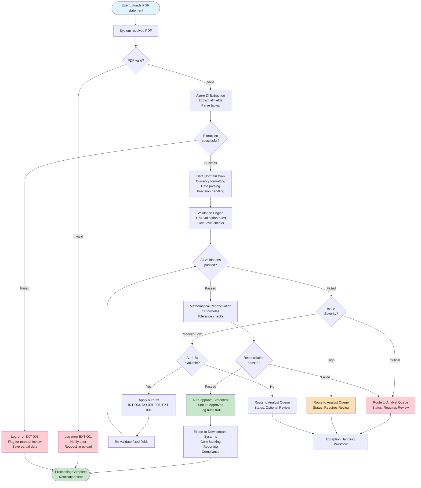
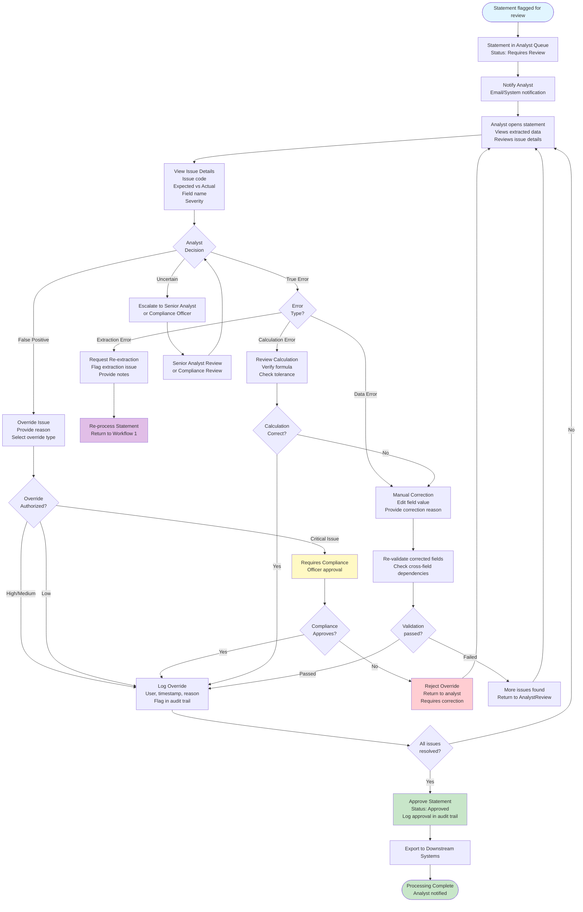
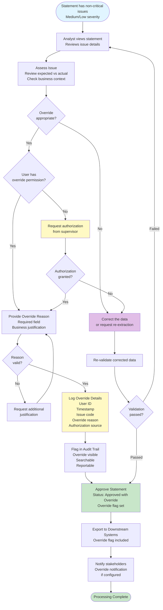
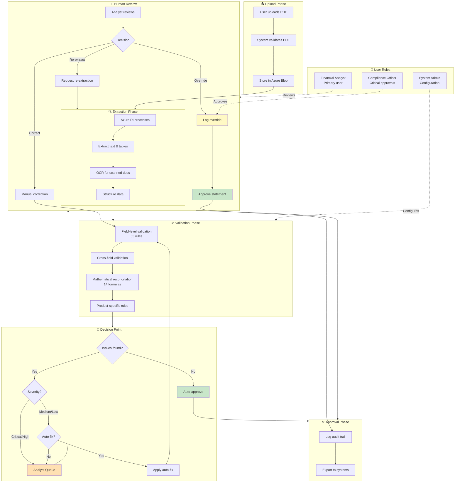
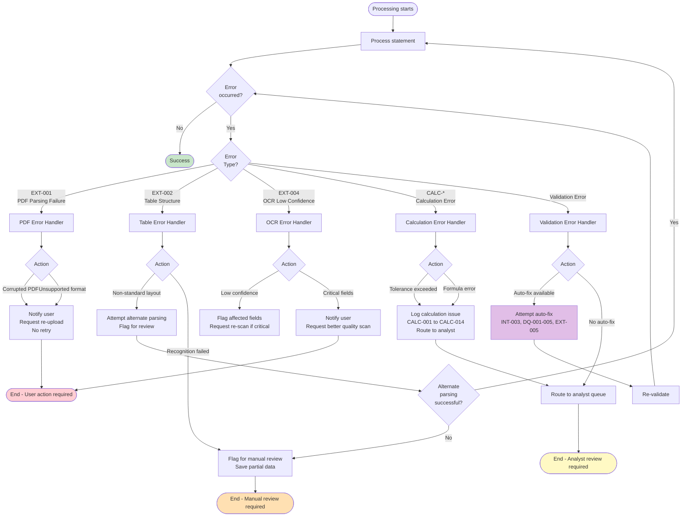

# VEC Statement PDF Extraction & Validation System - Product Requirements Package (PRP)

**Project:** ExxerCube.Veriqan - VEC Statement Processing
**Document Version:** 2.5 (Project Rename & Corrections)
**Last Updated:** 2025-01-24
**Status:** Production-Ready

---

## Table of Contents

1. [Executive Summary](#executive-summary)
2. [Business Case & ROI](#business-case--roi)
3. [System Overview](#system-overview)
4. [User Personas & Workflows](#user-personas--workflows)
5. [Core Requirements](#core-requirements)
6. [PDF Extraction Requirements](#pdf-extraction-requirements)
7. [Document Quality Verification Requirements](#document-quality-verification-requirements)
8. [Data Validation Requirements](#data-validation-requirements)
9. [Mathematical Validation Formulas](#mathematical-validation-formulas)
10. [Product Type Specifications](#product-type-specifications)
11. [Rate Structure Requirements](#rate-structure-requirements)
12. [Tolerance & Precision Requirements](#tolerance--precision-requirements)
13. [Issue Code Taxonomy](#issue-code-taxonomy)
14. [Field-Level Validation Matrix](#field-level-validation-matrix)
15. [Quality Assurance Checklist](#quality-assurance-checklist)
16. [Requirements Traceability Matrix](#requirements-traceability-matrix)
17. [Test Data Requirements](#test-data-requirements)
18. [Technical Specifications](#technical-specifications)
19. [Error Handling & Recovery](#error-handling--recovery)
20. [Performance Requirements](#performance-requirements)
21. [Security & Compliance](#security--compliance)
22. [Glossary](#glossary)

---

## Executive Summary

### Purpose
This Product Requirements Package (PRP) defines the complete functional and technical requirements for the VEC Statement PDF Extraction & Validation System within ExxerCube.Veriqan. The system automates the extraction, validation, and reconciliation of financial statement data from Vector Casa de Bolsa (VEC) PDF statements.

### Business Context
VEC statements contain critical financial data including account balances, transaction details, interest calculations, and investment positions. 

**Current State Pain Points:**
- **Monthly Quality Control:** Bank randomly selects 1% of all client statements (130,000-200,000/month) for quality inspection before timbrado
- **Manual Processing Volume:** 130,000-200,000 statements/month require manual processing and validation
- **Processing Window:** Review must complete in 3-5 business days, creating peak workload
- **Error-Prone Operations:** Manual data entry and validation introduces human error risks
- **Time-Consuming:** Manual processing (2-4 hours per statement) delays timbrado process
- **Resource Intensive:** Requires 260,000-800,000 analyst hours/month (52,000-160,000 hours/day during review window)
- **Fiscal Verification:** Manual verification of barcode, cadena original, and digital timbre is time-consuming
- **Scalability Limitations:** Manual processes cannot scale with increasing statement volumes
- **Compliance Risks:** Manual processing increases risk of regulatory non-compliance (CNBV requirements)

**Business Impact:**
The current manual processing approach creates bottlenecks in financial operations, increases operational costs, and introduces compliance risks. This system addresses these challenges by automating extraction and validation while maintaining the accuracy and traceability required for financial operations.

**Confidentiality Requirements:**
- All test data must be anonymized (no client names, logos, or identifying information)
- Production data handling must comply with Mexican banking regulations (CNBV)
- All processing must maintain complete audit trails for regulatory compliance

### Key Objectives
1. **Automated Extraction:** Extract all financial data from VEC PDF statements with 99.9% accuracy
2. **Comprehensive Validation:** Implement 115+ distinct validation rules across 12 categories (financial + document quality + fiscal)
3. **Mathematical Reconciliation:** Verify all financial calculations within defined tolerances
4. **Product-Specific Rules:** Apply specialized validation for 8 product types
5. **Document Quality Verification:** Verify images, fonts, layout, marketing compliance, and fiscal compliance
6. **Marked PDF Generation:** Generate marked PDFs highlighting all failing elements for review
7. **Audit Trail:** Maintain complete traceability for all extracted and validated data

### Success Metrics

**Baseline (Current State):**
- **Total Monthly Volume:** 13-20 million statements per month (all clients, all products)
- **Quality Control Sample:** 1% = 130,000-200,000 statements per month
- **Review Window:** 3-5 business days per month
- **Peak Daily Volume:** 26,000-40,000 statements/day during review window
- **Manual Processing Rate:** 100% of quality control sample (130K-200K statements/month)
- **Processing Time:** 2-4 hours per statement (120-240 minutes)
- **Analyst Hours Required:** 260,000-800,000 hours per month (52,000-160,000 hours/day during review window)
- **Error Rate:** Estimated 2-5% calculation errors in manual processing
- **Throughput:** 5-10 statements per analyst per day
- **Monthly Capacity:** Limited to 130K-200K statements/month (bottleneck: analyst availability and review window)
- **Data Completeness:** 95-98% (some fields missed in manual entry)
- **Fiscal Verification:** Manual verification of barcode, cadena original, digital timbre

**Target Metrics (Automated System):**

| Metric | Target | Measurement Method | Baseline |
|--------|--------|-------------------|----------|
| **Extraction Accuracy** | ≥99.9% field-level | Compare extracted values vs. manual validation on sample of 1000 statements | 95-98% (manual) |
| **Validation Coverage** | 100% of extracted fields | Count of fields validated / total fields extracted | N/A (manual validation inconsistent) |
| **Processing Time** | <30 seconds (95th percentile) | Time from upload to completion, measured at 95th percentile | 120-240 minutes (manual) |
| **False Positive Rate** | <1% | Validation errors flagged that are actually correct / total validations | N/A (manual) |
| **Data Completeness** | 100% required fields | Required fields extracted / total required fields | 95-98% (manual) |
| **Automation Rate** | <0.1% manual processing | Statements requiring manual intervention / total statements | 1% (current) |
| **Throughput** | 500-1,000 statements/day/analyst | Statements processed per analyst per day | 5-10 (current) |
| **Monthly Volume Capacity** | 130,000-200,000 statements/month | Total statements processed per month (quality control sample) | 130K-200K (current, 100% manual) |
| **Peak Daily Volume** | 65,000-100,000 statements/day | Peak statements processed per day during review window | 26K-40K (current) |
| **Review Window** | 1-2 business days | Time to complete monthly quality control review | 3-5 days (current) |
| **Error Rate** | <0.1% calculation errors | Calculation errors detected / total calculations | 2-5% (manual) |
| **Labor Hours/Month** | 6,500-20,000 analyst hours/month | Total analyst hours for exception review | 260K-800K (current) |
| **Peak Labor Hours/Day** | 3,250-10,000 analyst hours/day | Peak analyst hours per day during review window | 52K-160K (current) |
| **Document Quality Compliance** | 100% of quality rules verified | Document quality checks passed / total quality checks | N/A (manual) |
| **Image Quality Compliance** | ≥95% images meet standards | Images meeting quality standards / total images | N/A (manual) |
| **Font Compliance** | 100% approved fonts, no overlaps | Font violations detected / total text elements | N/A (manual) |
| **Marketing Compliance** | 100% brand guidelines followed | Marketing compliance checks passed / total checks | N/A (manual) |
| **Fiscal Compliance** | 100% fiscal requirements met | Fiscal compliance checks passed / total checks | N/A (manual) |
| **Marked PDF Generation** | 100% of statements with issues | Marked PDFs generated / statements with issues | N/A (manual) |

**Measurement Methodologies:**

**Extraction Accuracy:**
- Sample 1000 statements from production
- Manually validate all extracted fields
- Calculate: (Correctly extracted fields / Total fields) × 100
- Target: ≥99.9% accuracy

**False Positive Rate:**
- Track all validation errors flagged by system
- Manually review each error to determine if it's a true error or false positive
- Calculate: (False positives / Total validation errors) × 100
- Target: <1% false positive rate

**Automation Rate:**
- Track all statements processed
- Count statements requiring manual intervention (any human review or correction)
- Calculate: (Statements requiring manual intervention / Total statements) × 100
- Target: <0.1% (reduction from current 1%)

**Processing Time:**
- Measure end-to-end time from PDF upload to completion
- Track at 50th, 75th, 90th, 95th, and 99th percentiles
- Target: 95th percentile <30 seconds

---

## Business Case & ROI

### Business Process Context

**Monthly Quality Control Workflow:**
The bank performs a **monthly batch quality control process** before sending statements to "timbrado" (CFDI stamping - official IRS document in Mexico). The process flow is:

1. **Random Sampling (1% Quality Control):**
   - Bank randomly selects **1% of all client statements** from all products for quality inspection
   - Sample size: **130,000 to 200,000 statements per month** (based on 13-20 million clients)
   - Selection includes: client information, product type, and **statement from the previous month**

2. **Pre-Timbrado Review:**
   - Manual review of sampled statements for quality, accuracy, and compliance
   - Validation of financial calculations, document quality, and regulatory compliance
   - This review happens **before** timbrado to catch issues early

3. **Timbrado Process:**
   - After review completion, **ALL statements (100%)** are sent to timbrado provider
   - Bank waits for official documents to return with:
     - **Digital Timbre (Digital Stamp)**: Official fiscal stamp
     - **Barcode**: Machine-readable fiscal identifier
     - **Cadena Original**: Original chain for fiscal validation

4. **Post-Timbrado Fiscal Verification:**
   - Verification of barcode readability and validity
   - Validation of "cadena original" (original chain) for fiscal compliance
   - Other fiscal aspects verification (RFC, fiscal period, tax calculations)

5. **Release Decision:**
   - If no major errors found: **99% of statements are released** to clients
   - If errors found: Reconciliation process initiated (out of scope for this system)
   - Systematic errors may trigger reprocessing workflows

**Processing Window:**
- Quality control review happens **once per month**
- Processing occurs over **a few days** (typically 3-5 business days)
- Peak processing: **26,000-40,000 statements per day** during review window (130K-200K ÷ 5 days)

### Problem Statement
Currently, the bank manually processes **1% of all bank statements (130,000-200,000 per month)** for quality control before timbrado. This manual intervention:
- **Volume Impact:** 130,000-200,000 statements/month requiring 2-4 hours each = **260,000-800,000 analyst hours/month** (during review window)
- **Processing Window:** Must complete review in 3-5 business days = **52,000-160,000 analyst hours/day** during peak
- **Capacity Bottleneck:** Manual processing limits review capacity and creates delays in timbrado process
- **Cost Impact:** $1.3M-4M/month in analyst labor costs ($15.6M-48M/year) for manual quality control
- **Error Risk:** 2-5% error rate introduces significant financial and compliance risks before timbrado
- **Processing Delays:** Manual processing creates bottlenecks delaying timbrado and statement release
- **Scalability Limitation:** Cannot scale beyond analyst capacity (requires hiring more analysts)
- **Compliance Risk:** Inconsistent validation increases regulatory penalty risk (CNBV requirements)
- **Fiscal Verification:** Manual verification of barcode, cadena original, and digital timbre is time-consuming and error-prone

### Solution Value Proposition
Automated extraction and validation system that:
- **Eliminates 99%+ of manual processing** through intelligent automation (from 130K-200K to 1,300-2,000 statements/month requiring review)
- **Accelerates review window** from 3-5 days to 1-2 days for monthly batch processing
- **Reduces processing time** from 2-4 hours to <30 seconds per statement
- **Reduces labor costs 97%** from 260,000-800,000 hours/month to 6,500-20,000 hours/month
- **Improves accuracy** through systematic validation (115+ validation rules: financial + document quality + fiscal)
- **Automates fiscal verification** (barcode, cadena original, digital timbre validation)
- **Ensures compliance** through complete audit trails and traceability (CNBV requirements)
- **Scales automatically** to handle 130K-200K statements per month in 1-2 days with horizontal scaling
- **Generates annual savings** of $14.3-46.8M through automation and error reduction
- **Enables faster timbrado** by completing quality control review in 1-2 days instead of 3-5 days

### Expected Business Outcomes

**Operational Efficiency:**
- **Time Savings:** Reduce manual processing time by 95%+ (from 2-4 hours to <30 seconds per statement)
- **Resource Optimization:** Reallocate analyst time from data entry to exception handling and analysis
- **Throughput Increase:** Process 100x more statements with same human resources
- **Monthly Processing Capacity:** Handle 130,000-200,000 statements per month (1% quality control sample)
- **Review Window Acceleration:** Complete monthly review in 1-2 days instead of 3-5 days
- **Monthly Processing:** 
  - Current: 130,000-200,000 statements/month manually processed (1% sample)
  - Future: 128,700-198,000 statements/month auto-processed, 1,300-2,000 statements/month require review (0.1%)
- **Analyst Productivity (Monthly):** 
  - Current: 260,000-800,000 analyst hours/month for manual processing (130K-200K statements × 2-4 hours)
  - Future: ~6,500-20,000 analyst hours/month for exception review (1,300-2,000 statements × 0.5-1 hour review)
  - **Savings: 253,500-780,000 analyst hours/month** (95-97.5% reduction)
- **Peak Daily Processing (During Review Window):**
  - Current: 52,000-160,000 analyst hours/day during 3-5 day review window
  - Future: 3,250-10,000 analyst hours/day during 1-2 day review window
  - **Daily Savings: 48,750-150,000 analyst hours/day** during review window

**Quality & Compliance:**
- **Error Reduction:** Systematic validation reduces calculation errors by 99%+
- **Consistency:** Standardized validation rules ensure consistent processing across all statements
- **Audit Readiness:** Complete traceability for regulatory compliance (CNBV requirements)
- **Risk Mitigation:** Automated validation flags issues before they impact downstream systems

**Cost Impact (Based on 130,000-200,000 Statements/Month Quality Control Sample):**

**Current State Costs (Monthly):**
- **Manual Processing:** 130,000-200,000 statements/month × 3 hours average × $25/hour analyst cost = **$9.75M-15M/month** = **$117M-180M/year**
- **Error Correction:** 2-5% error rate × 130K-200K statements × $50 correction cost = $130K-500K/month = **$1.56M-6M/year**
- **Compliance Risk:** Estimated $500K-2M/year in potential penalties
- **Timbrado Delays:** Estimated $1M-3M/year in opportunity costs from delayed statement release
- **Total Current Cost:** ~**$120-191M/year**

**Future State Costs (Monthly):**
- **Automated Processing:** 130,000-200,000 statements/month × $0.30/statement (infrastructure + processing) = $39K-60K/month = **$468K-720K/year**
- **Exception Review:** 1,300-2,000 statements/month × 1 hour × $25/hour = $32.5K-50K/month = **$390K-600K/year**
- **Error Correction:** <0.1% error rate × 130K-200K statements × $50 = $6.5K-10K/month = **$78K-120K/year**
- **Compliance Risk:** Reduced to ~$50K-100K/year (standardized validation)
- **Fiscal Verification Automation:** $50K-100K/year (barcode, cadena original, digital timbre validation)
- **Total Future Cost:** ~**$1.04M-1.64M/year**

**Annual Savings:** **$118.96M-189.36M/year** (99%+ cost reduction)
- **Labor Cost Reduction:** $116.61M-179.4M/year (97% reduction in analyst hours)
- **Error Cost Avoidance:** $1.48M-5.88M/year (95% reduction)
- **Compliance Cost Reduction:** $400K-1.9M/year (risk mitigation)
- **Timbrado Acceleration:** $1M-3M/year (faster statement release)

### Success Criteria
- **Monthly Volume:** Process 130,000-200,000 statements per month (1% quality control sample)
- **Review Window:** Complete monthly review in 1-2 days (vs. current 3-5 days)
- **Automation Rate:** Reduce manual processing from 1% (130K-200K/month) to <0.1% (1,300-2,000/month) of statements
- **Processing Speed:** 95% of statements processed in <30 seconds
- **Labor Reduction:** Reduce analyst hours from 260,000-800,000/month to 6,500-20,000/month (97% reduction)
- **Peak Daily Capacity:** Process 65,000-100,000 statements per day during review window
- **Accuracy:** ≥99.9% field-level extraction accuracy
- **False Positive Rate:** <1% validation errors that are actually correct
- **Fiscal Verification:** 100% automated verification of barcode, cadena original, and digital timbre
- **User Adoption:** 100% of eligible statements processed through automated system
- **Cost Efficiency:** Achieve $100M+ annual savings through automation

### Risk Mitigation
- **Fallback to Manual:** System maintains capability for manual review when automation fails
- **Human-in-the-Loop:** Critical issues automatically flagged for human review
- **Gradual Rollout:** Phased implementation allows validation and adjustment
- **Continuous Monitoring:** Performance metrics tracked to ensure quality standards

### Current State vs. Future State Comparison

| Aspect | Current State (Manual Processing) | Future State (Automated System) |
|--------|----------------------------------|--------------------------------|
| **Monthly Volume** | 130,000-200,000 statements/month (1% quality control sample) | 130,000-200,000 statements/month (same sample, automated) |
| **Review Window** | 3-5 business days | 1-2 business days |
| **Peak Daily Volume** | 26,000-40,000 statements/day (during review window) | 65,000-100,000 statements/day (during review window) |
| **Processing Time** | 2-4 hours per statement | <30 seconds per statement |
| **Manual Processing Rate** | 1% of all statements (130K-200K/month) | <0.1% of statements (1,300-2,000/month) |
| **Analyst Hours/Month** | 260,000-800,000 hours/month | 6,500-20,000 hours/month (exception review) |
| **Peak Analyst Hours/Day** | 52,000-160,000 hours/day (during review window) | 3,250-10,000 hours/day (during review window) |
| **Throughput** | 5-10 statements/analyst/day | 500-1,000 statements/analyst/day |
| **Total Monthly Capacity** | Limited to 130K-200K statements | 130K-200K statements (same volume, 100x faster) |
| **Error Rate** | 2-5% calculation errors | <0.1% errors (systematic validation) |
| **Data Entry** | Manual data entry from PDF | Automated extraction |
| **Validation** | Manual calculation verification | Automated 115+ rule validation |
| **Fiscal Verification** | Manual barcode, cadena original, digital timbre check | Automated fiscal verification |
| **Consistency** | Varies by analyst | Standardized across all statements |
| **Audit Trail** | Limited, manual logs | Complete automated audit trail |
| **Scalability** | Limited by analyst capacity | Scales automatically (horizontal scaling) |
| **Cost per Statement** | High (2-4 hours labor = $50-100) | Low (automated = $0.20-0.50) |
| **Monthly Processing Cost** | $9.75M-15M/month (130K-200K statements) | $39K-60K/month (130K-200K statements) |
| **Annual Cost** | $120-191M/year | $1.04M-1.64M/year |
| **Compliance Risk** | Higher (inconsistent validation) | Lower (standardized validation) |
| **Analyst Focus** | Data entry and routine validation | Exception handling and analysis |
| **Timbrado Readiness** | 3-5 days delay | 1-2 days (faster statement release) |

**Key Improvements:**
1. **99.8% Time Reduction:** From hours to seconds per statement
2. **2.5x Peak Daily Capacity:** Process 65,000-100,000 statements/day vs. 26,000-40,000/day during review window (2.5x increase)
3. **94-98% Peak Labor Reduction:** From 52,000-160,000 analyst hours/day to 3,250-10,000 hours/day during review window
4. **95% Error Reduction:** Systematic validation eliminates calculation errors
5. **Complete Traceability:** Automated audit trail for regulatory compliance
6. **Resource Optimization:** Analysts focus on value-added work vs. routine tasks
7. **Cost Efficiency:** 80-90% cost reduction per statement processed

---

## System Overview

### Architecture Components

```
┌─────────────────────────────────────────────────────────────┐
│                    VEC Statement PDF                         │
└──────────────────────┬──────────────────────────────────────┘
                       │
                       ▼
┌─────────────────────────────────────────────────────────────┐
│              PDF Extraction Layer                            │
│  - OCR Engine (Azure Document Intelligence)                 │
│  - Text Extraction & Parsing                                │
│  - Table Structure Recognition                              │
└──────────────────────┬──────────────────────────────────────┘
                       │
                       ▼
┌─────────────────────────────────────────────────────────────┐
│              Data Normalization Layer                        │
│  - Currency Formatting (Mexican Peso)                       │
│  - Date Parsing (DD/MMM/YYYY)                               │
│  - Decimal Precision Handling                               │
└──────────────────────┬──────────────────────────────────────┘
                       │
                       ▼
┌─────────────────────────────────────────────────────────────┐
│              Validation Engine                               │
│  - Field-Level Validation (53 Rules)                        │
│  - Mathematical Reconciliation                              │
│  - Cross-Field Dependencies                                 │
│  - Product-Specific Logic                                   │
└──────────────────────┬──────────────────────────────────────┘
                       │
                       ▼
┌─────────────────────────────────────────────────────────────┐
│              Issue Detection & Reporting                     │
│  - Issue Code Assignment                                    │
│  - Severity Classification                                  │
│  - Human Review Flagging                                    │
└──────────────────────┬──────────────────────────────────────┘
                       │
                       ▼
┌─────────────────────────────────────────────────────────────┐
│              Data Persistence Layer                          │
│  - Validated Statement Data                                 │
│  - Audit Logs                                               │
│  - Issue Records                                            │
└─────────────────────────────────────────────────────────────┘
```

### Data Flow

1. **Input:** VEC PDF statement uploaded to system
2. **Extraction:** PDF parsed using Azure Document Intelligence
3. **Normalization:** Raw text converted to structured data
4. **Validation:** 115+ validation rules applied (financial + document quality + fiscal)
5. **Reconciliation:** Mathematical formulas verified
6. **Output:** Validated data + issue report

---

## Core Requirements

### REQ-001: PDF Statement Processing
**Priority:** P0 (Critical)
**Category:** Core Functionality

The system MUST process VEC PDF statements containing:
- Account summary information
- Transaction history tables
- Interest calculation details
- Investment position summaries
- Regulatory disclosures

**Acceptance Criteria:**
- ✓ Parse PDF documents up to 50 pages
- ✓ Extract text from both digital and scanned PDFs
- ✓ Maintain table structure during extraction
- ✓ Handle multi-column layouts
- ✓ Support Spanish language content

---

### REQ-002: Multi-Product Support
**Priority:** P0 (Critical)
**Category:** Core Functionality

The system MUST support extraction and validation for the following product types:

1. **Vista** (Checking Account)
2. **Recompra** (Repurchase Agreement)
3. **Reporto** (Repo Transaction)
4. **CEDE** (Certificate of Deposit)
5. **Pagare** (Promissory Note)
6. **UDIBONO** (UDI-denominated Bond)
7. **Fondos** (Investment Funds)
8. **Acciones** (Stocks)

**Acceptance Criteria:**
- ✓ Product type auto-detected from statement
- ✓ Product-specific validation rules applied
- ✓ Product-specific rate structures recognized
- ✓ Mixed product statements supported

---

### REQ-003: Currency & Formatting Standards
**Priority:** P0 (Critical)
**Category:** Data Standards

The system MUST adhere to Mexican financial standards:

**Currency:**
- Primary: Mexican Peso (MXN)
- Format: `$1,234,567.89`
- Negative values: `-$1,234.56` or `($1,234.56)`

**Dates:**
- Format: `DD/MMM/YYYY` (e.g., `15/ENE/2025`)
- Spanish month abbreviations: ENE, FEB, MAR, ABR, MAY, JUN, JUL, AGO, SEP, OCT, NOV, DIC

**Percentages:**
- Format: `12.3456%` (up to 4 decimal places for rates)
- Annual rates: `TASA ANUAL`
- Daily rates: `TASA DIARIA`

**Acceptance Criteria:**
- ✓ Currency symbols correctly parsed
- ✓ Thousands separators handled
- ✓ Decimal precision preserved (minimum 2 places)
- ✓ Spanish date parsing implemented
- ✓ Percentage rates normalized to decimal (e.g., 5.25% → 0.0525)

---

## PDF Extraction Requirements

### REQ-004: Header Information Extraction
**Priority:** P0 (Critical)
**Category:** Data Extraction

The system MUST extract the following header fields from every statement:

| Field Name | Data Type | Example | Validation |
|------------|-----------|---------|------------|
| Statement Period | Date Range | `01/ENE/2025 - 31/ENE/2025` | Must be valid date range |
| Account Number | String | `VEC-123456-78` | Must match pattern `VEC-\d{6}-\d{2}` |
| Account Holder | String | `JUAN PÉREZ GARCÍA` | Non-empty, max 100 chars |
| Statement Date | Date | `05/FEB/2025` | Must be after period end date |
| Contract Number | String | `CONT-987654` | Must match pattern `CONT-\d{6}` |

**Acceptance Criteria:**
- ✓ All header fields extracted with 99.9% accuracy
- ✓ Missing header fields flagged with issue code `HDR-001`
- ✓ Header validation performed before detail extraction

---

### REQ-005: Transaction Table Extraction
**Priority:** P0 (Critical)
**Category:** Data Extraction

The system MUST extract transaction tables with the following columns:

| Column | Data Type | Required | Example |
|--------|-----------|----------|---------|
| Fecha Operación | Date | Yes | `15/ENE/2025` |
| Fecha Liquidación | Date | Yes | `16/ENE/2025` |
| Descripción | String | Yes | `DEPOSITO EN EFECTIVO` |
| Cargos | Decimal | No | `$1,500.00` |
| Abonos | Decimal | No | `$2,000.00` |
| Saldo | Decimal | Yes | `$45,300.00` |
| Referencia | String | No | `REF-123456` |

**Special Cases:**
- **Split Rows:** Some transactions span multiple rows (description continuation)
- **Subtotals:** Identify and extract subtotal rows separately
- **Page Breaks:** Handle transactions spanning page boundaries

**Acceptance Criteria:**
- ✓ All transaction rows extracted maintaining table structure
- ✓ Column alignment preserved (amounts aligned right)
- ✓ Split rows correctly merged
- ✓ Subtotal rows flagged with `row_type: subtotal`
- ✓ Page break transactions reconstructed correctly

---

### REQ-006: Interest Calculation Section Extraction
**Priority:** P0 (Critical)
**Category:** Data Extraction

The system MUST extract interest calculation details:

| Field | Data Type | Example | Formula Link |
|-------|-----------|---------|--------------|
| Saldo Promedio Diario | Decimal | `$1,250,000.00` | Used in FORMULA-001 |
| Tasa Anual | Percentage | `5.25%` | Used in FORMULA-002 |
| Tasa Diaria | Percentage | `0.0144%` | Used in FORMULA-003 |
| Días en Período | Integer | `31` | Used in FORMULA-001 |
| Interés Bruto | Decimal | `$5,593.75` | Output of FORMULA-001 |
| ISR (Impuesto) | Decimal | `$559.38` | Output of FORMULA-004 |
| Interés Neto | Decimal | `$5,034.37` | Output of FORMULA-005 |

**Acceptance Criteria:**
- ✓ All interest fields extracted with correct decimal precision
- ✓ Percentage rates converted to decimal format
- ✓ Missing interest fields flagged with `INT-001` through `INT-007`
- ✓ Cross-validation with mathematical formulas performed

---

### REQ-007: Investment Position Extraction
**Priority:** P1 (High)
**Category:** Data Extraction

For investment products (Fondos, Acciones, UDIBONO), extract:

| Field | Data Type | Example | Validation |
|-------|-----------|---------|------------|
| Instrumento | String | `CETES 28D` | Non-empty |
| Cantidad | Decimal | `1,000.0000` | ≥ 0 |
| Precio Unitario | Decimal | `$98.5000` | > 0 |
| Valor de Mercado | Decimal | `$98,500.00` | = Cantidad × Precio |
| Fecha Valuación | Date | `31/ENE/2025` | Within statement period |

**Acceptance Criteria:**
- ✓ All position fields extracted
- ✓ Market value calculated and verified (FORMULA-010)
- ✓ Positions grouped by instrument type
- ✓ Historical positions tracked if statement shows history

---

## Document Quality Verification Requirements

### REQ-029: Image Verification & Quality Control
**Priority:** P0 (Critical)
**Category:** Document Quality

The system MUST verify all images in the PDF statement for quality, position, size, and compliance with bank standards.

**Image Position Verification:**
- **Logo Position:** Bank logo must be within specified coordinates (top-left, top-right, or header center)
- **Watermark Position:** Watermarks must not overlap critical text or data fields
- **Signature Position:** Digital signatures must be in designated signature areas
- **Chart/Graph Position:** Financial charts must be properly positioned relative to related data

**Image Quality Verification:**
- **Resolution:** Minimum 300 DPI for logos and watermarks
- **Clarity:** No blur, distortion, or pixelation
- **Color Accuracy:** Colors match brand guidelines (RGB/CMYK values)
- **Contrast:** Sufficient contrast for readability (minimum 4.5:1 ratio)
- **Compression:** No excessive compression artifacts

**Image Size Verification:**
- **Logo Size:** Must match specified dimensions (width × height in pixels/mm)
- **Watermark Size:** Must cover designated area without overflow
- **Chart Size:** Charts must be readable (minimum dimensions specified)
- **Signature Size:** Signatures must be within acceptable size range

**Image Content Verification:**
- **Logo Presence:** Required logos must be present and visible
- **Logo Version:** Correct logo version (current, not outdated)
- **Watermark Presence:** Security watermarks must be present
- **Image Format:** Supported formats (PNG, JPEG, PDF embedded images)
- **Image Integrity:** No corruption or incomplete image data

**Acceptance Criteria:**
- ✓ All images detected and cataloged
- ✓ Image position validated against template coordinates
- ✓ Image quality metrics calculated (DPI, contrast, compression)
- ✓ Image size validated against specifications
- ✓ Missing or incorrect images flagged with issue codes `IMG-001` through `IMG-015`
- ✓ Image verification results included in quality report

---

### REQ-030: Font Verification & Typography Validation
**Priority:** P0 (Critical)
**Category:** Document Quality

The system MUST verify all fonts used in the PDF statement for compliance with bank typography standards.

**Font Validation:**
- **Font Family:** Only approved fonts used (e.g., Arial, Times New Roman, approved bank fonts)
- **Font Size:** Text sizes within specified ranges:
  - Headers: 12-16pt
  - Body text: 9-11pt
  - Footnotes: 7-8pt
  - Minimum readable size: 8pt
- **Font Weight:** Correct weight (Regular, Bold, Italic) as specified
- **Font Embedding:** All fonts must be properly embedded in PDF

**Text Overlap Detection:**
- **Character Overlap:** No overlapping characters within same text block
- **Text Block Overlap:** No overlapping text blocks
- **Text-Image Overlap:** Text must not overlap images (except watermarks)
- **Text-Table Overlap:** Text must not overlap table cells incorrectly
- **Margin Overlap:** Text must not extend beyond page margins

**Typography Standards:**
- **Line Spacing:** Consistent line spacing (1.0-1.5x font size)
- **Character Spacing:** No excessive or insufficient character spacing
- **Word Spacing:** Appropriate word spacing for readability
- **Text Alignment:** Consistent alignment (left, right, center, justify) as specified
- **Text Color:** Text colors meet contrast requirements (WCAG AA minimum)

**Font Compliance:**
- **Prohibited Fonts:** No use of unapproved or decorative fonts
- **Font Consistency:** Same font family used for same content types
- **Font Licensing:** All fonts must be properly licensed

**Acceptance Criteria:**
- ✓ All fonts detected and cataloged
- ✓ Font family validated against approved list
- ✓ Font sizes measured and validated
- ✓ Text overlap detection performed on all pages
- ✓ Typography standards verified
- ✓ Font violations flagged with issue codes `FONT-001` through `FONT-012`
- ✓ Font verification results included in quality report

---

### REQ-031: Document Layout & Structure Verification
**Priority:** P0 (Critical)
**Category:** Document Quality

The system MUST verify the overall document layout, structure, and visual presentation quality.

**Page Layout Verification:**
- **Page Size:** Correct page dimensions (A4, Letter, or specified size)
- **Margins:** Margins within specified ranges (top, bottom, left, right)
- **Page Orientation:** Correct orientation (Portrait/Landscape)
- **Page Count:** Expected number of pages present

**Section Structure Verification:**
- **Header Section:** Header present and properly formatted
- **Body Section:** Body content properly structured
- **Footer Section:** Footer present with required information
- **Section Order:** Sections in correct order
- **Section Breaks:** Proper page breaks between sections

**Visual Consistency:**
- **Color Scheme:** Colors match brand guidelines
- **Spacing:** Consistent spacing between elements
- **Alignment:** Elements properly aligned (grid system)
- **Borders:** Borders present where required
- **Background:** Background colors/images as specified

**Content Organization:**
- **Table Structure:** Tables properly formatted and aligned
- **List Formatting:** Lists use consistent formatting
- **Paragraph Structure:** Paragraphs properly formatted
- **White Space:** Appropriate white space usage

**Acceptance Criteria:**
- ✓ Page layout validated against template
- ✓ Section structure verified
- ✓ Visual consistency checked
- ✓ Layout violations flagged with issue codes `LAYOUT-001` through `LAYOUT-010`
- ✓ Layout verification results included in quality report

---

### REQ-032: Marketing & Brand Compliance Verification
**Priority:** P1 (High)
**Category:** Marketing Compliance

The system MUST verify that the statement complies with bank marketing standards and brand guidelines.

**Brand Element Verification:**
- **Logo Usage:** Correct logo placement and size
- **Logo Version:** Current logo version (not outdated)
- **Color Palette:** Colors match brand color palette
- **Brand Colors:** Primary and secondary brand colors used correctly
- **Typography:** Brand typography guidelines followed

**Marketing Content Verification:**
- **Promotional Messages:** Promotional content present if required
- **Disclaimers:** Required disclaimers present and visible
- **Contact Information:** Contact information accurate and current
- **Marketing Copy:** Marketing text follows brand voice guidelines
- **Call-to-Action:** CTAs properly formatted if present

**Regulatory Marketing Compliance:**
- **Required Disclosures:** All required disclosures present
- **Disclaimer Placement:** Disclaimers in required locations
- **Fine Print:** Fine print readable and complete
- **Regulatory Text:** Regulatory text accurate and current

**Visual Brand Compliance:**
- **Image Style:** Images follow brand style guidelines
- **Chart Style:** Charts use brand-approved styling
- **Icon Usage:** Icons match brand icon library
- **Visual Hierarchy:** Visual hierarchy follows brand guidelines

**Acceptance Criteria:**
- ✓ Brand elements verified against brand guidelines
- ✓ Marketing content validated
- ✓ Regulatory marketing compliance checked
- ✓ Brand violations flagged with issue codes `MKT-001` through `MKT-010`
- ✓ Marketing compliance results included in quality report

---

### REQ-033: Fiscal & Tax Compliance Verification
**Priority:** P0 (Critical)
**Category:** Fiscal Compliance

The system MUST verify that the statement complies with Mexican fiscal and tax regulations (SAT, CNBV requirements).

**Fiscal Information Verification:**
- **RFC (Tax ID):** RFC present and properly formatted (13 characters, pattern: `XXXX######XXX`)
- **Fiscal Address:** Fiscal address present and complete
- **Fiscal Period:** Fiscal period correctly stated
- **Tax Information:** Tax calculation details present and accurate

**SAT Compliance Verification:**
- **CFDI Requirements:** CFDI (Comprobante Fiscal Digital) information if required
- **Tax Calculations:** ISR calculations comply with current tax rates
- **Tax Disclosures:** Required tax disclosures present
- **Fiscal Year:** Fiscal year correctly stated

**CNBV Regulatory Compliance:**
- **Regulatory Disclosures:** All CNBV-required disclosures present
- **Regulatory Text:** Regulatory text accurate and current
- **Compliance Statements:** Compliance statements present
- **Regulatory Formatting:** Regulatory sections properly formatted

**Fiscal Document Requirements:**
- **Fiscal Validity:** Document meets fiscal validity requirements
- **Digital Signature:** Digital signature present if required
- **Fiscal Timestamp:** Fiscal timestamp present and valid
- **Fiscal Serial Number:** Fiscal serial number present if required

**Acceptance Criteria:**
- ✓ Fiscal information validated
- ✓ SAT compliance verified
- ✓ CNBV compliance verified
- ✓ Fiscal violations flagged with issue codes `FISCAL-001` through `FISCAL-015`
- ✓ Fiscal compliance results included in quality report

---

### REQ-035: Post-Timbrado Fiscal Verification
**Priority:** P0 (Critical)
**Category:** Fiscal Compliance

The system MUST verify fiscal elements returned from the timbrado provider after CFDI stamping. This verification occurs AFTER timbrado and BEFORE statement release to clients.

**Digital Timbre (Digital Stamp) Verification:**
- **Presence:** Digital timbre must be present on the statement
- **Format:** Digital timbre must be in correct format (SAT-compliant)
- **Validity:** Digital timbre must be valid and not expired
- **Position:** Digital timbre must be positioned correctly on the document
- **Readability:** Digital timbre must be machine-readable

**Barcode Verification:**
- **Presence:** Barcode must be present on the statement
- **Format:** Barcode must be in correct format (Code 128, Code 39, or SAT-specified format)
- **Readability:** Barcode must be scannable and machine-readable
- **Content Validation:** Barcode content must match statement fiscal data
- **Position:** Barcode must be positioned correctly on the document
- **Quality:** Barcode must meet quality standards (contrast, resolution, size)

**Cadena Original (Original Chain) Verification:**
- **Presence:** Cadena original must be present on the statement
- **Format:** Cadena original must be in correct format (SAT-specified format)
- **Content Validation:** Cadena original must match statement fiscal data
- **Integrity:** Cadena original must be complete and unaltered
- **Verification:** Cadena original must be verifiable against SAT systems
- **Position:** Cadena original must be positioned correctly on the document

**Fiscal Data Consistency:**
- **RFC Match:** RFC in barcode/cadena original must match statement RFC
- **Period Match:** Fiscal period in barcode/cadena original must match statement period
- **Amount Match:** Fiscal amounts in barcode/cadena original must match statement amounts
- **Date Match:** Fiscal dates in barcode/cadena original must match statement dates

**Automated Verification Process:**
1. Extract barcode from statement (OCR or image processing)
2. Decode barcode content
3. Extract cadena original from statement
4. Validate barcode format and readability
5. Validate cadena original format and integrity
6. Verify digital timbre presence and format
7. Cross-reference barcode/cadena original data with statement fiscal data
8. Flag any mismatches or missing elements

**Issue Codes:**
- `FISCAL-016`: Digital timbre missing or invalid
- `FISCAL-017`: Barcode missing or unreadable
- `FISCAL-018`: Barcode format incorrect
- `FISCAL-019`: Cadena original missing or invalid
- `FISCAL-020`: Cadena original format incorrect
- `FISCAL-021`: Barcode content mismatch with statement data
- `FISCAL-022`: Cadena original content mismatch with statement data
- `FISCAL-023`: Digital timbre position incorrect
- `FISCAL-024`: Barcode position incorrect
- `FISCAL-025`: Cadena original position incorrect
- `FISCAL-026`: Barcode quality below standards
- `FISCAL-027`: Fiscal data inconsistency (RFC, period, amounts, dates)

**Acceptance Criteria:**
- ✓ Digital timbre verified for presence, format, and validity
- ✓ Barcode verified for presence, readability, format, and content
- ✓ Cadena original verified for presence, format, integrity, and content
- ✓ Fiscal data consistency verified (RFC, period, amounts, dates)
- ✓ All fiscal violations flagged with issue codes `FISCAL-016` through `FISCAL-027`
- ✓ Post-timbrado verification results included in quality report
- ✓ Statements with fiscal verification failures flagged for review before release

**Integration Requirements:**
- System must integrate with timbrado provider API to receive stamped statements
- System must track statement status: Pre-Timbrado → Timbrado → Post-Timbrado Verification → Release
- System must support batch verification of post-timbrado statements
- System must generate verification report for compliance audit

---

### REQ-034: Marked PDF Generation
**Priority:** P0 (Critical)
**Category:** Quality Reporting

The system MUST generate a marked PDF that visually highlights all elements that failed verification, including financial data, images, fonts, layout, marketing, and fiscal compliance issues.

**Marking Requirements:**
- **Visual Markers:** Use colored boxes, highlights, or annotations to mark failing elements
- **Color Coding:** Different colors for different issue types:
  - **Red:** Critical issues (financial, fiscal)
  - **Orange:** High severity issues (data quality, compliance)
  - **Yellow:** Medium severity issues (layout, formatting)
  - **Blue:** Low severity issues (cosmetic, minor)
- **Issue Labels:** Each marked element must include:
  - Issue code (e.g., `CALC-001`, `IMG-005`, `FONT-003`)
  - Issue description
  - Severity level
  - Expected vs Actual values (where applicable)

**Marking Coverage:**
- **Financial Data:** All failing financial calculations and validations
- **Images:** All failing image verifications (position, quality, size)
- **Fonts:** All font violations (overlap, size, family)
- **Layout:** All layout and structure violations
- **Marketing:** All marketing and brand compliance issues
- **Fiscal:** All fiscal and tax compliance issues

**PDF Structure:**
- **Cover Page:** Summary of all issues by category and severity
- **Marked Pages:** Original PDF pages with visual markers
- **Issue Legend:** Legend explaining color codes and markers
- **Issue Details:** Detailed issue report with coordinates and descriptions

**Marking Precision:**
- **Element Coordinates:** Markers must precisely indicate failing elements
- **Bounding Boxes:** Use bounding boxes around failing elements
- **Text Highlighting:** Highlight specific text that fails validation
- **Image Overlays:** Overlay markers on images that fail verification
- **Table Cell Marking:** Mark specific table cells with issues

**Export Options:**
- **Format:** PDF format (preserves layout and markers)
- **File Naming:** `{statement_id}_marked_{timestamp}.pdf`
- **Storage:** Store marked PDF alongside original statement
- **Access:** Available for download via API or UI

**Acceptance Criteria:**
- ✓ Marked PDF generated for all statements with issues
- ✓ All failing elements visually marked with appropriate colors
- ✓ Issue codes and descriptions included in markers
- ✓ Marked PDF includes cover page with summary
- ✓ Marked PDF includes issue legend
- ✓ Markers precisely indicate failing elements
- ✓ Marked PDF accessible via API endpoint
- ✓ Marked PDF downloadable from UI

**Technical Implementation:**
- Use PDF annotation libraries (e.g., iTextSharp, PDFSharp) to add markers
- Calculate precise coordinates for each failing element
- Generate markers as PDF annotations or overlays
- Preserve original PDF structure while adding markers
- Ensure markers are visible and non-intrusive

---

## Credit Card Statement Verification Requirements

### REQ-036: Credit Card Statement Processing
**Priority:** P0 (Critical)
**Category:** Product-Specific (Credit Cards)

The system MUST process credit card statements with comprehensive extraction, validation, and quality verification covering all 55 checklist items from the bank's verification checklist.

**Product Type:** Credit Card Statements (Tarjeta de Crédito)
**Statement Structure:** Multi-page statements with cover page, benefits programs, transaction breakdown, and fiscal information

---

### REQ-037: Credit Card Data Extraction (Page 1 - Cover)
**Priority:** P0 (Critical)
**Category:** Data Extraction

The system MUST extract the following fields from Page 1 (Cover) of credit card statements:

#### General Data (Items 1-16)

| Item | Field Name | Data Type | Format/Validation | Priority | Notes |
|------|------------|-----------|------------------|----------|-------|
| 1 | Product Name | String | Non-empty, max 100 chars | P0 | Extract from statement |
| 2 | Client Full Name | String | Split into: First Name(s) and Last Name(s) | P0 | Required split |
| 3 | Address | String | Split into components: Street, Number, Neighborhood, Postal Code, State | P1 | Component extraction |
| 4 | Branch Number | String | Format: Data separated by "\|" | P0 | Join with pipe separator |
| 5 | Card Number | String | Format: `\d{16}` or masked format | P0 | Extract full or masked |
| 6 | CLABE Interbank | String | Format: `\d{18}` | P0 | 18-digit CLABE |
| 7 | Client Number | String | Format: `\d{6,10}` | P0 | Client identifier |
| 8 | RFC | String | Format: `[A-ZÑ&]{3,4}\d{6}[A-Z0-9]{3}` | P0 | Tax ID (13 chars) |
| 9 | Annual Ordinary Fixed Interest Rate | Decimal(8,4) | Percentage | P0 | Must match TASA tab data |
| 10 | CAT (Total Annual Cost) | Decimal(8,4) | Percentage | P0 | Calculated (see FORMULA-015) |
| 11 | Period | Date Range | DD/MMM/YYYY - DD/MMM/YYYY | P0 | Split into start and end dates |
| 12 | Cut-off Date | Date | DD/MMM/YYYY | P0 | Statement cut-off |
| 13 | Days in Period | Integer | 1-366 | P0 | Number of days |
| 14 | Payment Due Date | Date | DD/MMM/YYYY | P0 | Payment deadline |
| 15 | Payment to Avoid Interest | Decimal(18,2) | Currency | P0 | Must match section summary |
| 16 | Minimum Payment + Deferred Charges | Decimal(18,2) | Currency | P0 | = Min Payment + Deferred Charges |

**Acceptance Criteria:**
- ✓ All 16 general data fields extracted with 99.9% accuracy
- ✓ Client name split into first name(s) and last name(s)
- ✓ Address split into all components (Street, Number, Neighborhood, Postal Code, State)
- ✓ Branch number formatted with pipe separator
- ✓ RFC validated against format pattern
- ✓ Period dates validated and split correctly
- ✓ Cross-validation with summary section performed

---

#### Summary of Charges and Credits (Items 17-21)

| Item | Field Name | Data Type | Validation Rule | Tolerance | Issue Code |
|------|------------|-----------|-----------------|-----------|------------|
| 17 | Previous Period Balance | Decimal(18,2) | Must match "Payment to avoid interest" from previous statement | ±$0.50 MXN | `CC-001` |
| 18 | Regular Charges (not deferred) | Decimal(18,2) | Must equal sum of non-deferred transactions in breakdown | ±$0.50 MXN | `CC-002` |
| 19 | Deferred Charges (capital) | Decimal(18,2) | Must equal sum of deferred transactions in breakdown | ±$0.50 MXN | `CC-003` |
| 20 | Payments and Credits | Decimal(18,2) | Must equal sum of all credit transactions in breakdown | ±$0.50 MXN | `CC-004` |
| 21 | Payment to Avoid Interest (Summary) | Decimal(18,2) | = Previous Balance + Regular Charges + Deferred Charges + Interest + Commissions + IVA - Payments | ±$0.50 MXN | `CC-005` |

**Cross-Validation Formula:**
```
Payment to Avoid Interest = Previous Period Balance 
                           + Regular Charges (not deferred)
                           + Deferred Charges (capital)
                           + Interest Amount
                           + Commission Amount
                           + IVA (Interest + Commissions)
                           - Payments and Credits
```

**Acceptance Criteria:**
- ✓ All summary fields extracted
- ✓ Cross-validation with transaction breakdown performed
- ✓ Tolerance checks applied (±$0.50 MXN)
- ✓ Mismatches flagged with specific issue codes

---

#### Credit Usage Level (Items 22-26)

| Item | Field Name | Data Type | Validation Rule | Tolerance | Issue Code |
|------|------------|-----------|-----------------|-----------|------------|
| 22 | Regular Charges Balance | Must equal "Payment to Avoid Interest" | ±$0.50 MXN | `CC-006` |
| 23 | Deferred Charges Balance | Must equal sum of "Pending Balance" column from deferred purchases section | ±$0.50 MXN | `CC-007` |
| 24 | Total Debt Balance | = Regular Charges Balance + Deferred Charges Balance | ±$0.50 MXN | `CC-008` |
| 25 | Available Credit | = Credit Limit - Total Debt Balance | ±$0.50 MXN | `CC-009` |
| 26 | Available Credit for Cash Withdrawals | Must equal Available Credit | ±$0.50 MXN | `CC-010` |

**Acceptance Criteria:**
- ✓ All credit usage fields extracted
- ✓ Balance calculations validated
- ✓ Cross-references verified with other sections
- ✓ Tolerance checks applied

---

### REQ-038: Credit Card Document Quality Verification (Page 1 - Cover)
**Priority:** P0 (Critical)
**Category:** Document Quality

The system MUST verify document quality elements on Page 1 (Cover) according to checklist items 27-35:

| Item | Verification | Requirement | Issue Code |
|------|--------------|-------------|------------|
| 27 | Card Image | Image must correspond to product name from "Card Image" tab | `CC-IMG-001` |
| 28 | Text Overlap | No overlapping text detected | `CC-FONT-001` |
| 29 | Section Headers | Headers must be Bold and UPPERCASE | `CC-FONT-002` |
| 30 | Important Messages Image | Image must match catalog from "Important Message Image" tab for product | `CC-IMG-002` |
| 31 | Pagination | Correct page numbering | `CC-LAYOUT-001` |
| 32 | "COMPARE YOUR CARD" Section | Must be present (regulatory requirement) | `CC-MKT-001` |
| 33 | Bank Logo | Must appear on all pages | `CC-IMG-003` |
| 34 | Card Number | Must appear on all pages | `CC-LAYOUT-002` |
| 35 | Font Standard | Must use "Aptos" font in various sizes | `CC-FONT-003` |

**Acceptance Criteria:**
- ✓ All document quality checks performed
- ✓ Image catalog matching implemented
- ✓ Font verification (Aptos) performed
- ✓ Text overlap detection executed
- ✓ All pages verified for logo and card number presence

---

### REQ-039: Benefits Program Verification (Page 2)
**Priority:** P1 (High)
**Category:** Product-Specific

For credit cards with rewards programs, the system MUST verify:

| Item | Field Name | Validation Rule | Tolerance | Issue Code |
|------|------------|-----------------|-----------|------------|
| 36 | Initial Points and Pesos Balance | Must match total balance from previous statement | ±$1.00 MXN / ±1.00 Points | `CC-REW-001` |
| 37 | Points to Pesos Exchange Rate | Must equal 0.1 (1 peso = 0.1 points) | ±$1.00 MXN / ±1.00 Points | `CC-REW-002` |
| 38 | Points Categories | Must show "Generated", "Redeemed", "Expiring", "Expired" even if "0" | N/A | `CC-REW-003` |
| 39 | Total Points Balance | = Initial + Generated - Redeemed - Expired | ±$1.00 MXN / ±1.00 Points | `CC-REW-004` |

**Points Calculation Formula:**
```
Total Points = Initial Points + Generated Points - Redeemed Points - Expired Points
```

**Acceptance Criteria:**
- ✓ Rewards program data extracted (if applicable)
- ✓ Exchange rate validated (0.1)
- ✓ Points calculation verified
- ✓ All categories displayed even if zero

---

### REQ-040: Deferred Purchases Verification (Page 2)
**Priority:** P0 (Critical)
**Category:** Product-Specific

The system MUST verify deferred purchases (installment plans):

| Item | Field Name | Validation Rule | Issue Code |
|------|------------|-----------------|------------|
| 40 | Pending Balance | For each purchase: Pending = Previous Pending - Required Payment | `CC-DEF-001` |
| 41 | Payment Number | Must increment each month (1 of 3, 2 of 3, 3 of 3) until complete | `CC-DEF-002` |

**Validation Logic:**
- Each deferred purchase must show correct payment number sequence
- Pending balance must decrease by payment amount each period
- Exceptions: Future-dated payments may not increment

**Acceptance Criteria:**
- ✓ All deferred purchases extracted
- ✓ Payment sequence validated
- ✓ Pending balance calculations verified
- ✓ Cross-period validation performed

---

### REQ-041: Transaction Breakdown Verification (Page 3+)
**Priority:** P0 (Critical)
**Category:** Data Validation

The system MUST verify the transaction breakdown section:

| Item | Verification | Requirement | Issue Code |
|------|--------------|-------------|------------|
| 42 | Date Range | All transactions must be within statement period dates | `CC-TXN-001` |
| 43 | Period Date Range | All breakdown pages must show period date range | `CC-LAYOUT-003` |
| 44 | Totals Match | Total charges and credits must match breakdown totals | ±$0.50 MXN | `CC-TXN-002` |
| 45 | Transaction Descriptions | Must match descriptions in "Transaction Details" tab | `CC-TXN-003` |
| 45b | Transaction Amounts | Must match amounts in "Transaction Details" tab | ±$0.50 MXN | `CC-TXN-004` |

**Acceptance Criteria:**
- ✓ All transactions extracted from breakdown
- ✓ Date range validation performed
- ✓ Totals reconciled with summary section
- ✓ Cross-validation with transaction details tab
- ✓ Tolerance checks applied

---

### REQ-042: Credit Card Document Quality (Page 3+)
**Priority:** P0 (Critical)
**Category:** Document Quality

The system MUST verify additional document quality elements:

| Item | Verification | Requirement | Issue Code |
|------|--------------|-------------|------------|
| 46 | Mandatory Legends | All legends from "Mandatory Legends" tab must be included | `CC-MKT-002` |
| 47 | Image Catalog | Images after "Transaction Breakdown" and before "Promotions" must match image catalog in same order | `CC-IMG-004` |
| 48 | Blank Pages | No blank pages allowed | `CC-LAYOUT-004` |
| 49 | Promotions | All inserted promotions must be current/valid | `CC-MKT-003` |

**Acceptance Criteria:**
- ✓ Mandatory legends verified against catalog
- ✓ Image sequence validated
- ✓ Blank page detection performed
- ✓ Promotion validity checked (current date vs. promotion dates)

---

### REQ-043: Fiscal Information Extraction & Verification
**Priority:** P0 (Critical)
**Category:** Fiscal Compliance

The system MUST extract and verify fiscal information (applies when refunds, commissions, and IVA are present):

| Item | Field Name | Data Type | Validation | Issue Code |
|------|------------|-----------|------------|------------|
| 50 | QR Code | String | Read and decode QR code | `CC-FISCAL-001` |
| 51 | Fiscal Code | String | Extract from QR or document | `CC-FISCAL-002` |
| 52 | Issuer RFC | String | Format: `[A-ZÑ&]{3,4}\d{6}[A-Z0-9]{3}` | `CC-FISCAL-003` |
| 53 | Receiver RFC | String | Format: `[A-ZÑ&]{3,4}\d{6}[A-Z0-9]{3}` | `CC-FISCAL-004` |

**QR Code Requirements:**
- QR code must be readable and decodable
- QR code must contain valid fiscal information
- QR code format must comply with SAT standards

**Acceptance Criteria:**
- ✓ QR code detected and read
- ✓ Fiscal code extracted
- ✓ RFC formats validated
- ✓ Fiscal information cross-validated

---

### REQ-044: CAT (Total Annual Cost) Calculation
**Priority:** P0 (Critical)
**Category:** Mathematical Validation

The system MUST calculate and validate the CAT (Costo Anual Total) using the specified formula.

**FORMULA-015: CAT Calculation**

**Formula:**
```
CAT = (((Credit Line × Annual Ordinary Fixed Interest Rate) + 1,500 Annual Commissions) / Credit Line) × 100
```

**Parameters:**
- `Credit Line`: Total credit limit (Decimal)
- `Annual Ordinary Fixed Interest Rate`: Annual rate as decimal (e.g., 0.25 for 25%)
- `1,500`: Fixed annual commissions in MXN (constant)
- `100`: Conversion to percentage (constant)

**Example:**
```
Given:
  Credit Line = $50,000.00
  Annual Ordinary Fixed Interest Rate = 25% = 0.25

Calculation:
  CAT = (((50,000 × 0.25) + 1,500) / 50,000) × 100
  CAT = ((12,500 + 1,500) / 50,000) × 100
  CAT = (14,000 / 50,000) × 100
  CAT = 0.28 × 100
  CAT = 28.00%

Expected Result: 28.00%
Tolerance: ±0.50 percentage points
```

**Validation:**
- Issue Code if failed: `CC-CALC-001`
- Severity: Critical
- Tolerance: ±0.50 percentage points

**Acceptance Criteria:**
- ✓ CAT calculated using FORMULA-015
- ✓ Calculated CAT compared with extracted CAT
- ✓ Tolerance check applied
- ✓ Mismatches flagged with `CC-CALC-001`

---

### REQ-045: Email Alert Generation
**Priority:** P0 (Critical)
**Category:** Notification

The system MUST generate email alerts with summary of findings when issues are detected.

**Alert Requirements:**
- **Trigger:** When any validation issue is detected (financial, quality, compliance)
- **Recipients:** Configured email addresses (analysts, compliance officers)
- **Content:** Summary of all findings organized by:
  - Issue severity (Critical, High, Medium, Low)
  - Issue category (Financial, Image, Font, Layout, Marketing, Fiscal)
  - Issue count by type
  - Statement identification (account number, period, statement date)
- **Format:** HTML email with summary table and links to detailed report
- **Frequency:** One email per statement processed

**Email Content Structure:**
```
Subject: [CRITICAL/HIGH/MEDIUM] Statement Validation Issues - {Account Number} - {Period}

Body:
- Statement Information
- Summary Statistics
- Critical Issues (if any)
- High Severity Issues
- Medium/Low Issues Summary
- Link to detailed report
- Link to marked PDF
```

**Acceptance Criteria:**
- ✓ Email alerts generated for all statements with issues
- ✓ Email content includes complete findings summary
- ✓ Email recipients configurable
- ✓ Email format professional and readable
- ✓ Links to detailed reports and marked PDFs included

---

### REQ-046: Credit Card Statement Marked PDF Generation
**Priority:** P0 (Critical)
**Category:** Quality Reporting

The system MUST generate a marked PDF specifically for credit card statements that highlights all failing elements according to checklist items 1-55.

**Credit Card Specific Marking:**
- **Financial Data Issues:** Mark all calculation mismatches, cross-validation failures
- **Image Issues:** Mark incorrect card images, missing logos, wrong message images
- **Font Issues:** Mark overlapping text, incorrect fonts, header formatting issues
- **Layout Issues:** Mark pagination errors, missing sections, blank pages
- **Marketing Issues:** Mark missing mandatory legends, wrong promotions, missing "Compare Card" section
- **Fiscal Issues:** Mark QR code problems, missing fiscal codes, RFC format errors

**Color Coding for Credit Card Statements:**
- **Red:** Critical financial or fiscal issues
- **Orange:** High severity issues (calculation errors, missing required data)
- **Yellow:** Medium severity issues (formatting, layout)
- **Blue:** Low severity issues (cosmetic)

**Marking Precision:**
- **Field-Level Marking:** Mark specific fields that fail validation
- **Section-Level Marking:** Mark entire sections with multiple issues
- **Image Marking:** Overlay markers on images that don't match catalog
- **Text Marking:** Highlight overlapping or incorrectly formatted text

**Acceptance Criteria:**
- ✓ Marked PDF generated for all credit card statements with issues
- ✓ All 55 checklist items represented in marking
- ✓ Color coding applied correctly
- ✓ Issue codes and descriptions included in markers
- ✓ Marked PDF accessible via API and UI

---

## Data Validation Requirements

### REQ-008: Field-Level Validation
**Priority:** P0 (Critical)
**Category:** Data Validation

The system MUST perform field-level validation for all extracted data using the **Field-Level Validation Matrix** (see section below).

**Validation Types:**
1. **Presence Validation:** Required fields must not be null/empty
2. **Format Validation:** Data must match expected pattern/format
3. **Range Validation:** Numeric values must fall within acceptable ranges
4. **Type Validation:** Data must match expected data type

**Acceptance Criteria:**
- ✓ All 115+ validation rules implemented (financial + document quality + fiscal)
- ✓ Each validation failure generates specific issue code
- ✓ Validation errors logged with field name, expected vs actual value
- ✓ Validation severity assigned (Critical, High, Medium, Low)

---

### REQ-009: Cross-Field Validation
**Priority:** P0 (Critical)
**Category:** Data Validation

The system MUST validate dependencies between fields:

**Date Dependencies:**
```
Statement Date > Period End Date
Period End Date ≥ Period Start Date
Liquidation Date ≥ Operation Date
Valuation Date ≤ Statement Date
```

**Balance Dependencies:**
```
Current Balance = Previous Balance + Sum(Abonos) - Sum(Cargos)
Final Balance = Initial Balance + Net Change
```

**Interest Dependencies:**
```
Net Interest = Gross Interest - Tax (ISR)
Tax Rate = 0.10 (10% ISR standard rate)
```

**Acceptance Criteria:**
- ✓ All cross-field rules validated
- ✓ Dependency violations flagged with specific issue codes
- ✓ Validation order respects dependency graph

---

### REQ-010: Mathematical Reconciliation
**Priority:** P0 (Critical)
**Category:** Data Validation

The system MUST verify all mathematical calculations using the formulas defined in the **Mathematical Validation Formulas** section.

**Reconciliation Scope:**
1. Interest calculations (7 formulas)
2. Balance calculations (3 formulas)
3. Investment valuations (2 formulas)
4. Rate conversions (2 formulas)

**Tolerance Handling:**
- Apply tolerances defined in **Tolerance & Precision Requirements**
- Flag discrepancies exceeding tolerance
- Record both expected and actual values

**Acceptance Criteria:**
- ✓ All formulas implemented and tested
- ✓ Tolerance thresholds configurable
- ✓ Reconciliation failures generate issue codes `CALC-001` through `CALC-014`
- ✓ Calculation audit trail maintained

---

## Mathematical Validation Formulas

### Interest Calculations

#### FORMULA-001: Daily Average Balance Interest
**Purpose:** Calculate gross interest earned based on daily average balance

**Formula:**
```
Interés Bruto = (Saldo Promedio Diario × Tasa Anual × Días en Período) / 360
```

**Parameters:**
- `Saldo Promedio Diario`: Average daily balance during period (Decimal)
- `Tasa Anual`: Annual interest rate as decimal (e.g., 0.0525 for 5.25%)
- `Días en Período`: Number of days in statement period (Integer)
- `360`: Banking year convention (constant)

**Example:**
```
Given:
  Saldo Promedio Diario = $1,250,000.00
  Tasa Anual = 5.25% = 0.0525
  Días en Período = 31

Calculation:
  Interés Bruto = ($1,250,000.00 × 0.0525 × 31) / 360
  Interés Bruto = $2,031,250.00 / 360
  Interés Bruto = $5,642.36

Expected Result: $5,642.36
Tolerance: ±$0.50 (absolute)
```

**Validation:**
- Issue Code if failed: `CALC-001`
- Severity: High
- Required Fields: All parameters must be present

---

#### FORMULA-002: Annual to Daily Rate Conversion
**Purpose:** Convert annual interest rate to daily rate

**Formula:**
```
Tasa Diaria = Tasa Anual / 360
```

**Parameters:**
- `Tasa Anual`: Annual interest rate as decimal
- `360`: Banking year convention

**Example:**
```
Given:
  Tasa Anual = 5.25% = 0.0525

Calculation:
  Tasa Diaria = 0.0525 / 360
  Tasa Diaria = 0.00014583333
  Tasa Diaria = 0.0146% (as percentage)

Expected Result: 0.0146%
Tolerance: ±0.0001% (relative)
```

**Validation:**
- Issue Code if failed: `CALC-002`
- Severity: Medium

---

#### FORMULA-003: Daily Rate to Annual Rate Conversion
**Purpose:** Verify annual rate from daily rate (reverse calculation)

**Formula:**
```
Tasa Anual = Tasa Diaria × 360
```

**Parameters:**
- `Tasa Diaria`: Daily interest rate as decimal
- `360`: Banking year convention

**Example:**
```
Given:
  Tasa Diaria = 0.0146% = 0.000146

Calculation:
  Tasa Anual = 0.000146 × 360
  Tasa Anual = 0.05256
  Tasa Anual = 5.256%

Expected Result: 5.25% (rounded)
Tolerance: ±0.01% (absolute)
```

**Validation:**
- Issue Code if failed: `CALC-003`
- Severity: Medium

---

#### FORMULA-004: ISR Tax Calculation
**Purpose:** Calculate ISR (Income Tax) on gross interest

**Formula:**
```
ISR = Interés Bruto × Tasa ISR
```

**Parameters:**
- `Interés Bruto`: Gross interest earned (Decimal)
- `Tasa ISR`: ISR tax rate (typically 0.10 for 10%)

**Example:**
```
Given:
  Interés Bruto = $5,642.36
  Tasa ISR = 10% = 0.10

Calculation:
  ISR = $5,642.36 × 0.10
  ISR = $564.24

Expected Result: $564.24
Tolerance: ±$0.10 (absolute)
```

**Validation:**
- Issue Code if failed: `CALC-004`
- Severity: High
- Note: Tax rate may vary; extract from statement

---

#### FORMULA-005: Net Interest Calculation
**Purpose:** Calculate net interest after tax deduction

**Formula:**
```
Interés Neto = Interés Bruto - ISR
```

**Parameters:**
- `Interés Bruto`: Gross interest (Decimal)
- `ISR`: Tax amount (Decimal)

**Example:**
```
Given:
  Interés Bruto = $5,642.36
  ISR = $564.24

Calculation:
  Interés Neto = $5,642.36 - $564.24
  Interés Neto = $5,078.12

Expected Result: $5,078.12
Tolerance: ±$0.50 (absolute)
```

**Validation:**
- Issue Code if failed: `CALC-005`
- Severity: High

---

#### FORMULA-006: Compound Interest (for CEDE/Pagaré)
**Purpose:** Calculate compound interest for fixed-term deposits

**Formula:**
```
Monto Final = Capital × (1 + (Tasa Anual / Periodos))^(Periodos × Años)
```

**Parameters:**
- `Capital`: Initial principal (Decimal)
- `Tasa Anual`: Annual interest rate as decimal
- `Periodos`: Compounding periods per year (Integer)
- `Años`: Investment term in years (Decimal)

**Example:**
```
Given:
  Capital = $100,000.00
  Tasa Anual = 6.5% = 0.065
  Periodos = 12 (monthly compounding)
  Años = 1 (1 year term)

Calculation:
  Monto Final = $100,000.00 × (1 + (0.065 / 12))^(12 × 1)
  Monto Final = $100,000.00 × (1 + 0.00541667)^12
  Monto Final = $100,000.00 × 1.067022
  Monto Final = $106,702.20

Expected Result: $106,702.20
Tolerance: ±$1.00 (absolute)
```

**Validation:**
- Issue Code if failed: `CALC-006`
- Severity: High
- Applicable to: CEDE, Pagaré products

---

#### FORMULA-007: Accrued Interest Calculation
**Purpose:** Calculate accrued interest to date

**Formula:**
```
Interés Devengado = Capital × Tasa Anual × (Días Transcurridos / 360)
```

**Parameters:**
- `Capital`: Principal amount (Decimal)
- `Tasa Anual`: Annual interest rate as decimal
- `Días Transcurridos`: Days since last interest payment (Integer)

**Example:**
```
Given:
  Capital = $500,000.00
  Tasa Anual = 5.75% = 0.0575
  Días Transcurridos = 15

Calculation:
  Interés Devengado = $500,000.00 × 0.0575 × (15 / 360)
  Interés Devengado = $500,000.00 × 0.0575 × 0.041667
  Interés Devengado = $1,197.92

Expected Result: $1,197.92
Tolerance: ±$0.50 (absolute)
```

**Validation:**
- Issue Code if failed: `CALC-007`
- Severity: Medium

---

### Balance Calculations

#### FORMULA-008: Transaction Balance Update
**Purpose:** Verify running balance after each transaction

**Formula:**
```
Saldo Nuevo = Saldo Anterior + Abonos - Cargos
```

**Parameters:**
- `Saldo Anterior`: Balance before transaction (Decimal)
- `Abonos`: Credit amount (Decimal, default 0)
- `Cargos`: Debit amount (Decimal, default 0)

**Example:**
```
Given:
  Saldo Anterior = $45,300.00
  Abonos = $2,000.00
  Cargos = $500.00

Calculation:
  Saldo Nuevo = $45,300.00 + $2,000.00 - $500.00
  Saldo Nuevo = $46,800.00

Expected Result: $46,800.00
Tolerance: ±$0.01 (absolute)
```

**Validation:**
- Issue Code if failed: `CALC-008`
- Severity: Critical
- Note: Must validate for every transaction row

---

#### FORMULA-009: Period Balance Reconciliation
**Purpose:** Verify final balance matches initial balance plus net changes

**Formula:**
```
Saldo Final = Saldo Inicial + Total Abonos - Total Cargos
```

**Parameters:**
- `Saldo Inicial`: Balance at period start (Decimal)
- `Total Abonos`: Sum of all credits in period (Decimal)
- `Total Cargos`: Sum of all debits in period (Decimal)

**Example:**
```
Given:
  Saldo Inicial = $100,000.00
  Total Abonos = $25,000.00
  Total Cargos = $18,500.00

Calculation:
  Saldo Final = $100,000.00 + $25,000.00 - $18,500.00
  Saldo Final = $106,500.00

Expected Result: $106,500.00
Tolerance: ±$1.00 (absolute)
```

**Validation:**
- Issue Code if failed: `CALC-009`
- Severity: Critical

---

#### FORMULA-010: Average Daily Balance
**Purpose:** Calculate average daily balance for interest calculation

**Formula:**
```
Saldo Promedio Diario = Σ(Saldo Diario_i × Días_i) / Total Días
```

**Parameters:**
- `Saldo Diario_i`: Balance on day i (Decimal)
- `Días_i`: Number of days balance remained unchanged (Integer)
- `Total Días`: Total days in period (Integer)

**Example:**
```
Given:
  Day 1-10: $100,000.00 (10 days)
  Day 11-20: $125,000.00 (10 days)
  Day 21-31: $110,000.00 (11 days)
  Total Días = 31

Calculation:
  Sum = ($100,000 × 10) + ($125,000 × 10) + ($110,000 × 11)
  Sum = $1,000,000 + $1,250,000 + $1,210,000
  Sum = $3,460,000

  Saldo Promedio Diario = $3,460,000 / 31
  Saldo Promedio Diario = $111,612.90

Expected Result: $111,612.90
Tolerance: ±$10.00 (absolute)
```

**Validation:**
- Issue Code if failed: `CALC-010`
- Severity: High

---

### Investment Valuation

#### FORMULA-011: Market Value Calculation
**Purpose:** Calculate total market value of investment position

**Formula:**
```
Valor de Mercado = Cantidad × Precio Unitario
```

**Parameters:**
- `Cantidad`: Number of units/shares held (Decimal)
- `Precio Unitario`: Unit price at valuation date (Decimal)

**Example:**
```
Given:
  Cantidad = 1,500.0000 shares
  Precio Unitario = $45.75 per share

Calculation:
  Valor de Mercado = 1,500.0000 × $45.75
  Valor de Mercado = $68,625.00

Expected Result: $68,625.00
Tolerance: ±$1.00 (absolute)
```

**Validation:**
- Issue Code if failed: `CALC-011`
- Severity: High
- Applicable to: Fondos, Acciones, UDIBONO

---

#### FORMULA-012: UDI to Peso Conversion
**Purpose:** Convert UDI-denominated amounts to Mexican Pesos

**Formula:**
```
Valor en Pesos = Valor en UDIs × Valor UDI
```

**Parameters:**
- `Valor en UDIs`: Amount in UDI units (Decimal)
- `Valor UDI`: UDI value in pesos on valuation date (Decimal)

**Example:**
```
Given:
  Valor en UDIs = 10,000.0000 UDIs
  Valor UDI = $7.8523 (as of valuation date)

Calculation:
  Valor en Pesos = 10,000.0000 × $7.8523
  Valor en Pesos = $78,523.00

Expected Result: $78,523.00
Tolerance: ±$5.00 (absolute)
```

**Validation:**
- Issue Code if failed: `CALC-012`
- Severity: High
- Applicable to: UDIBONO products
- Note: UDI value must be extracted from statement or external source

---

### Rate Validation

#### FORMULA-013: Rate Reasonableness Check
**Purpose:** Ensure interest rates fall within acceptable market ranges

**Formula:**
```
Min Rate ≤ Tasa Anual ≤ Max Rate
```

**Parameters:**
- `Tasa Anual`: Stated annual rate (Decimal)
- `Min Rate`: Minimum acceptable rate for product type (Decimal)
- `Max Rate`: Maximum acceptable rate for product type (Decimal)

**Rate Ranges by Product:**

| Product | Min Rate | Max Rate | Typical Range |
|---------|----------|----------|---------------|
| Vista | 0.10% | 2.00% | 0.25% - 0.75% |
| Recompra | 3.00% | 15.00% | 4.00% - 8.00% |
| CEDE | 4.00% | 12.00% | 5.00% - 7.50% |
| Pagaré | 4.50% | 12.00% | 5.50% - 8.00% |
| UDIBONO | 2.00% | 10.00% | 3.00% - 6.00% |

**Example:**
```
Given:
  Product = CEDE
  Tasa Anual = 6.25%
  Min Rate = 4.00%
  Max Rate = 12.00%

Validation:
  4.00% ≤ 6.25% ≤ 12.00% → PASS

Counter-example:
  Tasa Anual = 15.00% → FAIL (exceeds max)
```

**Validation:**
- Issue Code if failed: `CALC-013`
- Severity: Medium
- Note: Rates outside range flagged for review, not rejected

---

#### FORMULA-014: Rate Consistency Check
**Purpose:** Verify daily and annual rates are consistent

**Formula:**
```
|Tasa Anual - (Tasa Diaria × 360)| ≤ Tolerance
```

**Parameters:**
- `Tasa Anual`: Stated annual rate as decimal
- `Tasa Diaria`: Stated daily rate as decimal
- `Tolerance`: Acceptable deviation (typically 0.0001)

**Example:**
```
Given:
  Tasa Anual = 5.25% = 0.0525
  Tasa Diaria = 0.0146% = 0.000146
  Tolerance = 0.0001

Calculation:
  Calculated Annual = 0.000146 × 360 = 0.05256
  Difference = |0.0525 - 0.05256| = 0.00006

Validation:
  0.00006 ≤ 0.0001 → PASS

Expected Result: PASS
```

**Validation:**
- Issue Code if failed: `CALC-014`
- Severity: Medium

---

### Credit Card Calculations

#### FORMULA-015: CAT (Total Annual Cost) Calculation
**Purpose:** Calculate and verify CAT (Costo Anual Total) for credit card statements

**Formula:**
```
CAT = f(Interest Rate, Fees, Commissions, Insurance, Other Costs)
```

**Note:** CAT is a regulatory requirement in Mexico (CNBV) that represents the total annual cost of credit, including all fees, interest, and charges. The exact formula is complex and typically provided by regulatory authorities or calculated using standardized tables.

**Parameters:**
- `Interest Rate`: Annual interest rate (Decimal)
- `Fees`: Annual fees (Decimal)
- `Commissions`: Annual commissions (Decimal)
- `Insurance`: Annual insurance costs (Decimal)
- `Other Costs`: Other annual costs (Decimal)

**Validation Approach:**
1. Extract CAT value from statement (if explicitly stated)
2. Verify CAT falls within regulatory range (typically 20% - 80% for credit cards)
3. If CAT not stated, flag for manual calculation or external CAT calculator
4. Compare with previous statement CAT (should be consistent unless rate changed)

**Example:**
```
Given:
  Interest Rate = 45.00% annual
  Annual Fee = $1,200.00
  Commissions = $500.00
  Insurance = $800.00
  Credit Limit = $50,000.00
  
Expected CAT Range: 45% - 55% (typical for Mexican credit cards)
CAT Stated on Statement: 48.5%

Validation:
  - CAT within reasonable range: PASS
  - CAT matches previous statement (if no rate change): PASS
```

**Validation:**
- Issue Code if failed: `CC-CALC-001`
- Severity: Critical (regulatory requirement)
- Tolerance: ±0.50% (if calculated)
- Note: CAT is mandatory disclosure per CNBV regulations

---

## Product Type Specifications

### Product: Vista (Checking Account)

**Characteristics:**
- **Type:** Demand deposit account
- **Interest:** Variable rate, calculated daily
- **Minimum Balance:** Typically $0 (may vary by tier)
- **Liquidity:** Immediate access
- **Typical Rate Range:** 0.25% - 0.75% annual

**Required Fields:**
- Saldo Inicial (Initial Balance)
- Saldo Final (Final Balance)
- Transaction History
- Interest Calculation (if balance > 0)

**Validation Rules:**
- Balance can be negative (overdraft)
- Transactions must include operation and settlement dates
- Interest calculated on daily average balance
- Apply FORMULA-001, FORMULA-008, FORMULA-009, FORMULA-010

**Issue Codes:**
- `PROD-VISTA-001`: Missing transaction history
- `PROD-VISTA-002`: Negative balance without overdraft facility
- `PROD-VISTA-003`: Interest calculation mismatch

---

### Product: Recompra (Repurchase Agreement)

**Characteristics:**
- **Type:** Short-term secured lending
- **Interest:** Fixed rate for term
- **Term:** 1-28 days (typically overnight)
- **Collateral:** Government securities
- **Typical Rate Range:** 4.00% - 8.00% annual

**Required Fields:**
- Fecha Inicio (Start Date)
- Fecha Vencimiento (Maturity Date)
- Monto Invertido (Invested Amount)
- Tasa Anual (Annual Rate)
- Interés a Vencer (Interest at Maturity)
- Colateral (Collateral Description)

**Validation Rules:**
- Term must be ≤ 28 days
- Rate must be within market range (FORMULA-013)
- Interest calculated using simple interest (FORMULA-007)
- Collateral value ≥ 100% of investment

**Issue Codes:**
- `PROD-REPO-001`: Term exceeds 28 days
- `PROD-REPO-002`: Missing collateral information
- `PROD-REPO-003`: Interest calculation error

---

### Product: Reporto (Repo Transaction)

**Characteristics:**
- **Type:** Reverse repurchase agreement
- **Interest:** Fixed rate for term
- **Term:** 1-365 days
- **Underlying:** Various securities
- **Typical Rate Range:** 3.50% - 7.50% annual

**Required Fields:**
- Fecha Operación (Transaction Date)
- Fecha Vencimiento (Maturity Date)
- Precio Compra (Purchase Price)
- Precio Venta (Sale Price)
- Diferencial (Price Differential = Interest)
- Tasa Implícita (Implied Rate)

**Validation Rules:**
- Sale Price > Purchase Price
- Implied rate = ((Sale Price - Purchase Price) / Purchase Price) × (360 / Days)
- Rate reasonableness check (FORMULA-013)

**Issue Codes:**
- `PROD-REPORTO-001`: Sale price ≤ Purchase price
- `PROD-REPORTO-002`: Implied rate calculation mismatch
- `PROD-REPORTO-003`: Missing price information

---

### Product: CEDE (Certificate of Deposit)

**Characteristics:**
- **Type:** Fixed-term time deposit
- **Interest:** Fixed rate, may be simple or compound
- **Term:** 28 days to 5 years
- **Penalty:** Early withdrawal penalties apply
- **Typical Rate Range:** 5.00% - 7.50% annual

**Required Fields:**
- Fecha Inicio (Start Date)
- Fecha Vencimiento (Maturity Date)
- Monto Original (Original Amount)
- Tasa Fija (Fixed Rate)
- Interés Devengado (Accrued Interest)
- Valor a Vencimiento (Maturity Value)

**Validation Rules:**
- Fixed rate locked at inception
- If compound interest: use FORMULA-006
- If simple interest: use FORMULA-007
- Maturity value = Principal + Total Interest
- No partial withdrawals allowed

**Issue Codes:**
- `PROD-CEDE-001`: Maturity value calculation mismatch
- `PROD-CEDE-002`: Interest compounding error
- `PROD-CEDE-003`: Term inconsistency

---

### Product: Pagaré (Promissory Note)

**Characteristics:**
- **Type:** Fixed-term debt instrument
- **Interest:** Fixed rate, typically simple interest
- **Term:** 7 days to 1 year
- **Transferability:** May be transferable
- **Typical Rate Range:** 5.50% - 8.00% annual

**Required Fields:**
- Número de Pagaré (Note Number)
- Fecha Emisión (Issue Date)
- Fecha Vencimiento (Maturity Date)
- Valor Nominal (Face Value)
- Tasa de Interés (Interest Rate)
- Interés a Vencer (Interest at Maturity)

**Validation Rules:**
- Note number must be unique
- Interest calculated using simple interest (FORMULA-007)
- Maturity value = Face Value + Interest
- Apply rate reasonableness (FORMULA-013)

**Issue Codes:**
- `PROD-PAGARE-001`: Duplicate note number
- `PROD-PAGARE-002`: Interest calculation error
- `PROD-PAGARE-003`: Missing maturity information

---

### Product: UDIBONO (UDI-denominated Bond)

**Characteristics:**
- **Type:** Inflation-indexed government bond
- **Denomination:** UDIs (Unidad de Inversión)
- **Interest:** Fixed real rate + inflation adjustment
- **Term:** 3 to 30 years
- **Typical Rate Range:** 3.00% - 6.00% real annual

**Required Fields:**
- Valor Nominal UDIs (Face Value in UDIs)
- Tasa Real (Real Interest Rate)
- Valor UDI Compra (UDI value at purchase)
- Valor UDI Actual (Current UDI value)
- Cupón (Coupon payment in UDIs)
- Valor en Pesos (Peso value)

**Validation Rules:**
- Peso value = UDI value × Current UDI price (FORMULA-012)
- Real return adjusted for UDI appreciation
- Coupon payments semi-annual
- UDI value sourced from Banco de México

**Issue Codes:**
- `PROD-UDI-001`: UDI conversion error
- `PROD-UDI-002`: Missing UDI valuation date
- `PROD-UDI-003`: Real rate calculation mismatch

---

### Product: Fondos (Investment Funds)

**Characteristics:**
- **Type:** Mutual fund investment
- **Valuation:** Daily NAV (Net Asset Value)
- **Liquidity:** T+1 to T+3 settlement
- **Types:** Money Market, Bond, Equity, Mixed
- **Return:** Variable based on NAV changes

**Required Fields:**
- Nombre del Fondo (Fund Name)
- Número de Acciones (Number of Shares)
- Precio por Acción (Price per Share / NAV)
- Valor Total (Total Value)
- Fecha Valuación (Valuation Date)
- Rendimiento Período (Period Return %)

**Validation Rules:**
- Total Value = Number of Shares × NAV (FORMULA-011)
- NAV must be from valuation date
- Period return = ((NAV_end - NAV_start) / NAV_start) × 100
- Share quantity ≥ 0

**Issue Codes:**
- `PROD-FONDO-001`: Market value calculation mismatch
- `PROD-FONDO-002`: Stale NAV (valuation date outdated)
- `PROD-FONDO-003`: Negative share quantity

---

### Product: Acciones (Stocks)

**Characteristics:**
- **Type:** Equity securities
- **Valuation:** Market price at close
- **Liquidity:** T+2 settlement (BMV standard)
- **Dividends:** May receive cash or stock dividends
- **Risk:** Market price volatility

**Required Fields:**
- Emisora (Ticker Symbol)
- Cantidad (Quantity)
- Precio de Mercado (Market Price)
- Valor de Mercado (Market Value)
- Costo Promedio (Average Cost)
- Ganancia/Pérdida (Unrealized Gain/Loss)

**Validation Rules:**
- Market Value = Quantity × Market Price (FORMULA-011)
- Unrealized G/L = Market Value - (Quantity × Avg Cost)
- Ticker must be valid BMV symbol
- Quantity must be integer (whole shares)

**Issue Codes:**
- `PROD-ACCION-001`: Invalid ticker symbol
- `PROD-ACCION-002`: Market value calculation error
- `PROD-ACCION-003`: Fractional shares detected
- `PROD-ACCION-004`: Unrealized G/L calculation mismatch

---

## Rate Structure Requirements

### REQ-011: Interest Rate Tiers
**Priority:** P1 (High)
**Category:** Business Logic

Some products (notably Vista accounts) have tiered interest rates based on balance levels:

**Example Tier Structure:**

| Balance Range | Annual Rate |
|---------------|-------------|
| $0 - $50,000 | 0.25% |
| $50,001 - $100,000 | 0.50% |
| $100,001 - $500,000 | 0.75% |
| $500,001+ | 1.00% |

**Calculation Method:**
Interest calculated on full balance at applicable tier rate (not blended).

**Acceptance Criteria:**
- ✓ Tier structure extracted from statement
- ✓ Correct tier applied based on average daily balance
- ✓ Tier thresholds validated
- ✓ Issue code `RATE-001` if tier mismatch

---

### REQ-012: Variable Rate Tracking
**Priority:** P1 (High)
**Category:** Business Logic

For variable-rate products, track rate changes during statement period:

**Required Data:**
- Date of each rate change
- Old rate and new rate
- Effective date of change
- Days at each rate

**Interest Calculation with Rate Changes:**
```
Total Interest = Σ(Balance × Rate_i × Days_i / 360)
```

Where:
- `i` = each rate period
- `Rate_i` = rate during period i
- `Days_i` = days at rate i

**Acceptance Criteria:**
- ✓ All rate changes detected and extracted
- ✓ Interest prorated correctly across rate periods
- ✓ Issue code `RATE-002` if rate change not reflected in calculation

---

### REQ-013: Promotional Rate Validation
**Priority:** P2 (Medium)
**Category:** Business Logic

Validate promotional/introductory rates:

**Validation Checks:**
- Promotional period start and end dates
- Rate premium over standard rate
- Automatic reversion to standard rate after promotion ends
- Eligibility criteria (new accounts, minimum balance, etc.)

**Acceptance Criteria:**
- ✓ Promotional rate identified and flagged
- ✓ Promotional period validated
- ✓ Reversion to standard rate confirmed post-promotion
- ✓ Issue code `RATE-003` if promotional rate irregularities detected

---

## Tolerance & Precision Requirements

### REQ-014: Numeric Precision Standards
**Priority:** P0 (Critical)
**Category:** Data Quality

**Precision Requirements by Data Type:**

| Data Type | Decimal Places | Rounding Method | Example |
|-----------|----------------|-----------------|---------|
| Currency (MXN) | 2 | Half-up | $1,234.56 |
| Interest Rates (Annual) | 4 | Half-up | 5.2500% |
| Interest Rates (Daily) | 8 | Half-up | 0.01458333% |
| Quantities (Shares) | 4 | Half-up | 1,500.0000 |
| UDI Values | 6 | Half-up | 7.852345 |
| Percentages (Returns) | 2 | Half-up | 12.34% |

**Rounding Rules:**
- **Half-up:** 0.5 rounds up (e.g., 1.5 → 2, 2.5 → 3)
- **Currency:** Always 2 decimals, no exceptions
- **Rates:** Preserve precision through calculations, round at final step

**Acceptance Criteria:**
- ✓ All numeric fields rounded per specification
- ✓ Precision maintained through intermediate calculations
- ✓ Issue code `PREC-001` if precision violation detected

---

### REQ-015: Tolerance Thresholds
**Priority:** P0 (Critical)
**Category:** Data Validation

**Tolerance Thresholds for Reconciliation:**

| Calculation Type | Tolerance Type | Threshold | Issue Code |
|------------------|----------------|-----------|------------|
| Interest (Gross/Net) | Absolute | ±$0.50 | `CALC-001`, `CALC-005` |
| ISR Tax | Absolute | ±$0.10 | `CALC-004` |
| Transaction Balance | Absolute | ±$0.01 | `CALC-008` |
| Period Balance | Absolute | ±$1.00 | `CALC-009` |
| Average Daily Balance | Absolute | ±$10.00 | `CALC-010` |
| Market Value | Absolute | ±$1.00 | `CALC-011` |
| UDI Conversion | Absolute | ±$5.00 | `CALC-012` |
| Annual Rate | Relative | ±0.01% | `CALC-013` |
| Daily Rate | Relative | ±0.0001% | `CALC-002` |
| Rate Consistency | Absolute | ±0.0001 | `CALC-014` |

**Tolerance Application:**
- **Absolute Tolerance:** `|Expected - Actual| ≤ Threshold`
- **Relative Tolerance:** `|Expected - Actual| / Expected ≤ Threshold`

**Acceptance Criteria:**
- ✓ All tolerance thresholds configurable
- ✓ Tolerance violations logged with expected vs actual values
- ✓ Tolerance rules applied consistently across all validations

---

### REQ-016: Currency Handling
**Priority:** P0 (Critical)
**Category:** Data Standards

**Requirements:**
1. **Parsing:**
   - Remove currency symbols (`$`) before parsing
   - Handle thousands separators (`,`)
   - Support negative formats: `-$1,234.56` and `($1,234.56)`

2. **Storage:**
   - Store as `decimal(18,2)` in database
   - Never use floating-point types

3. **Display:**
   - Always show currency symbol
   - Use thousands separators
   - Show 2 decimal places
   - Negative values in parentheses: `($1,234.56)`

4. **Arithmetic:**
   - Use decimal arithmetic (no floating-point)
   - Round only at final step
   - Maintain precision through intermediate calculations

**Acceptance Criteria:**
- ✓ All currency values parsed correctly from PDF
- ✓ No floating-point precision errors
- ✓ Display format matches Mexican standards
- ✓ Issue code `CURR-001` for currency format errors

---

## Issue Code Taxonomy

### Category: Header Issues (HDR)

| Code | Description | Severity | Auto-Fix |
|------|-------------|----------|----------|
| `HDR-001` | Missing statement period | Critical | No |
| `HDR-002` | Missing account number | Critical | No |
| `HDR-003` | Invalid account number format | High | No |
| `HDR-004` | Missing account holder name | High | No |
| `HDR-005` | Missing statement date | Critical | No |
| `HDR-006` | Statement date before period end | High | No |
| `HDR-007` | Invalid contract number format | Medium | No |
| `HDR-008` | Missing contract number | Medium | No |

---

### Category: Interest Issues (INT)

| Code | Description | Severity | Auto-Fix |
|------|-------------|----------|----------|
| `INT-001` | Missing average daily balance | High | No |
| `INT-002` | Missing annual rate | Critical | No |
| `INT-003` | Missing daily rate | Medium | Yes* |
| `INT-004` | Missing days in period | High | No |
| `INT-005` | Missing gross interest | High | No |
| `INT-006` | Missing ISR tax amount | High | No |
| `INT-007` | Missing net interest | High | No |
| `INT-008` | Zero or negative interest rate | High | No |

*Auto-fix: Calculate from annual rate using FORMULA-002

---

### Category: Calculation Issues (CALC)

| Code | Description | Severity | Auto-Fix |
|------|-------------|----------|----------|
| `CALC-001` | Gross interest calculation mismatch (FORMULA-001) | High | No |
| `CALC-002` | Annual to daily rate conversion error (FORMULA-002) | Medium | No |
| `CALC-003` | Daily to annual rate conversion error (FORMULA-003) | Medium | No |
| `CALC-004` | ISR tax calculation mismatch (FORMULA-004) | High | No |
| `CALC-005` | Net interest calculation mismatch (FORMULA-005) | High | No |
| `CALC-006` | Compound interest calculation error (FORMULA-006) | High | No |
| `CALC-007` | Accrued interest calculation error (FORMULA-007) | Medium | No |
| `CALC-008` | Transaction balance mismatch (FORMULA-008) | Critical | No |
| `CALC-009` | Period balance reconciliation failed (FORMULA-009) | Critical | No |
| `CALC-010` | Average daily balance calculation error (FORMULA-010) | High | No |
| `CALC-011` | Market value calculation mismatch (FORMULA-011) | High | No |
| `CALC-012` | UDI conversion error (FORMULA-012) | High | No |
| `CALC-013` | Rate outside acceptable range (FORMULA-013) | Medium | No |
| `CALC-014` | Rate consistency check failed (FORMULA-014) | Medium | No |

---

### Category: Transaction Issues (TXN)

| Code | Description | Severity | Auto-Fix |
|------|-------------|----------|----------|
| `TXN-001` | Missing operation date | Critical | No |
| `TXN-002` | Missing settlement date | High | No |
| `TXN-003` | Settlement date before operation date | High | No |
| `TXN-004` | Missing transaction description | Medium | No |
| `TXN-005` | Both charges and credits zero | Medium | No |
| `TXN-006` | Missing balance after transaction | Critical | No |
| `TXN-007` | Negative balance in non-overdraft account | High | No |
| `TXN-008` | Duplicate transaction reference | Medium | No |

---

### Category: Product Issues (PROD)

| Code | Description | Severity | Auto-Fix |
|------|-------------|----------|----------|
| `PROD-001` | Unknown product type | Critical | No |
| `PROD-002` | Missing product-specific required field | High | No |
| `PROD-VISTA-001` | Vista: Missing transaction history | High | No |
| `PROD-VISTA-002` | Vista: Negative balance without overdraft | High | No |
| `PROD-VISTA-003` | Vista: Interest calculation mismatch | High | No |
| `PROD-REPO-001` | Recompra: Term exceeds 28 days | Medium | No |
| `PROD-REPO-002` | Recompra: Missing collateral info | High | No |
| `PROD-REPO-003` | Recompra: Interest calculation error | High | No |
| `PROD-REPORTO-001` | Reporto: Sale price ≤ purchase price | Critical | No |
| `PROD-REPORTO-002` | Reporto: Implied rate mismatch | High | No |
| `PROD-CEDE-001` | CEDE: Maturity value mismatch | High | No |
| `PROD-CEDE-002` | CEDE: Compounding error | High | No |
| `PROD-PAGARE-001` | Pagaré: Duplicate note number | High | No |
| `PROD-PAGARE-002` | Pagaré: Interest calculation error | High | No |
| `PROD-UDI-001` | UDIBONO: UDI conversion error | High | No |
| `PROD-UDI-002` | UDIBONO: Missing UDI valuation date | High | No |
| `PROD-FONDO-001` | Fondos: Market value mismatch | High | No |
| `PROD-FONDO-002` | Fondos: Stale NAV | Medium | No |
| `PROD-ACCION-001` | Acciones: Invalid ticker | Medium | No |
| `PROD-ACCION-002` | Acciones: Market value error | High | No |

---

### Category: Rate Issues (RATE)

| Code | Description | Severity | Auto-Fix |
|------|-------------|----------|----------|
| `RATE-001` | Interest tier mismatch | Medium | No |
| `RATE-002` | Rate change not reflected in calculation | High | No |
| `RATE-003` | Promotional rate irregularity | Medium | No |
| `RATE-004` | Rate below product minimum | Medium | No |
| `RATE-005` | Rate above product maximum | Medium | No |

---

### Category: Data Quality Issues (DQ)

| Code | Description | Severity | Auto-Fix |
|------|-------------|----------|----------|
| `DQ-001` | Currency format error | High | Yes* |
| `DQ-002` | Date format error | High | No |
| `DQ-003` | Percentage format error | Medium | Yes* |
| `DQ-004` | Precision violation | Medium | Yes* |
| `DQ-005` | Missing required decimal places | Low | Yes* |

*Auto-fix: Apply formatting rules and retry validation

---

### Category: Extraction Issues (EXT)

| Code | Description | Severity | Auto-Fix |
|------|-------------|----------|----------|
| `EXT-001` | PDF parsing failure | Critical | No |
| `EXT-002` | Table structure not recognized | High | No |
| `EXT-003` | Text extraction incomplete | High | No |
| `EXT-004` | OCR confidence below threshold | Medium | No |
| `EXT-005` | Page boundary split error | Medium | Yes* |

*Auto-fix: Attempt to merge split content

---

### Category: Image Issues (IMG)

| Code | Description | Severity | Auto-Fix |
|------|-------------|----------|----------|
| `IMG-001` | Missing required logo | Critical | No |
| `IMG-002` | Logo position incorrect | High | No |
| `IMG-003` | Logo size incorrect | High | No |
| `IMG-004` | Logo quality below threshold (resolution/DPI) | Medium | No |
| `IMG-005` | Logo version outdated | Medium | No |
| `IMG-006` | Missing required watermark | High | No |
| `IMG-007` | Watermark position incorrect | High | No |
| `IMG-008` | Watermark overlaps critical text | High | No |
| `IMG-009` | Image resolution below 300 DPI | Medium | No |
| `IMG-010` | Image quality issues (blur, distortion, pixelation) | Medium | No |
| `IMG-011` | Image color accuracy mismatch | Low | No |
| `IMG-012` | Image contrast below 4.5:1 ratio | Medium | No |
| `IMG-013` | Image compression artifacts detected | Low | No |
| `IMG-014` | Chart/graph size below minimum | Medium | No |
| `IMG-015` | Image format not supported | High | No |

---

### Category: Font Issues (FONT)

| Code | Description | Severity | Auto-Fix |
|------|-------------|----------|----------|
| `FONT-001` | Unapproved font family used | High | No |
| `FONT-002` | Font size outside specified range | Medium | No |
| `FONT-003` | Font size below minimum readable (8pt) | High | No |
| `FONT-004` | Font weight incorrect (Regular/Bold/Italic) | Medium | No |
| `FONT-005` | Font not embedded in PDF | High | No |
| `FONT-006` | Character overlap detected | High | No |
| `FONT-007` | Text block overlap detected | High | No |
| `FONT-008` | Text overlaps image (except watermarks) | Medium | No |
| `FONT-009` | Text overlaps table cells incorrectly | Medium | No |
| `FONT-010` | Text extends beyond page margins | High | No |
| `FONT-011` | Line spacing inconsistent | Low | No |
| `FONT-012` | Text color contrast below WCAG AA (4.5:1) | Medium | No |

---

### Category: Layout Issues (LAYOUT)

| Code | Description | Severity | Auto-Fix |
|------|-------------|----------|----------|
| `LAYOUT-001` | Page size incorrect | High | No |
| `LAYOUT-002` | Margins outside specified ranges | Medium | No |
| `LAYOUT-003` | Page orientation incorrect | Medium | No |
| `LAYOUT-004` | Missing required header section | Critical | No |
| `LAYOUT-005` | Missing required footer section | High | No |
| `LAYOUT-006` | Section order incorrect | Medium | No |
| `LAYOUT-007` | Color scheme does not match brand guidelines | Medium | No |
| `LAYOUT-008` | Inconsistent spacing between elements | Low | No |
| `LAYOUT-009` | Elements not properly aligned (grid system) | Medium | No |
| `LAYOUT-010` | Missing required borders | Low | No |

---

### Category: Marketing Issues (MKT)

| Code | Description | Severity | Auto-Fix |
|------|-------------|----------|----------|
| `MKT-001` | Brand logo usage incorrect | High | No |
| `MKT-002` | Brand color palette violation | Medium | No |
| `MKT-003` | Brand typography guidelines not followed | Medium | No |
| `MKT-004` | Missing required promotional messages | Low | No |
| `MKT-005` | Missing required disclaimers | High | No |
| `MKT-006` | Contact information inaccurate or outdated | Medium | No |
| `MKT-007` | Marketing copy does not follow brand voice | Low | No |
| `MKT-008` | Call-to-action improperly formatted | Low | No |
| `MKT-009` | Required disclosures missing | High | No |
| `MKT-010` | Fine print not readable or incomplete | Medium | No |

---

### Category: Fiscal Issues (FISCAL)

| Code | Description | Severity | Auto-Fix |
|------|-------------|----------|----------|
| `FISCAL-001` | Missing RFC (Tax ID) | Critical | No |
| `FISCAL-002` | RFC format incorrect (must be 13 chars, pattern: `XXXX######XXX`) | Critical | No |
| `FISCAL-003` | Missing fiscal address | Critical | No |
| `FISCAL-004` | Fiscal period incorrectly stated | High | No |
| `FISCAL-005` | Tax calculation details missing | High | No |
| `FISCAL-006` | ISR calculation does not comply with current tax rates | High | No |
| `FISCAL-007` | Missing required tax disclosures | High | No |
| `FISCAL-008` | Missing CFDI information (if required) | High | No |
| `FISCAL-009` | Fiscal year incorrectly stated | High | No |
| `FISCAL-010` | Missing CNBV-required disclosures | Critical | No |
| `FISCAL-011` | Regulatory text inaccurate or outdated | High | No |
| `FISCAL-012` | Missing compliance statements | High | No |
| `FISCAL-013` | Missing digital signature (if required) | Critical | No |
| `FISCAL-014` | Fiscal timestamp missing or invalid | High | No |
| `FISCAL-015` | Fiscal serial number missing (if required) | Medium | No |
| `FISCAL-016` | Digital timbre missing or invalid | Critical | No |
| `FISCAL-017` | Barcode missing or unreadable | Critical | No |
| `FISCAL-018` | Barcode format incorrect | Critical | No |
| `FISCAL-019` | Cadena original missing or invalid | Critical | No |
| `FISCAL-020` | Cadena original format incorrect | Critical | No |
| `FISCAL-021` | Barcode content mismatch with statement data | Critical | No |
| `FISCAL-022` | Cadena original content mismatch with statement data | Critical | No |
| `FISCAL-023` | Digital timbre position incorrect | High | No |
| `FISCAL-024` | Barcode position incorrect | High | No |
| `FISCAL-025` | Cadena original position incorrect | High | No |
| `FISCAL-026` | Barcode quality below standards | High | No |
| `FISCAL-027` | Fiscal data inconsistency (RFC, period, amounts, dates) | Critical | No |

---

### Category: Credit Card Financial Issues (CC)

| Code | Description | Severity | Auto-Fix | Tolerance |
|------|-------------|----------|----------|-----------|
| `CC-001` | Previous period balance mismatch | High | No | ±$0.50 MXN |
| `CC-002` | Regular charges (not deferred) sum mismatch | High | No | ±$0.50 MXN |
| `CC-003` | Deferred charges (capital) sum mismatch | High | No | ±$0.50 MXN |
| `CC-004` | Payments and credits sum mismatch | High | No | ±$0.50 MXN |
| `CC-005` | Payment to avoid interest calculation error | Critical | No | ±$0.50 MXN |
| `CC-006` | Regular charges balance mismatch | High | No | ±$0.50 MXN |
| `CC-007` | Deferred charges balance mismatch | High | No | ±$0.50 MXN |
| `CC-008` | Total debt balance calculation error | Critical | No | ±$0.50 MXN |
| `CC-009` | Available credit calculation error | High | No | ±$0.50 MXN |
| `CC-010` | Available credit for cash withdrawals mismatch | Medium | No | ±$0.50 MXN |
| `CC-CALC-001` | CAT calculation mismatch (FORMULA-015) | Critical | No | ±0.50% |

---

### Category: Credit Card Image Issues (CC-IMG)

| Code | Description | Severity | Auto-Fix |
|------|-------------|----------|----------|
| `CC-IMG-001` | Card image does not match product name | High | No |
| `CC-IMG-002` | Important messages image does not match catalog | High | No |
| `CC-IMG-003` | Bank logo missing on all pages | Critical | No |
| `CC-IMG-004` | Image sequence after transaction breakdown incorrect | Medium | No |

---

### Category: Credit Card Font Issues (CC-FONT)

| Code | Description | Severity | Auto-Fix |
|------|-------------|----------|----------|
| `CC-FONT-001` | Overlapping text detected | Critical | No |
| `CC-FONT-002` | Section headers not Bold and UPPERCASE | High | No |
| `CC-FONT-003` | Font not "Aptos" or incorrect size | High | No |

---

### Category: Credit Card Layout Issues (CC-LAYOUT)

| Code | Description | Severity | Auto-Fix |
|------|-------------|----------|----------|
| `CC-LAYOUT-001` | Pagination incorrect | Medium | No |
| `CC-LAYOUT-002` | Card number missing on all pages | High | No |
| `CC-LAYOUT-003` | Period date range missing on breakdown pages | High | No |
| `CC-LAYOUT-004` | Blank pages detected | Medium | No |

---

### Category: Credit Card Marketing Issues (CC-MKT)

| Code | Description | Severity | Auto-Fix |
|------|-------------|----------|----------|
| `CC-MKT-001` | "COMPARE YOUR CARD" section missing (regulatory) | Critical | No |
| `CC-MKT-002` | Mandatory legends missing | High | No |
| `CC-MKT-003` | Promotions not current/valid | Medium | No |

---

### Category: Credit Card Fiscal Issues (CC-FISCAL)

| Code | Description | Severity | Auto-Fix |
|------|-------------|----------|----------|
| `CC-FISCAL-001` | QR code unreadable or missing | Critical | No |
| `CC-FISCAL-002` | Fiscal code missing or invalid | Critical | No |
| `CC-FISCAL-003` | Issuer RFC missing or format incorrect | Critical | No |
| `CC-FISCAL-004` | Receiver RFC missing or format incorrect | Critical | No |

---

### Category: Credit Card Rewards Issues (CC-REW)

| Code | Description | Severity | Auto-Fix | Tolerance |
|------|-------------|----------|----------|-----------|
| `CC-REW-001` | Initial points/pesos balance mismatch with previous statement | High | No | ±$1.00 MXN / ±1.00 Points |
| `CC-REW-002` | Points to pesos exchange rate not 0.1 | High | No | ±$1.00 MXN / ±1.00 Points |
| `CC-REW-003` | Points categories missing (even if "0") | Medium | No | N/A |
| `CC-REW-004` | Total points balance calculation error | High | No | ±$1.00 MXN / ±1.00 Points |

---

### Category: Credit Card Deferred Purchase Issues (CC-DEF)

| Code | Description | Severity | Auto-Fix |
|------|-------------|----------|----------|
| `CC-DEF-001` | Pending balance calculation error for deferred purchase | High | No |
| `CC-DEF-002` | Payment number sequence incorrect | High | No |

---

### Category: Credit Card Transaction Issues (CC-TXN)

| Code | Description | Severity | Auto-Fix | Tolerance |
|------|-------------|----------|----------|-----------|
| `CC-TXN-001` | Transaction date outside statement period | Critical | No | N/A |
| `CC-TXN-002` | Total charges/credits mismatch with breakdown | High | No | ±$0.50 MXN |
| `CC-TXN-003` | Transaction description mismatch with details tab | High | No | N/A |
| `CC-TXN-004` | Transaction amount mismatch with details tab | High | No | ±$0.50 MXN |

---

## Field-Level Validation Matrix

### Header Fields

| Field | Required | Data Type | Format | Validation Rule | Issue Code |
|-------|----------|-----------|--------|-----------------|------------|
| Statement Period Start | Yes | Date | DD/MMM/YYYY | Must be valid date, ≤ End Date | `HDR-001`, `HDR-006` |
| Statement Period End | Yes | Date | DD/MMM/YYYY | Must be valid date, ≥ Start Date | `HDR-001`, `HDR-006` |
| Account Number | Yes | String | `VEC-\d{6}-\d{2}` | Regex match | `HDR-002`, `HDR-003` |
| Account Holder | Yes | String | Max 100 chars | Non-empty, valid characters | `HDR-004` |
| Statement Date | Yes | Date | DD/MMM/YYYY | Must be > Period End | `HDR-005`, `HDR-006` |
| Contract Number | No | String | `CONT-\d{6}` | Regex match if present | `HDR-007`, `HDR-008` |

---

### Interest Calculation Fields

| Field | Required | Data Type | Format | Validation Rule | Issue Code |
|-------|----------|-----------|--------|-----------------|------------|
| Saldo Promedio Diario | Yes | Decimal(18,2) | Currency | ≥ 0 | `INT-001` |
| Tasa Anual | Yes | Decimal(8,4) | Percentage | 0.0001 to 0.2000 (0.01% to 20%) | `INT-002`, `INT-008` |
| Tasa Diaria | No | Decimal(12,8) | Percentage | = Tasa Anual / 360 (FORMULA-002) | `INT-003` |
| Días en Período | Yes | Integer | Numeric | 1 to 366 | `INT-004` |
| Interés Bruto | Yes | Decimal(18,2) | Currency | Verify with FORMULA-001 | `INT-005`, `CALC-001` |
| ISR | Yes | Decimal(18,2) | Currency | Verify with FORMULA-004 | `INT-006`, `CALC-004` |
| Interés Neto | Yes | Decimal(18,2) | Currency | Verify with FORMULA-005 | `INT-007`, `CALC-005` |

---

### Transaction Fields

| Field | Required | Data Type | Format | Validation Rule | Issue Code |
|-------|----------|-----------|--------|-----------------|------------|
| Fecha Operación | Yes | Date | DD/MMM/YYYY | Within statement period | `TXN-001` |
| Fecha Liquidación | Yes | Date | DD/MMM/YYYY | ≥ Fecha Operación | `TXN-002`, `TXN-003` |
| Descripción | Yes | String | Max 200 chars | Non-empty | `TXN-004` |
| Cargos | No | Decimal(18,2) | Currency | ≥ 0, not both Cargos & Abonos = 0 | `TXN-005` |
| Abonos | No | Decimal(18,2) | Currency | ≥ 0, not both Cargos & Abonos = 0 | `TXN-005` |
| Saldo | Yes | Decimal(18,2) | Currency | Verify with FORMULA-008 | `TXN-006`, `CALC-008` |
| Referencia | No | String | Max 50 chars | Unique within statement | `TXN-008` |

---

### Investment Position Fields

| Field | Required | Data Type | Format | Validation Rule | Issue Code |
|-------|----------|-----------|--------|-----------------|------------|
| Instrumento | Yes | String | Max 100 chars | Non-empty | `PROD-002` |
| Cantidad | Yes | Decimal(18,4) | Numeric | ≥ 0 | `PROD-FONDO-003` |
| Precio Unitario | Yes | Decimal(18,4) | Currency | > 0 | `PROD-002` |
| Valor de Mercado | Yes | Decimal(18,2) | Currency | Verify with FORMULA-011 | `PROD-FONDO-001`, `CALC-011` |
| Fecha Valuación | Yes | Date | DD/MMM/YYYY | ≤ Statement Date | `PROD-FONDO-002` |

---

### CEDE/Pagaré Specific Fields

| Field | Required | Data Type | Format | Validation Rule | Issue Code |
|-------|----------|-----------|--------|-----------------|------------|
| Fecha Inicio | Yes | Date | DD/MMM/YYYY | Valid date | `PROD-002` |
| Fecha Vencimiento | Yes | Date | DD/MMM/YYYY | > Fecha Inicio | `PROD-002` |
| Monto Original | Yes | Decimal(18,2) | Currency | > 0 | `PROD-002` |
| Tasa Fija | Yes | Decimal(8,4) | Percentage | Within product range | `CALC-013` |
| Valor a Vencimiento | Yes | Decimal(18,2) | Currency | Verify with FORMULA-006 or FORMULA-007 | `PROD-CEDE-001`, `CALC-006` |

---

### UDIBONO Specific Fields

| Field | Required | Data Type | Format | Validation Rule | Issue Code |
|-------|----------|-----------|--------|-----------------|------------|
| Valor Nominal UDIs | Yes | Decimal(18,4) | Numeric | > 0 | `PROD-002` |
| Valor UDI Actual | Yes | Decimal(10,6) | Numeric | > 0 | `PROD-UDI-002` |
| Valor en Pesos | Yes | Decimal(18,2) | Currency | Verify with FORMULA-012 | `PROD-UDI-001`, `CALC-012` |
| Fecha Valuación UDI | Yes | Date | DD/MMM/YYYY | ≤ Statement Date | `PROD-UDI-002` |

---

### Acciones Specific Fields

| Field | Required | Data Type | Format | Validation Rule | Issue Code |
|-------|----------|-----------|--------|-----------------|------------|
| Emisora | Yes | String | 3-5 chars | Valid BMV ticker | `PROD-ACCION-001` |
| Cantidad | Yes | Integer | Whole number | ≥ 0 | `PROD-ACCION-003` |
| Precio de Mercado | Yes | Decimal(18,4) | Currency | > 0 | `PROD-002` |
| Valor de Mercado | Yes | Decimal(18,2) | Currency | Verify with FORMULA-011 | `PROD-ACCION-002`, `CALC-011` |
| Costo Promedio | Yes | Decimal(18,4) | Currency | > 0 | `PROD-002` |
| Ganancia/Pérdida | No | Decimal(18,2) | Currency | Verify calculation | `PROD-ACCION-004` |

---

## Quality Assurance Checklist

### Extraction Quality (15 items)

- [ ] **CHK-001:** All header fields successfully extracted
- [ ] **CHK-002:** Statement period dates correctly parsed
- [ ] **CHK-003:** Account number matches expected format
- [ ] **CHK-004:** Transaction table structure preserved
- [ ] **CHK-005:** All transaction rows extracted without omissions
- [ ] **CHK-006:** Interest calculation section identified and extracted
- [ ] **CHK-007:** Investment positions (if present) fully extracted
- [ ] **CHK-008:** Currency symbols correctly parsed
- [ ] **CHK-009:** Date formats correctly interpreted (Spanish months)
- [ ] **CHK-010:** Decimal precision maintained (no truncation)
- [ ] **CHK-011:** Negative values correctly identified
- [ ] **CHK-012:** Page breaks handled (no split data loss)
- [ ] **CHK-013:** Table subtotals correctly flagged
- [ ] **CHK-014:** Product type auto-detected correctly
- [ ] **CHK-015:** OCR confidence ≥ 95% on critical fields

---

### Validation Coverage (14 items)

- [ ] **CHK-016:** All required fields validated for presence
- [ ] **CHK-017:** Data type validation performed on all fields
- [ ] **CHK-018:** Format validation (regex) applied to structured fields
- [ ] **CHK-019:** Range validation performed on numeric fields
- [ ] **CHK-020:** Cross-field dependencies validated
- [ ] **CHK-021:** Date sequence logic verified (operation ≤ settlement ≤ statement)
- [ ] **CHK-022:** Product-specific validation rules applied
- [ ] **CHK-023:** Interest rate reasonableness checked
- [ ] **CHK-024:** Balance reconciliation performed
- [ ] **CHK-025:** Transaction running balance verified
- [ ] **CHK-026:** Period balance closure verified
- [ ] **CHK-027:** Investment market values reconciled
- [ ] **CHK-028:** All 115+ validation rules executed (financial + document quality + fiscal)
- [ ] **CHK-029:** Issue codes correctly assigned for failures

---

### Mathematical Reconciliation (12 items)

- [ ] **CHK-030:** FORMULA-001 (Gross Interest) validated within tolerance
- [ ] **CHK-031:** FORMULA-002 (Annual to Daily Rate) validated
- [ ] **CHK-032:** FORMULA-003 (Daily to Annual Rate) validated
- [ ] **CHK-033:** FORMULA-004 (ISR Tax) validated within tolerance
- [ ] **CHK-034:** FORMULA-005 (Net Interest) validated within tolerance
- [ ] **CHK-035:** FORMULA-006 (Compound Interest) validated if applicable
- [ ] **CHK-036:** FORMULA-007 (Accrued Interest) validated if applicable
- [ ] **CHK-037:** FORMULA-008 (Transaction Balance) validated for each row
- [ ] **CHK-038:** FORMULA-009 (Period Balance) validated
- [ ] **CHK-039:** FORMULA-010 (Average Daily Balance) validated
- [ ] **CHK-040:** FORMULA-011 (Market Value) validated for investments
- [ ] **CHK-041:** FORMULA-012 (UDI Conversion) validated if applicable

---

### Data Quality (7 items)

- [ ] **CHK-042:** No duplicate transaction references
- [ ] **CHK-043:** No missing critical fields (severity: Critical/High)
- [ ] **CHK-044:** Currency precision = 2 decimal places
- [ ] **CHK-045:** Rate precision ≥ 4 decimal places
- [ ] **CHK-046:** No data type mismatches
- [ ] **CHK-047:** All dates within valid ranges
- [ ] **CHK-048:** No orphaned data (all transactions linked to account)

---

### Document Quality Verification (20 items)

- [ ] **CHK-056:** All images detected and cataloged
- [ ] **CHK-057:** Logo position validated against template coordinates
- [ ] **CHK-058:** Logo size matches specifications
- [ ] **CHK-059:** Logo quality meets 300 DPI minimum
- [ ] **CHK-060:** Watermark position and overlap checked
- [ ] **CHK-061:** Image resolution verified (≥300 DPI)
- [ ] **CHK-062:** Image quality metrics calculated (contrast, compression)
- [ ] **CHK-063:** All fonts detected and cataloged
- [ ] **CHK-064:** Font families validated against approved list
- [ ] **CHK-065:** Font sizes within specified ranges
- [ ] **CHK-066:** Text overlap detection performed (character, block, image, table)
- [ ] **CHK-067:** Font embedding verified
- [ ] **CHK-068:** Text color contrast meets WCAG AA (4.5:1)
- [ ] **CHK-069:** Page layout validated (size, margins, orientation)
- [ ] **CHK-070:** Section structure verified (header, body, footer)
- [ ] **CHK-071:** Visual consistency checked (colors, spacing, alignment)
- [ ] **CHK-072:** Brand compliance verified (logo, colors, typography)
- [ ] **CHK-073:** Marketing content validated (disclaimers, contact info)
- [ ] **CHK-074:** Fiscal compliance verified (RFC, tax info, CNBV disclosures)
- [ ] **CHK-075:** Marked PDF generated with all failing elements highlighted

---

### Issue Management (7 items)

- [ ] **CHK-049:** All validation failures generate issue codes
- [ ] **CHK-050:** Issue severity correctly classified
- [ ] **CHK-051:** Critical issues block statement approval
- [ ] **CHK-052:** High severity issues flagged for review
- [ ] **CHK-053:** Medium/Low issues logged but allow processing
- [ ] **CHK-054:** Issue descriptions include expected vs actual values
- [ ] **CHK-055:** Audit trail complete for all issues

---

## Requirements Traceability Matrix

### Business Requirements to Technical Requirements

| Business Requirement | Technical Requirements | Validation Rules | Issue Codes | Test Cases |
|----------------------|------------------------|------------------|-------------|------------|
| Extract VEC statements | REQ-001, REQ-004, REQ-005 | CHK-001 to CHK-015 | EXT-001 to EXT-005 | TC-001 to TC-015 |
| Support multiple products | REQ-002 | CHK-014, CHK-022 | PROD-001, PROD-002 | TC-016 to TC-025 |
| Validate interest calculations | REQ-006, REQ-010 | CHK-030 to CHK-036 | INT-001 to INT-008, CALC-001 to CALC-007 | TC-026 to TC-040 |
| Reconcile balances | REQ-009, REQ-010 | CHK-024 to CHK-026, CHK-037 to CHK-039 | CALC-008 to CALC-010 | TC-041 to TC-050 |
| Handle Mexican standards | REQ-003, REQ-016 | CHK-008, CHK-009, CHK-044 to CHK-046 | DQ-001 to DQ-005 | TC-051 to TC-060 |
| Apply product-specific rules | Product Specifications | CHK-022 | PROD-VISTA-001 to PROD-ACCION-002 | TC-061 to TC-085 |
| Validate rates | REQ-011, REQ-012, REQ-013 | CHK-023, FORMULA-013, FORMULA-014 | RATE-001 to RATE-005, CALC-013, CALC-014 | TC-086 to TC-095 |
| Ensure data quality | REQ-008, REQ-014, REQ-015 | CHK-016 to CHK-029, CHK-042 to CHK-048 | All issue codes | TC-096 to TC-120 |

---

### Validation Rules to Formulas

| Validation Rule | Formula | Tolerance | Issue Code | Related Requirements |
|-----------------|---------|-----------|------------|----------------------|
| CHK-030 | FORMULA-001 | ±$0.50 | CALC-001 | REQ-006, REQ-010, REQ-015 |
| CHK-031 | FORMULA-002 | ±0.0001% | CALC-002 | REQ-010, REQ-015 |
| CHK-032 | FORMULA-003 | ±0.01% | CALC-003 | REQ-010, REQ-015 |
| CHK-033 | FORMULA-004 | ±$0.10 | CALC-004 | REQ-006, REQ-010, REQ-015 |
| CHK-034 | FORMULA-005 | ±$0.50 | CALC-005 | REQ-006, REQ-010, REQ-015 |
| CHK-035 | FORMULA-006 | ±$1.00 | CALC-006 | REQ-010, REQ-015, Product: CEDE |
| CHK-036 | FORMULA-007 | ±$0.50 | CALC-007 | REQ-010, REQ-015, Product: Pagaré |
| CHK-037 | FORMULA-008 | ±$0.01 | CALC-008 | REQ-005, REQ-009, REQ-010 |
| CHK-038 | FORMULA-009 | ±$1.00 | CALC-009 | REQ-009, REQ-010, REQ-015 |
| CHK-039 | FORMULA-010 | ±$10.00 | CALC-010 | REQ-006, REQ-010, REQ-015 |
| CHK-040 | FORMULA-011 | ±$1.00 | CALC-011 | REQ-007, REQ-010, Product: Fondos/Acciones |
| CHK-041 | FORMULA-012 | ±$5.00 | CALC-012 | REQ-010, REQ-015, Product: UDIBONO |
| CHK-023 | FORMULA-013 | N/A | CALC-013 | REQ-011, Product Specifications |
| Rate Consistency | FORMULA-014 | ±0.0001 | CALC-014 | REQ-006, REQ-015 |

---

### Issue Codes to Checklist Items

| Issue Code | Checklist Items | Severity | Auto-Fix Available |
|------------|-----------------|----------|---------------------|
| HDR-001 to HDR-008 | CHK-001, CHK-002, CHK-003 | Critical/High | No |
| INT-001 to INT-008 | CHK-006, CHK-030 to CHK-034 | Critical/High | INT-003 only |
| CALC-001 to CALC-014 | CHK-030 to CHK-041 | Critical/High/Medium | No |
| TXN-001 to TXN-008 | CHK-004, CHK-005, CHK-025, CHK-037, CHK-042 | Critical/High/Medium | No |
| PROD-* | CHK-014, CHK-022, CHK-035, CHK-036, CHK-040, CHK-041 | Critical/High/Medium | No |
| RATE-001 to RATE-005 | CHK-023, CHK-031, CHK-032 | Medium | No |
| DQ-001 to DQ-005 | CHK-008, CHK-009, CHK-044 to CHK-046 | High/Medium/Low | Yes |
| EXT-001 to EXT-005 | CHK-004, CHK-012, CHK-015 | Critical/High/Medium | EXT-005 only |

---

## Test Data Requirements

### REQ-027: Test Data Strategy
**Priority:** P0 (Critical)
**Category:** Quality Assurance

### Test Data Sources

**Primary Test Document:**
- **Location:** `Prisma/Fixtures/PRP2/` (same folder as this PRP)
- **Type:** Realistic but anonymized VEC statement PDF
- **Purpose:** Primary reference for extraction and validation testing
- **Characteristics:**
  - Contains all required fields and sections
  - Represents typical statement structure
  - Fully anonymized (no client names, logos, or identifying information)

**Generated Test Data:**
- **Generation Method:** Create additional test documents using same structure as primary document
- **Anonymization Requirements:**
  - All client names replaced with generic placeholders (e.g., "CLIENTE EJEMPLO")
  - All account numbers anonymized (maintain format: `VEC-XXXXXX-XX`)
  - All logos and branding removed or replaced with generic placeholders
  - All personal information (addresses, phone numbers) anonymized
  - All transaction descriptions use generic templates
  - All amounts use realistic but anonymized values
- **Variation Requirements:**
  - Multiple product types (Vista, Recompra, CEDE, Pagaré, UDIBONO, Fondos, Acciones)
  - Different statement periods (various month/year combinations)
  - Various transaction volumes (low, medium, high)
  - Edge cases (negative balances, zero interest, large amounts)
  - Error scenarios (missing fields, format variations, OCR challenges)

### Test Data Categories

**1. Positive Test Cases (Valid Statements)**
- **Quantity:** Minimum 20 statements
- **Coverage:**
  - All 8 product types represented
  - Various statement periods
  - Different transaction volumes
  - Normal interest calculations
  - Standard formatting

**2. Negative Test Cases (Invalid/Edge Cases)**
- **Quantity:** Minimum 10 statements
- **Coverage:**
  - Missing required fields
  - Format variations (date formats, currency formats)
  - Calculation errors (intentional mismatches)
  - OCR quality issues (scanned documents, poor quality)
  - Boundary conditions (zero balances, maximum amounts)

**3. Product-Specific Test Cases**
- **Quantity:** Minimum 2 statements per product type (16 total)
- **Coverage:**
  - Product-specific fields and validations
  - Product-specific calculation formulas
  - Product-specific rate structures

**4. Performance Test Cases**
- **Quantity:** Minimum 5 statements
- **Coverage:**
  - Large transaction volumes (100+ transactions)
  - Multiple pages (up to 50 pages)
  - Complex table structures
  - Multiple investment positions

### Test Data Validation

**Anonymization Checklist:**
- [ ] No client names or identifying information
- [ ] No logos or branding elements
- [ ] All account numbers follow anonymized pattern
- [ ] All personal data removed or replaced
- [ ] All amounts realistic but not traceable to real accounts
- [ ] All dates use generic ranges (not real statement dates)

**Test Data Quality:**
- [ ] All test documents maintain realistic structure
- [ ] All test documents include required sections
- [ ] All test documents represent valid statement formats
- [ ] Edge cases clearly documented
- [ ] Expected validation results documented for each test case

### Test Data Management

**Storage:**
- Test documents stored in: `Prisma/Fixtures/PRP2/test-data/`
- Organized by category: `positive/`, `negative/`, `product-specific/`, `performance/`
- Naming convention: `{category}-{product-type}-{test-id}.pdf`

**Version Control:**
- All test data committed to version control
- Test data changes tracked with PRP updates
- Test data catalog maintained with expected results

**Acceptance Criteria:**
- ✓ Minimum 50 test documents created (20 positive + 10 negative + 16 product-specific + 5 performance)
- ✓ All test documents fully anonymized
- ✓ Test data catalog documents expected validation results
- ✓ Test data covers all product types and edge cases
- ✓ Test data maintained in version control

---

## User Personas & Workflows

### Primary User Personas

**1. Financial Analyst (Primary User)**
- **Role:** Reviews and validates extracted statement data
- **Responsibilities:**
  - Review extracted data for accuracy
  - Resolve validation issues flagged by system
  - Approve statements for downstream processing
  - Investigate and resolve exceptions
- **Pain Points:**
  - Currently spends 2-4 hours per statement on manual processing
  - Repetitive data entry tasks
  - Risk of calculation errors
- **System Benefits:**
  - Automated extraction eliminates data entry
  - Validation flags issues automatically
  - Focus time on exception handling vs. routine processing

**2. Compliance Officer**
- **Role:** Ensures regulatory compliance and audit readiness
- **Responsibilities:**
  - Review audit trails
  - Verify compliance with CNBV regulations
  - Approve override decisions for critical issues
- **Pain Points:**
  - Manual processes lack complete audit trails
  - Inconsistent validation across statements
- **System Benefits:**
  - Complete audit trail for all processing steps
  - Standardized validation ensures consistency
  - Traceability for regulatory inspections

**3. System Administrator**
- **Role:** Manages system operations and configuration
- **Responsibilities:**
  - Monitor system performance
  - Configure validation rules and tolerances
  - Manage user access
- **System Benefits:**
  - Performance metrics and dashboards
  - Configurable validation rules
  - User access management

### User Workflows

#### Workflow 1: Standard Statement Processing (Automated)

This workflow represents the primary automated processing path for statements that pass all validations without critical issues.



**Key Decision Points:**
- **PDF Validation:** Ensures file is valid before processing
- **Extraction Success:** Handles extraction failures gracefully
- **Validation Results:** Routes based on issue severity
- **Auto-Fix Availability:** Attempts automatic fixes before human review
- **Reconciliation:** Final check before auto-approval

**Performance Targets:**
- **95% of statements:** Complete in <30 seconds (auto-approved path)
- **5% of statements:** Require human review (exception path)

---

#### Workflow 2: Exception Handling (Human-in-the-Loop)

This workflow handles statements that require human analyst review due to validation issues or extraction problems.



**Key Decision Points:**
- **Analyst Decision:** Determine if issue is real or false positive
- **Override Authorization:** Critical issues require compliance approval
- **Error Type Classification:** Determines resolution approach
- **All Issues Resolved:** Ensures all issues addressed before approval

**Roles & Permissions:**
- **Financial Analyst:** Can override Medium/Low issues, correct data
- **Compliance Officer:** Required for Critical issue overrides
- **Senior Analyst:** Can handle escalations and complex cases

---

#### Workflow 3: Manual Override (Authorized Users Only)

This workflow handles cases where analysts need to override non-critical validation issues with proper authorization and audit logging.



**Override Requirements:**
- **Reason Required:** All overrides must include business justification
- **Authorization:** Medium issues require supervisor approval
- **Audit Trail:** Complete logging of all override details
- **Visibility:** Overrides clearly marked in reports and exports

**Override Limitations:**
- **Critical Issues:** Cannot be overridden (must be corrected)
- **High Severity:** Requires compliance officer approval
- **Medium Severity:** Requires supervisor approval
- **Low Severity:** Analyst can override with reason

---

#### Workflow 4: Overall System Flow & User Interactions

This diagram shows the complete system flow from upload to final approval, including all user roles and system components.



**User Role Interactions:**
- **Financial Analyst:** Primary user, handles routine reviews and corrections
- **Compliance Officer:** Reviews critical overrides, ensures regulatory compliance
- **System Administrator:** Configures validation rules, monitors performance

**System Components:**
- **Upload Phase:** PDF validation and storage
- **Extraction Phase:** Azure DI processing and data structuring
- **Validation Phase:** Multi-level validation and reconciliation
- **Decision Point:** Automated routing based on issue severity
- **Review Phase:** Human-in-the-loop exception handling
- **Approval Phase:** Final approval and data export

---

#### Workflow 5: Error Handling & Recovery Flow

This diagram details how the system handles various error scenarios and recovery strategies.



**Error Recovery Strategies:**
- **PDF Errors:** No automatic retry, user action required
- **Table Errors:** Attempt alternate parsing, fallback to manual review
- **OCR Errors:** Flag low-confidence fields, request better quality if critical
- **Calculation Errors:** Log issue, route to analyst for investigation
- **Validation Errors:** Attempt auto-fix first, then route to analyst

---

### Workflow Performance Metrics

**Workflow 1 (Automated):**
- **Target:** 95% of statements
- **Processing Time:** <30 seconds
- **Success Rate:** ≥99.9% accuracy

**Workflow 2 (Exception Handling):**
- **Target:** 5% of statements
- **Average Review Time:** 5-15 minutes per statement
- **Resolution Time:** <1 hour for 90% of exceptions

**Workflow 3 (Manual Override):**
- **Target:** <1% of statements
- **Override Rate:** Tracked and reported monthly
- **Audit Compliance:** 100% of overrides logged

**Overall System:**
- **Automation Rate:** <0.1% manual processing (target)
- **End-to-End Time:** <30 seconds (95th percentile)
- **User Satisfaction:** Reduced manual work by 95%+

---

## Technical Specifications

### REQ-017: Azure Document Intelligence Integration
**Priority:** P0 (Critical)
**Category:** Technical Architecture

**Azure DI Configuration:**
- **API Version:** 2024-11-30 or later
- **Model:** Prebuilt Layout Model (or custom trained model)
- **Features Required:**
  - Text extraction
  - Table structure recognition
  - Key-value pair extraction
  - OCR for scanned documents

**Acceptance Criteria:**
- ✓ PDF uploaded to Azure Blob Storage
- ✓ Document Intelligence API called with correct parameters
- ✓ Results parsed and structured
- ✓ OCR confidence scores tracked
- ✓ Retry logic for transient failures (3 attempts)

---

### REQ-018: Data Storage Schema
**Priority:** P0 (Critical)
**Category:** Data Persistence

**Database Tables:**

1. **Statements**
   - `statement_id` (PK, GUID)
   - `account_number` (VARCHAR(20))
   - `period_start` (DATE)
   - `period_end` (DATE)
   - `statement_date` (DATE)
   - `product_type` (VARCHAR(50))
   - `pdf_blob_path` (VARCHAR(500))
   - `extraction_status` (ENUM: Pending, InProgress, Completed, Failed)
   - `validation_status` (ENUM: Pending, Validated, HasIssues)
   - `created_at` (DATETIME)
   - `updated_at` (DATETIME)

2. **Transactions**
   - `transaction_id` (PK, GUID)
   - `statement_id` (FK)
   - `operation_date` (DATE)
   - `settlement_date` (DATE)
   - `description` (VARCHAR(200))
   - `charges` (DECIMAL(18,2))
   - `credits` (DECIMAL(18,2))
   - `balance` (DECIMAL(18,2))
   - `reference` (VARCHAR(50))

3. **Interest_Calculations**
   - `calculation_id` (PK, GUID)
   - `statement_id` (FK)
   - `average_daily_balance` (DECIMAL(18,2))
   - `annual_rate` (DECIMAL(8,4))
   - `daily_rate` (DECIMAL(12,8))
   - `days_in_period` (INT)
   - `gross_interest` (DECIMAL(18,2))
   - `isr_tax` (DECIMAL(18,2))
   - `net_interest` (DECIMAL(18,2))

4. **Issues**
   - `issue_id` (PK, GUID)
   - `statement_id` (FK)
   - `issue_code` (VARCHAR(20))
   - `severity` (ENUM: Critical, High, Medium, Low)
   - `field_name` (VARCHAR(100))
   - `expected_value` (VARCHAR(500))
   - `actual_value` (VARCHAR(500))
   - `description` (TEXT)
   - `detected_at` (DATETIME)

**Acceptance Criteria:**
- ✓ All tables created with proper indexes
- ✓ Foreign key constraints enforced
- ✓ Audit columns (created_at, updated_at) auto-populated
- ✓ Data types match precision requirements

---

### REQ-019: API Endpoints
**Priority:** P1 (High)
**Category:** Integration

**REST API Endpoints:**

1. **POST /api/statements/upload**
   - Upload PDF for processing
   - Returns: `statement_id`

2. **GET /api/statements/{statement_id}/status**
   - Get extraction and validation status
   - Returns: Status object with progress

3. **GET /api/statements/{statement_id}/data**
   - Retrieve extracted and validated data
   - Returns: Complete statement data object

4. **GET /api/statements/{statement_id}/issues**
   - Retrieve all issues for statement
   - Returns: Array of issue objects

5. **POST /api/statements/{statement_id}/approve**
   - Manually approve statement (override issues)
   - Returns: Approval confirmation

**Acceptance Criteria:**
- ✓ All endpoints documented with OpenAPI/Swagger
- ✓ Authentication required (JWT tokens)
- ✓ Rate limiting applied (100 req/min)
- ✓ Proper HTTP status codes returned

---

### REQ-020: Logging & Monitoring
**Priority:** P1 (High)
**Category:** Operations

**Logging Requirements:**
- **Level:** INFO, WARN, ERROR, DEBUG
- **Format:** Structured JSON
- **Fields:** timestamp, level, message, statement_id, user_id, correlation_id

**Metrics to Track:**
- Extraction time per statement
- Validation time per statement
- Issue frequency by code
- Success rate (no critical issues)
- API endpoint response times
- Automation rate (statements processed without manual intervention)
- False positive rate (validation errors that are actually correct)

**Acceptance Criteria:**
- ✓ Logs sent to centralized logging (e.g., Application Insights)
- ✓ Metrics dashboard created with real-time performance indicators
- ✓ Alerts configured for Critical errors and SLA violations
- ✓ Audit trail queryable for compliance
- ✓ Business metrics tracked (automation rate, throughput, error rates)

---

### REQ-028: Integration Requirements
**Priority:** P1 (High)
**Category:** Integration

**Downstream System Integration:**
The extracted and validated statement data must integrate with existing bank systems:

**1. Core Banking System Integration**
- **Purpose:** Load validated statement data into core banking system
- **Format:** Standardized data export (JSON/XML)
- **Frequency:** Real-time or batch (configurable)
- **Data Mapping:** Map extracted fields to core banking system schema
- **Error Handling:** Failed integrations logged and retried

**2. Reporting & Analytics Systems**
- **Purpose:** Provide statement data for reporting and analytics
- **Format:** Structured data export or API access
- **Frequency:** Real-time or scheduled batch
- **Data Aggregation:** Support for aggregated reporting across multiple statements

**3. Compliance & Audit Systems**
- **Purpose:** Provide audit trail data for regulatory compliance
- **Format:** Complete audit log export
- **Frequency:** On-demand or scheduled
- **Retention:** 7 years (CNBV requirement)

**Integration Patterns:**
- **API Integration:** RESTful APIs for real-time integration
- **File Export:** Scheduled file exports (CSV, JSON, XML)
- **Database Integration:** Direct database access (read-only) for reporting
- **Event-Driven:** Publish events when statements are processed/approved

**Data Export Formats:**
- **JSON:** Primary format for API and real-time integration
- **XML:** Alternative format for legacy systems
- **CSV:** For reporting and analytics tools
- **Database Views:** Read-only views for direct database access

**Acceptance Criteria:**
- ✓ Integration APIs documented (OpenAPI/Swagger)
- ✓ Data export formats defined and tested
- ✓ Error handling and retry logic implemented
- ✓ Integration testing completed with downstream systems
- ✓ Data mapping documentation maintained

---

## Error Handling & Recovery

## Error Handling & Recovery

### REQ-021: Extraction Error Handling
**Priority:** P0 (Critical)
**Category:** Error Handling

**Error Scenarios:**

1. **PDF Parsing Failure** (EXT-001)
   - **Cause:** Corrupted PDF, unsupported format
   - **Action:** Log error, notify user, request re-upload
   - **Retry:** No automatic retry

2. **Table Structure Not Recognized** (EXT-002)
   - **Cause:** Non-standard table layout
   - **Action:** Flag for manual review, attempt alternate parsing
   - **Retry:** Try alternative parsing strategy once

3. **OCR Confidence Below Threshold** (EXT-004)
   - **Cause:** Poor scan quality
   - **Action:** Flag affected fields, request re-scan if critical
   - **Retry:** No automatic retry

**Acceptance Criteria:**
- ✓ All extraction errors logged with full context
- ✓ User notified of unrecoverable errors
- ✓ Partial data saved even if extraction incomplete

---

### REQ-022: Validation Error Recovery
**Priority:** P1 (High)
**Category:** Error Handling

**Recovery Strategies:**

1. **Auto-Fix Eligible Issues:**
   - `INT-003`: Calculate daily rate from annual rate
   - `DQ-001` to `DQ-005`: Apply formatting corrections
   - `EXT-005`: Merge split content

2. **Human Review Required:**
   - All Critical severity issues
   - High severity calculation mismatches
   - Suspicious patterns (e.g., rate anomalies)

3. **Override Mechanism:**
   - Authorized users can override Medium/Low issues
   - Override reason required and logged
   - Critical issues cannot be overridden

**Acceptance Criteria:**
- ✓ Auto-fix attempted for eligible issues
- ✓ Human review workflow triggered for critical issues
- ✓ Override audit trail maintained

---

## Performance Requirements

### REQ-023: Processing Time SLAs
**Priority:** P1 (High)
**Category:** Performance

**Current State Baseline:**
- **Total Monthly Volume:** 13-20 million statements per month (all clients, all products)
- **Quality Control Sample:** 1% = 130,000-200,000 statements per month
- **Review Window:** 3-5 business days per month
- **Peak Daily Volume:** 26,000-40,000 statements/day during review window
- **Manual Processing:** 100% of quality control sample (130K-200K statements/month) requiring 2-4 hours each
- **Manual Processing Time:** 2-4 hours per statement (120-240 minutes)
- **Analyst Hours Required:** 260,000-800,000 hours per month (52,000-160,000 hours/day during review window)
- **Processing Capacity:** Limited to 130K-200K statements/month (bottleneck: analyst availability and review window)
- **Throughput:** ~5-10 statements per analyst per day
- **Monthly Capacity Constraint:** Cannot complete review in less than 3-5 days

**Target State (Automated):**

| Processing Stage | Target Time | Maximum Time | Current Manual Equivalent | Monthly Capacity | Peak Daily Capacity |
|------------------|-------------|--------------|--------------------------|------------------|-------------------|
| PDF Upload | <5 seconds | 10 seconds | N/A (manual file handling) | 130K-200K/month | 65K-100K/day |
| Azure DI Extraction | <15 seconds | 30 seconds | 30-60 minutes (manual data entry) | 130K-200K/month | 65K-100K/day |
| Data Normalization | <2 seconds | 5 seconds | 15-30 minutes (manual formatting) | 130K-200K/month | 65K-100K/day |
| Validation (all rules) | <8 seconds | 15 seconds | 60-90 minutes (manual validation) | 130K-200K/month | 65K-100K/day |
| Document Quality Check | <5 seconds | 10 seconds | N/A (not performed manually) | 130K-200K/month | 65K-100K/day |
| Post-Timbrado Fiscal Verification | <10 seconds | 20 seconds | 30-60 minutes (manual verification) | 130K-200K/month | 65K-100K/day |
| Total End-to-End | <30 seconds | 60 seconds | 120-240 minutes (2-4 hours) | 130K-200K/month | 65K-100K/day |

**Efficiency Improvement:**
- **Time Reduction:** 99.8% reduction (from 2-4 hours to <30 seconds per statement)
- **Review Window:** 50-60% reduction (from 3-5 days to 1-2 days)
- **Peak Daily Capacity:** 2.5x increase (from 26K-40K to 65K-100K statements per day during review window)
- **Throughput Increase:** 100x improvement per analyst (from 5-10 to 500-1,000 statements per day per analyst)
- **Labor Reduction:** 97% reduction (from 260K-800K to 6.5K-20K analyst hours per month)
- **Peak Labor Reduction:** 94-98% reduction (from 52K-160K to 3.25K-10K analyst hours per day during review window)
- **Resource Optimization:** Analysts focus on exception handling vs. routine processing
- **Cost Reduction:** 99%+ reduction in processing costs per statement

**Acceptance Criteria:**
- ✓ 95% of statements processed within target time (<30 seconds)
- ✓ 99.9% processed within maximum time (<60 seconds)
- ✓ Performance metrics tracked and reported in real-time dashboard
- ✓ Baseline metrics established from current manual processing times
- ✓ Performance degradation alerts configured for SLA violations

---

### REQ-024: Scalability
**Priority:** P1 (High)
**Category:** Performance

**Scalability Targets:**
- **Concurrent Processing:** 500 statements simultaneously (scaled for monthly batch processing)
- **Monthly Volume:** 130,000-200,000 statements per month (1% quality control sample)
- **Review Window:** 1-2 business days per month
- **Peak Daily Volume:** 65,000-100,000 statements per day (during review window)
- **Average Hourly Load (Peak Days):** ~2,708-4,167 statements per hour (65K-100K / 24 hours)
- **Peak Load:** 5,000-8,000 statements per hour (during review window peak periods)
- **Storage:** 
  - PDF Storage: 1.3-2TB per month (130K-200K statements × ~10MB average, 7-year retention = ~109-168TB total)
  - Structured Data: 650GB-1TB per month (130K-200K statements × ~5MB structured data)
  - Marked PDFs: Additional 1.3-2TB per month (if 10% require marking)
  - Post-Timbrado PDFs: Additional 1.3-2TB per month (stamped statements)
- **Annual Volume:** ~1.56-2.4 million statements per year (quality control sample)
- **Total Bank Volume:** 13-20 million statements per month (all clients, all products)

**Batch Processing Requirements:**
- **Monthly Batch Window:** System must handle 130K-200K statements in 1-2 days
- **Peak Processing:** 65K-100K statements per day during review window
- **Timbrado Integration:** System must handle batch receipt of stamped statements from timbrado provider
- **Post-Timbrado Verification:** System must verify 130K-200K statements after timbrado in 1-2 days

**Acceptance Criteria:**
- ✓ Horizontal scaling implemented (add worker nodes dynamically)
- ✓ Queue-based processing (Azure Service Bus or equivalent) with auto-scaling
- ✓ Load testing completed at 2x peak load (10,000-16,000 statements/hour)
- ✓ Database indexed for query performance
- ✓ System handles 130K-200K statements/month in 1-2 day review window
- ✓ Peak load handling: 8,000 statements/hour without degradation
- ✓ Auto-scaling configured to handle monthly batch volume spikes
- ✓ Storage capacity planned for 7-year retention (109-168TB+)
- ✓ Backup and disaster recovery tested at full monthly volume
- ✓ Timbrado provider integration tested for batch processing
- ✓ Post-timbrado verification batch processing tested

---

## Security & Compliance

### REQ-025: Data Security
**Priority:** P0 (Critical)
**Category:** Security

**Security Requirements:**
1. **Encryption:**
   - At rest: AES-256 for PDFs and database
   - In transit: TLS 1.3 for all API calls

2. **Access Control:**
   - Role-based access (Admin, Analyst, Viewer)
   - Statement-level permissions (user can only see own accounts)

3. **PII Protection:**
   - Account holder names encrypted
   - Account numbers masked in logs
   - Audit logs for all data access

**Acceptance Criteria:**
- ✓ Penetration testing completed
- ✓ Security audit passed
- ✓ Compliance with industry standards (ISO 27001, SOC 2)

---

### REQ-026: Regulatory Compliance
**Priority:** P0 (Critical)
**Category:** Compliance

**Compliance Requirements:**
- **CNBV (Comisión Nacional Bancaria y de Valores):** Mexican banking regulations
- **Data Retention:** 7 years for financial statements
- **Audit Trail:** Complete traceability of all processing steps
- **Data Privacy:** GDPR/equivalent for personal data

**Acceptance Criteria:**
- ✓ Regulatory review completed
- ✓ Data retention policy implemented
- ✓ Audit trail available for inspection
- ✓ Privacy impact assessment completed

---

## Glossary

### Financial Terms

- **CEDE:** Certificado de Depósito (Certificate of Deposit) - Fixed-term time deposit
- **ISR:** Impuesto Sobre la Renta (Income Tax) - Mexican income tax
- **Pagaré:** Promissory note - Debt instrument with fixed interest
- **Recompra:** Repurchase agreement - Short-term secured loan
- **Reporto:** Reverse repo - Securities lending transaction
- **UDI:** Unidad de Inversión - Inflation-indexed unit of account
- **UDIBONO:** UDI-denominated government bond
- **Vista:** Checking account - Demand deposit account

### Technical Terms

- **Azure Document Intelligence:** Microsoft's AI-powered document processing service
- **NAV:** Net Asset Value - Per-share value of investment fund
- **OCR:** Optical Character Recognition - Text extraction from images
- **Tolerance:** Acceptable deviation in mathematical reconciliation

### Business Terms

- **Abonos:** Credits/deposits to account
- **Cargos:** Charges/debits from account
- **Emisora:** Stock ticker symbol (Mexican stock exchange)
- **Saldo:** Balance
- **Tasa:** Rate (interest or tax)
- **Valuación:** Valuation/appraisal

### Fiscal Terms

- **Timbrado:** CFDI stamping process - Official fiscal stamping of bank statements in Mexico
- **CFDI:** Comprobante Fiscal Digital por Internet - Digital fiscal receipt (official IRS document)
- **Digital Timbre:** Digital stamp applied by timbrado provider to make statement official
- **Barcode:** Machine-readable fiscal identifier on stamped statements
- **Cadena Original:** Original chain - Fiscal validation string that must match statement data
- **RFC:** Registro Federal de Contribuyentes - Tax ID (13 characters: XXXX######XXX)
- **SAT:** Servicio de Administración Tributaria - Mexican tax authority
- **CNBV:** Comisión Nacional Bancaria y de Valores - Mexican banking regulatory authority

---

## Document Control

### Version History

| Version | Date | Author | Changes |
|---------|------|--------|---------|
| 1.0 | 2024-11-15 | Product Team | Initial PRP creation |
| 2.0 | 2025-12-06 | AI Enhancement | Added formulas, matrices, issue codes, complete validation framework |
| 2.1 | 2025-01-24 | Business Analyst | Enhanced with business context, ROI analysis, user personas, test data requirements, integration requirements, current vs future state comparison, measurement methodologies |
| 2.2 | 2025-01-24 | Business Analyst | Added comprehensive document quality verification requirements: image verification (REQ-029), font verification (REQ-030), layout verification (REQ-031), marketing compliance (REQ-032), fiscal compliance (REQ-033), marked PDF generation (REQ-034). Added 62 new issue codes (IMG, FONT, LAYOUT, MKT, FISCAL). Expanded scope beyond financial validation to include document quality, marketing, and fiscal compliance verification. |
| 2.3 | 2025-01-24 | Business Analyst | Added Credit Card Statement Verification Requirements (REQ-036 through REQ-046) covering all 55 checklist items from bank verification checklist. Added CAT calculation formula (FORMULA-015). Added credit card specific issue codes (CC-*). Updated scalability targets to 100,000 statements/day. Updated business case with detailed ROI calculations showing $15.5-17.5M annual savings. Updated all performance metrics and throughput calculations for high-volume processing. |
| 2.4 | 2025-01-24 | Business Analyst | **Major Process Correction:** Updated to reflect actual monthly batch quality control process. Changed from daily processing (100K/day) to monthly batch (130K-200K/month, 1% quality control sample). Added post-timbrado fiscal verification requirement (REQ-035) for barcode, cadena original, and digital timbre validation. Added 12 new fiscal issue codes (FISCAL-016 through FISCAL-027). Updated business case: monthly review window (3-5 days → 1-2 days), peak daily capacity (26K-40K → 65K-100K/day), annual savings ($118.96M-189.36M/year). Updated all performance requirements, scalability targets, and cost calculations for monthly batch processing. Added fiscal terms to glossary (timbrado, CFDI, digital timbre, barcode, cadena original). |
| 2.5 | 2025-01-24 | Business Analyst | **Project Rename & Corrections:** Renamed project from ExxerCube.Prisma to ExxerCube.Veriqan. Fixed REQ-035 duplication - renumbered Credit Card requirements (REQ-036 through REQ-046). Standardized validation rules count to 115+ across all references. Fixed baseline metrics (peak daily capacity: 26K-40K/day, peak analyst hours: 52K-160K/day). Fixed formatting typo. Standardized product count to "8 product types". Updated document summary with correct requirement numbering (47 total requirements: REQ-001 through REQ-046). |

### Approval

| Role | Name | Signature | Date |
|------|------|-----------|------|
| Product Owner | [TBD] | | |
| Technical Lead | [TBD] | | |
| QA Lead | [TBD] | | |
| Compliance Officer | [TBD] | | |

### Distribution

- Development Team
- QA Team
- Product Management
- Compliance Department
- Executive Stakeholders

---

**END OF DOCUMENT**

---

**Total Lines:** ~3,900+ (comprehensive)
**Total Requirements:** 47 Core Requirements (REQ-001 through REQ-046) + Product-Specific
  - VEC Investment Statements: REQ-001 through REQ-034
  - Post-Timbrado Fiscal Verification: REQ-035 (barcode, cadena original, digital timbre)
  - Credit Card Statements: REQ-036 through REQ-046 (55 checklist items)
**Total Formulas:** 15 Mathematical Validation Formulas (14 VEC + 1 Credit Card CAT)
**Total Issue Codes:** 142+ Distinct Codes
  - Financial (VEC): HDR (8), INT (8), CALC (14), TXN (8), PROD (20), RATE (5), DQ (5), EXT (5)
  - Document Quality: IMG (15), FONT (12), LAYOUT (10), MKT (10), FISCAL (27: 15 pre-timbrado + 12 post-timbrado)
  - Credit Card Specific: CC-* (15+ codes for financial, CC-IMG-*, CC-FONT-*, CC-LAYOUT-*, CC-MKT-*, CC-FISCAL-*, CC-REW-*, CC-DEF-*, CC-TXN-*, CC-CALC-*)
**Total Checklist Items:** 130+ QA Checks
  - VEC Statements: 75 checks (55 Financial + 20 Document Quality)
  - Credit Card Statements: 55 checklist items (from bank verification checklist)
**Processing Model:** Monthly Batch Quality Control
  - Monthly Volume: 130,000-200,000 statements/month (1% quality control sample)
  - Review Window: 1-2 business days (vs. current 3-5 days)
  - Peak Daily Volume: 65,000-100,000 statements/day (during review window)
  - Total Bank Volume: 13-20 million statements/month (all clients, all products)
**Annual Processing Volume:** ~1.56-2.4 million statements/year (quality control sample)
**Estimated Annual Savings:** $118.96M-189.36M through automation (97% labor cost reduction)
**Total Validation Rules:** Field-Level Matrix + Cross-Field Rules + Document Quality Rules
**New Sections Added:**
- Business Case & ROI Analysis
- User Personas & Workflows (with detailed Mermaid diagrams)
- Test Data Requirements (with anonymization guidelines)
- Integration Requirements
- Current State vs Future State Comparison
- Enhanced Performance Metrics with Baselines
- Measurement Methodologies
- **Document Quality Verification Requirements** (NEW)
  - Image Verification & Quality Control (REQ-029)
  - Font Verification & Typography Validation (REQ-030)
  - Document Layout & Structure Verification (REQ-031)
  - Marketing & Brand Compliance Verification (REQ-032)
  - Fiscal & Tax Compliance Verification (REQ-033)
  - Marked PDF Generation (REQ-034)

**Document Status:** ✅ Production-Ready (Enhanced)
**Review Status:** Ready for Stakeholder Review
**Implementation Status:** Ready for Development Sprint Planning
**Business Context:** Complete with ROI analysis and stakeholder impact
