# ExxerCube.Prisma Brownfield Enhancement Architecture

**Version:** 1.0  
**Date:** 2025-01-12  
**Status:** Draft  
**Project:** ExxerCube.Prisma - Regulatory Compliance Automation System

---

## Table of Contents

1. [Introduction](#introduction)
2. [Enhancement Scope and Integration Strategy](#enhancement-scope-and-integration-strategy)
3. [Tech Stack Alignment](#tech-stack-alignment)
4. [Data Models and Schema Changes](#data-models-and-schema-changes)
5. [Component Architecture](#component-architecture)
6. [API Design and Integration](#api-design-and-integration)
7. [Source Tree Integration](#source-tree-integration)
8. [Infrastructure and Deployment Integration](#infrastructure-and-deployment-integration)
9. [Coding Standards and Conventions](#coding-standards-and-conventions)
10. [Testing Strategy](#testing-strategy)
11. [Security Integration](#security-integration)
12. [Next Steps](#next-steps)

---

## Introduction

This document outlines the architectural approach for enhancing **ExxerCube.Prisma** with the **Regulatory Compliance Automation System**. Its primary goal is to serve as the guiding architectural blueprint for AI-driven development of new features while ensuring seamless integration with the existing system.

**Relationship to Existing Architecture:**
This document supplements existing project architecture by defining how new components will integrate with current systems. Where conflicts arise between new and existing patterns, this document provides guidance on maintaining consistency while implementing enhancements.

### Existing Project Analysis

#### Current Project State

- **Primary Purpose:** ExxerCube.Prisma is a C# implementation of an OCR document processing pipeline using Hexagonal Architecture to integrate with existing Python modules. The solution provides a clean, maintainable interface for processing Spanish legal documents with high accuracy.
- **Current Tech Stack:** 
  - .NET 10 (C#) with nullable reference types
  - Python 3.9+ integration via CSnakes library
  - Tesseract OCR engine
  - ASP.NET Core Blazor Server UI with MudBlazor components
  - Entity Framework Core (for future database integration)
  - xUnit v3 for testing
- **Architecture Style:** Hexagonal Architecture (Ports and Adapters) with Railway-Oriented Programming (`Result<T>` pattern)
- **Deployment Method:** Currently supports console application and Blazor Server web application

#### Available Documentation

- ✅ **Tech Stack Documentation** - README.md documents .NET 10, Python 3.9+, Tesseract OCR
- ✅ **Source Tree/Architecture** - Hexagonal Architecture documented in `docs/architecture/hexagonal-architecture.md`
- ✅ **Coding Standards** - Documented in `docs/development/coding-standards.md` (Railway-Oriented Programming, Result<T> pattern, XML documentation requirements)
- ✅ **API Documentation** - Basic API docs in `docs/api/`
- ✅ **Development Guides** - Implementation guides and quality assurance documentation
- ⚠️ **External API Documentation** - Python modules documented but may need expansion
- ⚠️ **UX/UI Guidelines** - Blazor Server UI exists but detailed guidelines may need documentation

**Documentation Status:**
The project has solid foundational documentation for architecture and development practices. The existing Hexagonal Architecture aligns well with the proposed Interface-Driven Development (ITDD) approach in the PRP. However, comprehensive technical debt documentation and detailed UI/UX guidelines may need to be created as part of this enhancement.

#### Identified Constraints

- **Existing Interfaces Must Be Preserved:** Current domain interfaces (`IFieldExtractor`, `IOcrExecutor`, `IImagePreprocessor`, `IFileLoader`, `IPythonInteropService`, `IOutputWriter`, `IOcrProcessingService`) must remain functional (CR1)
- **Python-C# Integration:** Must maintain CSnakes integration with existing Python modules (`prisma-ocr-pipeline`, `prisma-ai-extractors`) (CR2)
- **Architecture Pattern:** Must maintain Hexagonal Architecture boundaries - new interfaces in Domain layer, implementations in Infrastructure layer (CR6)
- **Error Handling Pattern:** Must maintain Railway-Oriented Programming with `Result<T>` pattern (CR5)
- **Database Schema:** New tables must be additive-only, no modifications to existing tables (CR4)
- **UI Consistency:** New UI components must follow existing MudBlazor patterns (CR3)
- **Build Configuration:** Must maintain `TreatWarningsAsErrors` and XML documentation requirements

### Change Log

| Change | Date | Version | Description | Author |
|--------|------|---------|-------------|--------|
| Initial Architecture Draft | 2025-01-12 | 1.0 | Created brownfield architecture document for Regulatory Compliance Automation System enhancement | Architect |

---

## Enhancement Scope and Integration Strategy

**Enhancement Type:** New Feature Addition + Major Feature Modification  
**Scope:** Transform existing OCR document processing pipeline into a comprehensive Regulatory Compliance Automation System that automates end-to-end processing of regulatory directives (oficios) from UIF/CNBV, from document acquisition through SIRO-compliant export generation.  
**Integration Impact:** Significant Impact - Substantial existing code changes required

### Integration Approach

**Code Integration Strategy:** 
- Extend existing domain interfaces (`IFieldExtractor` → `IFieldExtractor<T>`) rather than replace them
- Create new domain interfaces (28 total) in `Domain/Interfaces/` following existing patterns
- Implement new adapters in separate Infrastructure projects by concern (BrowserAutomation, Database, FileStorage, Extraction, Classification, Export)
- Create new Application services for orchestration that use existing and new interfaces via DI
- Maintain backward compatibility with existing OCR pipeline

**Database Integration:** 
- Use Entity Framework Core migrations to add new tables without modifying existing schema
- New tables: `FileMetadata`, `AuditRecords`, `SLAStatus`, `ReviewCases`, `ReviewDecisions`, `Expediente`, `Persona`, `Oficio`, `ComplianceActions`
- Maintain referential integrity between related entities
- Support both SQL Server and PostgreSQL via EF Core providers

**API Integration:** 
- New interfaces defined in Domain layer following Hexagonal Architecture
- Implementations in Infrastructure layer as adapters
- REST API endpoints for manual review UI components (Blazor Server can call directly, but API layer supports future separation)
- Maintain existing Python integration via CSnakes

**UI Integration:** 
- New Blazor Server components in existing UI project (`ExxerCube.Prisma.Web.UI`)
- Use MudBlazor components for consistency
- SignalR for real-time updates (SLA alerts, processing status)
- Maintain existing UI patterns and navigation structure

### Compatibility Requirements

- **Existing API Compatibility:** Maintained - All existing interfaces remain functional, new interfaces extend rather than replace
- **Database Schema Compatibility:** Additive-only - New tables only, no modifications to existing tables
- **UI/UX Consistency:** Maintained - New components follow existing MudBlazor patterns and navigation
- **Performance Impact:** Minimal - New features run in parallel with existing OCR pipeline, async processing throughout

---

## Tech Stack Alignment

### Existing Technology Stack

| Category | Current Technology | Version | Usage in Enhancement | Notes |
|----------|-------------------|---------|---------------------|-------|
| **Runtime** | .NET | 10 | Core platform for all new components | Already in use, no changes needed |
| **Language** | C# | Latest | All new code | Nullable reference types enabled |
| **Python Integration** | CSnakes.Runtime | 1.2.1 | Maintain existing OCR integration | Critical for backward compatibility |
| **Python Runtime** | Python | 3.9+ | OCR processing modules | External dependency, no changes |
| **OCR Engine** | Tesseract | - | PDF OCR fallback | External dependency, no changes |
| **Web Framework** | ASP.NET Core | 9.0.8 | Blazor Server UI | Already in use for UI |
| **UI Components** | MudBlazor | 8.11 | New compliance UI components | Already integrated, extend usage |
| **Real-time** | SignalR | 9.0.8 | SLA alerts, processing status | Already available, extend usage |
| **ORM** | Entity Framework Core | 9.0.8 | Database persistence for new entities | Already in use, extend with new entities |
| **Database** | SQL Server / PostgreSQL | - | Data storage | Support both via EF Core providers |
| **Testing** | xUnit v3 | 3.0.1 | Unit and integration tests | Already in use, extend test coverage |
| **Testing** | Shouldly | 4.3.0 | Fluent assertions | Already in use |
| **Testing** | NSubstitute | 5.3.0 | Mocking framework | Already in use |
| **Browser Automation** | Microsoft.Playwright | 1.54.0 | Browser automation for document download | **Already included!** Ready to use |
| **Resilience** | Polly | 8.6.3 | Retry policies for external calls | Already in use, extend for new integrations |
| **JSON** | Newtonsoft.Json | 13.0.3 | JSON serialization | Already in use |
| **Logging** | Microsoft.Extensions.Logging | 9.0.8 | Structured logging | Already in use, extend for new components |

### New Technology Additions

| Technology | Version | Purpose | Rationale | Integration Method |
|------------|---------|---------|-----------|-------------------|
| **DocumentFormat.OpenXml** | Latest | DOCX metadata extraction | Required for parsing DOCX files and extracting structured fields | Add to `Infrastructure.Extraction` project |
| **EPPlus** or **ClosedXML** | Latest | Excel layout generation | Required for generating SIRO-compliant Excel files (FR18) | Add to `Infrastructure.Export` project |
| **iTextSharp** or **PdfSharp** | Latest | PDF digital signing | Required for digitally signed PDF exports (FR16, PAdES standard) | Add to `Infrastructure.Export` project |
| **Microsoft.EntityFrameworkCore.PostgreSQL** | 9.0.8 | PostgreSQL support | Required if PostgreSQL is used (currently only SQL Server provider included) | Add to `Infrastructure.Database` project if needed |
| **Azure.Storage.Blobs** | Latest | Azure Blob Storage support | Optional - for cloud file storage if not using local filesystem | Add to `Infrastructure.FileStorage` project if needed |

**Note:** Playwright is already included in the project (Version 1.54.0), so browser automation can proceed immediately without additional package installation.

### Rationale

**Trade-offs and choices:**
- **DocumentFormat.OpenXml vs. other DOCX libraries:** Chosen for official Microsoft support and comprehensive DOCX format support
- **EPPlus vs. ClosedXML:** EPPlus is more feature-rich but has licensing considerations; ClosedXML is free and open-source. Decision pending based on licensing requirements.
- **iTextSharp vs. PdfSharp:** iTextSharp has better PAdES support but licensing costs; PdfSharp is free but may require additional work for PAdES compliance. Decision pending based on compliance requirements.
- **PostgreSQL provider:** Only add if PostgreSQL is actually used; SQL Server provider already included

**Assumptions:**
- Playwright 1.54.0 is sufficient for browser automation requirements
- Existing .NET 9.0.8 packages are compatible with .NET 10 runtime
- No additional runtime dependencies beyond what's already in the project

**Areas needing validation:**
- Confirmation on Excel library choice (EPPlus vs. ClosedXML) based on licensing
- Confirmation on PDF signing library choice (iTextSharp vs. PdfSharp) based on PAdES compliance requirements
- Verification if PostgreSQL support is needed or if SQL Server only is sufficient

---

**Select 1-9 or type your question/feedback:**

1. **Proceed to next section** (Data Models and Schema Changes)
2. **Tree of Thoughts Deep Dive** - Analyze technology choices through multiple reasoning paths
3. **Assumption Validation** - Validate assumptions about technology requirements
4. **Risk Analysis** - Identify technology risks and mitigation strategies
5. **Stakeholder Perspective** - Consider viewpoints of developers, DevOps, and business stakeholders
6. **Alternative Approaches** - Explore alternative technology choices
7. **Constraint Mapping** - Map technical constraints from PRD/PRP to technology decisions
8. **Integration Point Analysis** - Deep dive into technology integration points
9. **Architectural Decision Records** - Document key technology decisions with rationale

---

## Data Models and Schema Changes

### New Data Models

#### FileMetadata

**Purpose:** Tracks downloaded regulatory documents with metadata for duplicate detection and audit trail.

**Integration:** 
- Extends existing file handling patterns (`IFileLoader` already handles file paths)
- Used by `IDownloadTracker` for duplicate detection via checksum
- Referenced by `SLAStatus` via `FileId` foreign key

**Key Attributes:**
- `FileId` (string, PK): Unique identifier for the file
- `FileName` (string): Original filename from download source
- `FilePath` (string): Storage path where file is saved
- `Url` (string?, nullable): Source URL where file was downloaded from
- `DownloadTimestamp` (DateTime): When the file was downloaded
- `Checksum` (string): SHA-256 hash for duplicate detection
- `FileSize` (long): File size in bytes
- `Format` (FileFormat enum): File type (PDF, XML, DOCX, ZIP)

**Relationships:**
- **With Existing:** None (new entity)
- **With New:** Referenced by `SLAStatus`, `AuditRecord`, `ReviewCase`

#### Expediente

**Purpose:** Represents a regulatory case file (expediente) from CNBV/UIF.

**Integration:**
- Core domain entity for regulatory compliance processing
- Extracted from XML documents via `IXmlNullableParser<Expediente>`
- Part of `UnifiedMetadataRecord` which consolidates all document sources

**Key Attributes:**
- `NumeroExpediente` (string): Case number (e.g., "A/AS1-2505-088637-PHM")
- `NumeroOficio` (string): Oficio number (e.g., "214-1-18714972/2025")
- `SolicitudSiara` (string): SIARA request number
- `Folio` (int): Folio number
- `OficioYear` (int): Year of the oficio
- `AreaClave` (int): Area code
- `AreaDescripcion` (string): Area description (e.g., "ASEGURAMIENTO", "HACENDARIO")
- `FechaPublicacion` (DateTime): Publication date
- `DiasPlazo` (int): Days granted for compliance
- `AutoridadNombre` (string): Authority name
- `AutoridadEspecificaNombre` (string?, nullable): Specific authority name
- `NombreSolicitante` (string?, nullable): Requester name
- `Referencia`, `Referencia1`, `Referencia2` (string): Reference fields
- `TieneAseguramiento` (bool): Whether case involves asset seizure
- `SolicitudPartes` (List<SolicitudParte>): List of parties involved
- `SolicitudEspecificas` (List<SolicitudEspecifica>): Specific requests

**Relationships:**
- **With Existing:** None (new entity)
- **With New:** Part of `UnifiedMetadataRecord`, referenced by `Oficio`, `ComplianceAction`

#### Persona

**Purpose:** Represents a person (physical or legal entity) involved in a regulatory case.

**Integration:**
- Extracted from XML, DOCX, and PDF documents
- Used by `IPersonIdentityResolver` for identity resolution and deduplication
- Part of `UnifiedMetadataRecord` for compliance processing

**Key Attributes:**
- `ParteId` (int): Party identifier
- `Caracter` (string): Character/role (e.g., "Patrón Determinado", "Contribuyente Auditado")
- `PersonaTipo` (string): Type - "Fisica" or "Moral"
- `Paterno` (string?, nullable): Last name (paternal)
- `Materno` (string?, nullable): Last name (maternal)
- `Nombre` (string): First name
- `Rfc` (string?, nullable): Tax identification number
- `Relacion` (string?, nullable): Relationship to case
- `Domicilio` (string?, nullable): Address
- `Complementarios` (string?, nullable): Additional info (CURP, birth date, etc.)
- `RfcVariants` (List<string>): RFC variants for identity resolution

**Relationships:**
- **With Existing:** None (new entity)
- **With New:** Part of `Expediente.SolicitudPartes`, referenced by `ComplianceAction`

#### Oficio

**Purpose:** Represents a regulatory directive (oficio).

**Integration:**
- Extracted from regulatory documents
- Links `Expediente` to compliance requirements
- Used for SLA deadline calculation

**Key Attributes:**
- `NumeroOficio` (string): Oficio number
- `NumeroExpediente` (string): Related expediente number
- `FechaRecepcion` (DateTime): Receipt date
- `FechaRegistro` (DateTime): Registration date
- `FechaEstimadaConclusion` (DateTime): Estimated completion date
- `DiasPlazo` (int): Days granted for compliance
- `TipoAsunto` (string): Subject type ("EMBARGO", "DESEMBARGO", "DOCUMENTACIÓN", etc.)
- `Subdivision` (string): Subdivision (e.g., "A/AS Especial Aseguramiento")
- `Descripcion` (string): Full description
- `NombreRemitente` (string): Sender name
- `Requisitos` (List<ComplianceRequirement>): Compliance requirements

**Relationships:**
- **With Existing:** None (new entity)
- **With New:** References `Expediente`, part of `UnifiedMetadataRecord`, referenced by `ComplianceAction`

#### ComplianceAction

**Purpose:** Represents a compliance action to be taken based on legal directive classification.

**Integration:**
- Generated by `ILegalDirectiveClassifier.MapToComplianceActionAsync`
- Used for export generation and compliance tracking
- Links to originating expediente/oficio for traceability

**Key Attributes:**
- `ActionType` (ComplianceActionType enum): Action type (Block, Unblock, Document, Transfer, Information, Ignore)
- `AccountNumber` (string?, nullable): Account number if applicable
- `ProductType` (string?, nullable): Product type if applicable
- `Amount` (decimal?, nullable): Amount if applicable
- `ExpedienteOrigen` (string?, nullable): Original expediente that required action
- `OficioOrigen` (string?, nullable): Original oficio that required action
- `RequerimientoOrigen` (string?, nullable): Original requerimiento ID
- `AdditionalData` (Dictionary<string, object>): Additional action-specific data

**Relationships:**
- **With Existing:** None (new entity)
- **With New:** References `Expediente`, `Oficio`, part of `UnifiedMetadataRecord`

#### SLAStatus

**Purpose:** Tracks SLA deadlines and escalation status for regulatory responses.

**Integration:**
- Calculated by `ISLAEnforcer` when files are ingested
- Used for escalation and dashboard display
- Referenced by `UnifiedMetadataRecord` for compliance tracking

**Key Attributes:**
- `FileId` (string, FK): Reference to `FileMetadata.FileId`
- `IntakeDate` (DateTime): Date file was received
- `Deadline` (DateTime): Calculated deadline (intake date + business days)
- `DaysPlazo` (int): Days granted for compliance
- `RemainingTime` (TimeSpan): Time remaining until deadline
- `IsAtRisk` (bool): Whether within critical threshold
- `IsBreached` (bool): Whether deadline has passed
- `EscalationLevel` (EscalationLevel enum): Current escalation level (None, Warning, Critical, Breached)
- `EscalatedAt` (DateTime?, nullable): When escalation was triggered

**Relationships:**
- **With Existing:** None (new entity)
- **With New:** References `FileMetadata`, part of `UnifiedMetadataRecord`

#### AuditRecord

**Purpose:** Immutable audit log entry for all processing steps.

**Integration:**
- Created by `IAuditLogger` throughout all processing stages
- Used for compliance reporting and traceability
- Supports 7-year retention requirement (NFR9)

**Key Attributes:**
- `Id` (string, PK): Unique audit record identifier
- `FileId` (string, FK): Reference to `FileMetadata.FileId`
- `Action` (AuditAction enum): Action type (Download, Classification, Move, Extraction, Review, Export, Escalation)
- `Timestamp` (DateTime): When action occurred
- `UserId` (string): User who performed action (or system for automated actions)
- `Details` (Dictionary<string, object>): Action-specific details (JSON)
- `Classification` (ClassificationResult?, nullable): Classification result if applicable (JSON)
- `Scores` (ClassificationScores?, nullable): Classification scores if applicable (JSON)

**Relationships:**
- **With Existing:** None (new entity)
- **With New:** References `FileMetadata`, may reference `ClassificationResult`

#### UnifiedMetadataRecord

**Purpose:** Consolidated metadata record combining data from XML, DOCX, and PDF sources.

**Integration:**
- Generated by `IFieldMatcher<T>.GenerateUnifiedRecordAsync`
- Extends existing `ExtractedFields` concept but more comprehensive
- Used as input for export generation and compliance actions

**Key Attributes:**
- `Expediente` (Expediente): Regulatory case information
- `Personas` (List<Persona>): List of persons involved
- `Oficio` (Oficio): Regulatory directive information
- `ExtractedFields` (ExtractedFields): Field extraction results (extends existing entity)
- `Classification` (ClassificationResult): Document classification
- `MatchedFields` (MatchedFields): Field matching results across sources
- `RequirementSummary` (RequirementSummary?, nullable): PDF requirement summary
- `SlaStatus` (SLAStatus?, nullable): SLA tracking information

**Relationships:**
- **With Existing:** Uses existing `ExtractedFields` entity (extends rather than replaces)
- **With New:** Aggregates `Expediente`, `Persona`, `Oficio`, `ClassificationResult`, `MatchedFields`, `RequirementSummary`, `SLAStatus`

#### ClassificationResult

**Purpose:** Represents file classification results with confidence scores.

**Integration:**
- Generated by `IFileClassifier` during Stage 2 processing
- Used for file organization and compliance routing
- Logged to audit trail

**Key Attributes:**
- `Level1` (ClassificationLevel1 enum): Main category (Aseguramiento, Desembargo, Documentacion, Informacion, Transferencia, OperacionesIlicitas)
- `Level2` (ClassificationLevel2?, nullable): Subcategory (Especial, Judicial, Hacendario)
- `Scores` (ClassificationScores): Detailed scoring information
- `Confidence` (int): Overall confidence score (0-100)

**Relationships:**
- **With Existing:** None (new entity)
- **With New:** Part of `UnifiedMetadataRecord`, referenced by `AuditRecord`

#### MatchedFields

**Purpose:** Represents field matching results across XML, DOCX, and PDF sources.

**Integration:**
- Generated by `IFieldMatcher<T>.MatchFieldsAsync`
- Used to consolidate best values from multiple sources
- Part of `UnifiedMetadataRecord` for unified processing

**Key Attributes:**
- `FieldMatches` (Dictionary<string, FieldMatchResult>): Matched fields with confidence scores
- `OverallAgreement` (float): Overall agreement level (0.0-1.0)
- `ConflictingFields` (List<string>): Fields with conflicting values
- `MissingFields` (List<string>): Fields missing from all sources

**Relationships:**
- **With Existing:** None (new entity)
- **With New:** Part of `UnifiedMetadataRecord`

### Schema Integration Strategy

**Database Changes Required:**
- **New Tables:** 
  - `FileMetadata` (PK: FileId, Index: Checksum, DownloadTimestamp)
  - `Expediente` (PK: NumeroExpediente)
  - `Persona` (PK: ParteId, Index: Rfc)
  - `Oficio` (PK: NumeroOficio, FK: NumeroExpediente)
  - `ComplianceActions` (PK: Id, FK: ExpedienteOrigen, OficioOrigen)
  - `SLAStatus` (PK: FileId, FK: FileMetadata.FileId, Index: Deadline, IsAtRisk, IsBreached)
  - `AuditRecords` (PK: Id, FK: FileMetadata.FileId, Index: FileId, Timestamp, Action)
  - `ReviewCases` (PK: CaseId, FK: FileMetadata.FileId)
  - `ReviewDecisions` (PK: DecisionId, FK: ReviewCases.CaseId)

- **Modified Tables:** None (additive-only approach per CR4)

- **New Indexes:**
  - `FileMetadata.Checksum` - For duplicate detection performance
  - `FileMetadata.DownloadTimestamp` - For date range queries
  - `SLAStatus.Deadline` - For at-risk queries
  - `SLAStatus.IsAtRisk`, `SLAStatus.IsBreached` - For filtering
  - `AuditRecords.FileId` - For file audit queries
  - `AuditRecords.Timestamp` - For date range queries
  - `AuditRecords.Action` - For action type queries
  - `Persona.Rfc` - For identity resolution queries

- **Migration Strategy:** 
  - Use Entity Framework Core migrations
  - All migrations are additive-only (no modifications to existing tables)
  - Support both SQL Server and PostgreSQL via EF Core providers
  - Test migrations on both database providers before deployment
  - Enable rollback capability (migrations can be reversed)

**Backward Compatibility:**
- No modifications to existing tables ensures zero impact on existing functionality
- New tables are independent and can be deployed incrementally
- Existing OCR pipeline continues to function without database dependencies
- Database schema changes are optional - system can function with file-based storage initially

### Rationale

**Trade-offs and choices:**
- **Separate tables vs. JSON columns:** Chosen separate tables for better query performance, referential integrity, and indexing capabilities
- **Additive-only schema vs. refactoring:** Chosen additive-only to minimize risk and enable safe rollback
- **EF Core migrations vs. manual SQL:** Chosen EF Core migrations for version control, cross-provider support, and rollback capability

**Assumptions:**
- Database will be used for persistence (vs. file-based only)
- Both SQL Server and PostgreSQL need to be supported
- 7-year audit retention can be handled via database partitioning or archival strategy
- Existing system doesn't have database dependencies that would conflict

**Areas needing validation:**
- Confirmation that additive-only database changes are acceptable
- Verification of database provider preference (SQL Server vs. PostgreSQL vs. both)
- Validation of audit retention strategy (database partitioning, archival, etc.)

---

---

## Component Architecture

### New Components

#### DocumentIngestionService (Application Layer)

**Responsibility:** Orchestrates Stage 1 workflow: browser automation, file download, duplicate detection, storage, and metadata logging.

**Integration Points:**
- Uses `IBrowserAutomationAgent` (PORT) for browser operations
- Uses `IDownloadTracker` (PORT) for duplicate detection
- Uses `IDownloadStorage` (PORT) for file persistence
- Uses `IFileMetadataLogger` (PORT) for metadata logging
- Coordinates workflow across all Stage 1 interfaces

**Key Interfaces:**
- `IBrowserAutomationAgent` - Browser session management
- `IDownloadTracker` - Duplicate detection
- `IDownloadStorage` - File persistence
- `IFileMetadataLogger` - Metadata logging

**Dependencies:**
- **Existing Components:** None (new orchestration service)
- **New Components:** Stage 1 interfaces (all new)

**Technology Stack:** .NET 10, Railway-Oriented Programming (`Result<T>`), Dependency Injection

#### MetadataExtractionService (Application Layer)

**Responsibility:** Orchestrates Stage 2 workflow: file type identification, metadata extraction (XML/DOCX/PDF), classification, file naming, and organization.

**Integration Points:**
- Uses `IFileTypeIdentifier` for file type detection
- Uses `IMetadataExtractor` for metadata extraction (wraps existing `IOcrExecutor` for OCR fallback)
- Uses `IFileClassifier` for document classification
- Uses `ISafeFileNamer` for file naming
- Uses `IFileMover` for file organization
- Integrates with existing `IOcrExecutor` and `IImagePreprocessor` via `IMetadataExtractor`

**Key Interfaces:**
- `IFileTypeIdentifier` - File type detection
- `IMetadataExtractor` - Metadata extraction (extends existing OCR)
- `IFileClassifier` - Document classification
- `ISafeFileNamer` - File naming
- `IFileMover` - File organization

**Dependencies:**
- **Existing Components:** `IOcrExecutor`, `IImagePreprocessor` (via `IMetadataExtractor` wrapper)
- **New Components:** Stage 2 interfaces

**Technology Stack:** .NET 10, DocumentFormat.OpenXml (for DOCX), existing OCR pipeline

#### FieldMatchingService (Application Layer)

**Responsibility:** Orchestrates field extraction and matching across XML, DOCX, and PDF sources, generating unified metadata records.

**Integration Points:**
- Uses `IFieldExtractor<T>` (generic extension of existing `IFieldExtractor`)
- Uses `IFieldMatcher<T>` for cross-format field matching
- Uses `IMatchingPolicy` for configurable matching rules
- Generates `UnifiedMetadataRecord` from matched fields

**Key Interfaces:**
- `IFieldExtractor<T>` - Generic field extraction (extends existing `IFieldExtractor`)
- `IFieldMatcher<T>` - Field matching across formats
- `IMatchingPolicy` - Matching policy configuration

**Dependencies:**
- **Existing Components:** `IFieldExtractor` (extended to generic version)
- **New Components:** `IFieldMatcher<T>`, `IMatchingPolicy`

**Technology Stack:** .NET 10, Generic type system for source-agnostic extraction

#### DecisionLogicService (Application Layer)

**Responsibility:** Orchestrates Stage 3 workflow: identity resolution, legal directive classification, and compliance action mapping.

**Integration Points:**
- Uses `IPersonIdentityResolver` for identity resolution
- Uses `ILegalDirectiveClassifier` for legal text classification
- Uses `ISLAEnforcer` for SLA tracking
- Uses `IManualReviewerPanel` for review case management

**Key Interfaces:**
- `IPersonIdentityResolver` - Identity resolution and deduplication
- `ILegalDirectiveClassifier` - Legal directive classification
- `ISLAEnforcer` - SLA deadline tracking
- `IManualReviewerPanel` - Manual review interface

**Dependencies:**
- **Existing Components:** None
- **New Components:** Stage 3 interfaces

**Technology Stack:** .NET 10, Rule-based classification logic

#### ExportService (Application Layer)

**Responsibility:** Orchestrates Stage 4 workflow: SIRO XML/PDF export generation, schema validation, and digital signing.

**Integration Points:**
- Uses `IResponseExporter` for regulatory format export
- Uses `ILayoutGenerator` for Excel layout generation
- Uses `IPdfRequirementSummarizer` for PDF summarization
- Validates data completeness before export

**Key Interfaces:**
- `IResponseExporter` - SIRO XML/PDF export
- `ILayoutGenerator` - Excel layout generation
- `IPdfRequirementSummarizer` - PDF requirement summarization

**Dependencies:**
- **Existing Components:** None
- **New Components:** Stage 4 interfaces

**Technology Stack:** .NET 10, EPPlus/ClosedXML (Excel), iTextSharp/PdfSharp (PDF signing)

#### PlaywrightBrowserAutomationAdapter (Infrastructure.BrowserAutomation)

**Responsibility:** Implements `IBrowserAutomationAgent` using Playwright for browser automation.

**Integration Points:**
- Implements `IBrowserAutomationAgent` (PORT)
- Uses Playwright library for browser control
- Configuration via `IOptions<BrowserAutomationOptions>`

**Key Interfaces:**
- Implements: `IBrowserAutomationAgent`

**Dependencies:**
- **Existing Components:** None
- **New Components:** `IBrowserAutomationAgent` interface

**Technology Stack:** .NET 10, Microsoft.Playwright (already included)

#### DownloadTrackerService (Infrastructure.Database)

**Responsibility:** Implements `IDownloadTracker` for duplicate detection using database checksum queries.

**Integration Points:**
- Implements `IDownloadTracker` (PORT)
- Uses Entity Framework Core for database operations
- Queries `FileMetadata` table by checksum

**Key Interfaces:**
- Implements: `IDownloadTracker`

**Dependencies:**
- **Existing Components:** None
- **New Components:** `IDownloadTracker` interface, `FileMetadata` entity

**Technology Stack:** .NET 10, Entity Framework Core, SQL Server/PostgreSQL

#### FileMetadataLoggerService (Infrastructure.Database)

**Responsibility:** Implements `IFileMetadataLogger` for logging file metadata to database.

**Integration Points:**
- Implements `IFileMetadataLogger` (PORT)
- Uses Entity Framework Core for database operations
- Persists to `FileMetadata` table

**Key Interfaces:**
- Implements: `IFileMetadataLogger`

**Dependencies:**
- **Existing Components:** None
- **New Components:** `IFileMetadataLogger` interface, `FileMetadata` entity

**Technology Stack:** .NET 10, Entity Framework Core

#### FileSystemDownloadStorageAdapter (Infrastructure.FileStorage)

**Responsibility:** Implements `IDownloadStorage` for persisting files to local filesystem with deterministic paths.

**Integration Points:**
- Implements `IDownloadStorage` (PORT)
- Uses file system APIs for storage
- Supports multiple naming strategies (checksum-based, timestamp-based, metadata-based)

**Key Interfaces:**
- Implements: `IDownloadStorage`

**Dependencies:**
- **Existing Components:** None
- **New Components:** `IDownloadStorage` interface

**Technology Stack:** .NET 10, System.IO

#### XmlMetadataExtractor (Infrastructure.Extraction)

**Responsibility:** Implements XML metadata extraction using `IXmlNullableParser<T>` pattern.

**Integration Points:**
- Implements `IMetadataExtractor.ExtractFromXmlAsync`
- Uses `IXmlNullableParser<Expediente>` for XML parsing
- Maps XML structure to `ExtractedMetadata` entity

**Key Interfaces:**
- Implements: `IMetadataExtractor` (partial - XML extraction)
- Uses: `IXmlNullableParser<T>`

**Dependencies:**
- **Existing Components:** None
- **New Components:** `IMetadataExtractor`, `IXmlNullableParser<T>`

**Technology Stack:** .NET 10, System.Xml

#### DocxMetadataExtractor (Infrastructure.Extraction)

**Responsibility:** Implements DOCX metadata extraction using DocumentFormat.OpenXml.

**Integration Points:**
- Implements `IMetadataExtractor.ExtractFromDocxAsync`
- Uses DocumentFormat.OpenXml for DOCX parsing
- Maps DOCX content to `ExtractedMetadata` entity

**Key Interfaces:**
- Implements: `IMetadataExtractor` (partial - DOCX extraction)

**Dependencies:**
- **Existing Components:** None
- **New Components:** `IMetadataExtractor`

**Technology Stack:** .NET 10, DocumentFormat.OpenXml

#### PdfMetadataExtractor (Infrastructure.Extraction)

**Responsibility:** Implements PDF metadata extraction with OCR fallback using existing OCR pipeline.

**Integration Points:**
- Implements `IMetadataExtractor.ExtractFromPdfAsync`
- Uses existing `IOcrExecutor` for OCR fallback (maintains compatibility)
- Uses existing `IImagePreprocessor` for scanned PDF preprocessing
- Maps PDF content to `ExtractedMetadata` entity

**Key Interfaces:**
- Implements: `IMetadataExtractor` (partial - PDF extraction)
- Uses: `IOcrExecutor` (existing), `IImagePreprocessor` (existing)

**Dependencies:**
- **Existing Components:** `IOcrExecutor`, `IImagePreprocessor` (via wrapper pattern)
- **New Components:** `IMetadataExtractor`

**Technology Stack:** .NET 10, Existing OCR pipeline, PDF parsing libraries

#### FileClassifierService (Infrastructure.Classification)

**Responsibility:** Implements deterministic rule-based classification for Level 1 and Level 2 categories.

**Integration Points:**
- Implements `IFileClassifier`
- Uses rule-based decision trees for classification
- Calculates confidence scores (0-100)

**Key Interfaces:**
- Implements: `IFileClassifier`

**Dependencies:**
- **Existing Components:** None
- **New Components:** `IFileClassifier`

**Technology Stack:** .NET 10, Rule-based classification logic

#### PersonIdentityResolverService (Infrastructure.Classification)

**Responsibility:** Implements identity resolution handling RFC variants and alias names.

**Integration Points:**
- Implements `IPersonIdentityResolver`
- Uses database for identity storage and lookup
- Handles RFC variant matching and name alias resolution

**Key Interfaces:**
- Implements: `IPersonIdentityResolver`

**Dependencies:**
- **Existing Components:** None
- **New Components:** `IPersonIdentityResolver`

**Technology Stack:** .NET 10, Entity Framework Core

#### LegalDirectiveClassifierService (Infrastructure.Classification)

**Responsibility:** Implements legal text classification to map clauses to compliance actions.

**Integration Points:**
- Implements `ILegalDirectiveClassifier`
- Uses rule-based or NLP-based classification
- Maps directives to `ComplianceAction` entities

**Key Interfaces:**
- Implements: `ILegalDirectiveClassifier`

**Dependencies:**
- **Existing Components:** None
- **New Components:** `ILegalDirectiveClassifier`

**Technology Stack:** .NET 10, Rule-based classification (or NLP libraries if needed)

#### SLAEnforcerService (Infrastructure.Database)

**Responsibility:** Implements SLA deadline calculation and escalation logic.

**Integration Points:**
- Implements `ISLAEnforcer`
- Uses Entity Framework Core for SLA status persistence
- Calculates business days for deadline computation
- Triggers escalation alerts

**Key Interfaces:**
- Implements: `ISLAEnforcer`

**Dependencies:**
- **Existing Components:** None
- **New Components:** `ISLAEnforcer`, `SLAStatus` entity

**Technology Stack:** .NET 10, Entity Framework Core

#### SiroXmlExporter (Infrastructure.Export)

**Responsibility:** Implements SIRO-compliant XML export generation.

**Integration Points:**
- Implements `IResponseExporter.ExportSiroXmlAsync`
- Maps `UnifiedMetadataRecord` to SIRO schema
- Validates against SIRO XSD schema

**Key Interfaces:**
- Implements: `IResponseExporter` (partial - XML export)

**Dependencies:**
- **Existing Components:** None
- **New Components:** `IResponseExporter`

**Technology Stack:** .NET 10, System.Xml, XML schema validation

#### DigitalPdfSigner (Infrastructure.Export)

**Responsibility:** Implements digitally signed PDF export using X.509 certificates.

**Integration Points:**
- Implements `IResponseExporter.ExportSignedPdfAsync`
- Uses PDF signing library (iTextSharp or PdfSharp)
- Supports PAdES standard compliance

**Key Interfaces:**
- Implements: `IResponseExporter` (partial - PDF signing)

**Dependencies:**
- **Existing Components:** None
- **New Components:** `IResponseExporter`

**Technology Stack:** .NET 10, iTextSharp or PdfSharp, X.509 certificate support

#### AuditLoggerService (Infrastructure.Database)

**Responsibility:** Implements audit logging for all processing steps.

**Integration Points:**
- Implements `IAuditLogger`
- Uses Entity Framework Core for audit record persistence
- Supports correlation IDs for distributed tracing

**Key Interfaces:**
- Implements: `IAuditLogger`

**Dependencies:**
- **Existing Components:** None
- **New Components:** `IAuditLogger`, `AuditRecord` entity

**Technology Stack:** .NET 10, Entity Framework Core

### Component Interaction Diagram

```mermaid
graph TB
    subgraph "UI Layer"
        UI[Blazor Server UI]
    end
    
    subgraph "Application Layer"
        DI[DocumentIngestionService]
        ME[MetadataExtractionService]
        FM[FieldMatchingService]
        DL[DecisionLogicService]
        ES[ExportService]
    end
    
    subgraph "Domain Layer - Ports"
        BA[IBrowserAutomationAgent]
        DT[IDownloadTracker]
        DS[IDownloadStorage]
        FL[IFileMetadataLogger]
        FT[IFileTypeIdentifier]
        MX[IMetadataExtractor]
        FC[IFileClassifier]
        FE[IFieldExtractor&lt;T&gt;]
        FMT[IFieldMatcher&lt;T&gt;]
        PI[IPersonIdentityResolver]
        LD[ILegalDirectiveClassifier]
        SLA[ISLAEnforcer]
        EXP[IResponseExporter]
        AL[IAuditLogger]
        OCREX[IOcrExecutor]
        IMPREX[IImagePreprocessor]
    end
    
    subgraph "Infrastructure Layer - Adapters"
        PBA[PlaywrightBrowserAutomationAdapter]
        DTS[DownloadTrackerService]
        FSSA[FileSystemDownloadStorageAdapter]
        FMLS[FileMetadataLoggerService]
        FTI[FileTypeIdentifierService]
        XME[XmlMetadataExtractor]
        DME[DocxMetadataExtractor]
        PME[PdfMetadataExtractor]
        FCS[FileClassifierService]
        PIS[PersonIdentityResolverService]
        LDS[LegalDirectiveClassifierService]
        SLAS[SLAEnforcerService]
        SXE[SiroXmlExporter]
        DPS[DigitalPdfSigner]
        ALS[AuditLoggerService]
        OCREXADAP[OcrExecutorAdapter]
        IMPREXADAP[ImagePreprocessorAdapter]
    end
    
    UI --> DI
    UI --> ME
    UI --> FM
    UI --> DL
    UI --> ES
    
    DI --> BA
    DI --> DT
    DI --> DS
    DI --> FL
    
    ME --> FT
    ME --> MX
    ME --> FC
    ME --> OCREX
    ME --> IMPREX
    
    FM --> FE
    FM --> FMT
    
    DL --> PI
    DL --> LD
    DL --> SLA
    
    ES --> EXP
    
    BA -.->|implements| PBA
    DT -.->|implements| DTS
    DS -.->|implements| FSSA
    FL -.->|implements| FMLS
    FT -.->|implements| FTI
    MX -.->|implements| XME
    MX -.->|implements| DME
    MX -.->|implements| PME
    FC -.->|implements| FCS
    FE -.->|implements| DocxFieldExtractor
    FE -.->|implements| PdfOcrFieldExtractor
    FMT -.->|implements| FieldMatcherService
    PI -.->|implements| PIS
    LD -.->|implements| LDS
    SLA -.->|implements| SLAS
    EXP -.->|implements| SXE
    EXP -.->|implements| DPS
    AL -.->|implements| ALS
    OCREX -.->|implements| OCREXADAP
    IMPREX -.->|implements| IMPREXADAP
    
    PME --> OCREXADAP
    PME --> IMPREXADAP
```



**Legend:**
- Solid arrows (→): Dependency/Usage (Application uses Domain interfaces)
- Dotted arrows (-.->): Implementation (Infrastructure implements Domain interfaces)
- All dependencies flow inward toward Domain layer

---

## Source Tree Integration

### Existing Project Structure

```
Prisma/Code/Src/CSharp/
├── Domain/
│   ├── Common/
│   │   └── Result.cs
│   ├── Entities/
│   │   ├── ImageData.cs
│   │   ├── OCRResult.cs
│   │   ├── ExtractedFields.cs
│   │   └── ...
│   └── Interfaces/
│       ├── IFileLoader.cs
│       ├── IOcrExecutor.cs
│       ├── IImagePreprocessor.cs
│       ├── IFieldExtractor.cs
│       └── ...
├── Application/
│   └── Services/
│       ├── OcrProcessingService.cs
│       └── ...
├── Infrastructure/
│   ├── Python/
│   ├── FileSystem/
│   └── DependencyInjection/
└── UI/
    └── ExxerCube.Prisma.Web.UI/
```

### New File Organization

```
Prisma/Code/Src/CSharp/
├── Domain/
│   ├── Common/
│   │   ├── Result.cs                    # Existing
│   │   └── Unit.cs                      # New: Non-generic Result support
│   ├── Entities/
│   │   ├── ImageData.cs                 # Existing
│   │   ├── OCRResult.cs                 # Existing
│   │   ├── ExtractedFields.cs           # Existing (extended)
│   │   ├── FileMetadata.cs              # New: Stage 1 entity
│   │   ├── Expediente.cs                # New: Regulatory case
│   │   ├── Persona.cs                   # New: Person entity
│   │   ├── Oficio.cs                    # New: Regulatory directive
│   │   ├── ComplianceAction.cs           # New: Compliance action
│   │   ├── SLAStatus.cs                 # New: SLA tracking
│   │   ├── AuditRecord.cs               # New: Audit log
│   │   ├── UnifiedMetadataRecord.cs     # New: Consolidated metadata
│   │   ├── ClassificationResult.cs      # New: Classification results
│   │   ├── MatchedFields.cs             # New: Field matching results
│   │   └── RequirementSummary.cs        # New: PDF requirement summary
│   └── Interfaces/
│       ├── IFileLoader.cs                # Existing
│       ├── IOcrExecutor.cs               # Existing
│       ├── IImagePreprocessor.cs         # Existing
│       ├── IFieldExtractor.cs            # Existing (extended to generic)
│       ├── IBrowserAutomationAgent.cs    # New: Stage 1
│       ├── IDownloadTracker.cs           # New: Stage 1
│       ├── IDownloadStorage.cs           # New: Stage 1
│       ├── IFileMetadataLogger.cs        # New: Stage 1
│       ├── IFileTypeIdentifier.cs        # New: Stage 2
│       ├── IMetadataExtractor.cs         # New: Stage 2 (wraps OCR)
│       ├── ISafeFileNamer.cs             # New: Stage 2
│       ├── IFileClassifier.cs            # New: Stage 2
│       ├── IFileMover.cs                 # New: Stage 2
│       ├── IFieldExtractor<T>.cs         # New: Stage 2 (generic)
│       ├── IFieldMatcher<T>.cs           # New: Stage 2/3
│       ├── IXmlNullableParser<T>.cs      # New: Stage 2
│       ├── ISLAEnforcer.cs               # New: Stage 3
│       ├── IPersonIdentityResolver.cs    # New: Stage 3
│       ├── ILegalDirectiveClassifier.cs  # New: Stage 3
│       ├── IManualReviewerPanel.cs       # New: Stage 3
│       ├── IResponseExporter.cs           # New: Stage 4
│       ├── ILayoutGenerator.cs            # New: Stage 4
│       ├── IPdfRequirementSummarizer.cs   # New: Stage 4
│       ├── ICriterionMapper.cs           # New: Stage 4
│       └── IAuditLogger.cs                # New: Cross-cutting
├── Application/
│   └── Services/
│       ├── OcrProcessingService.cs       # Existing
│       ├── DocumentIngestionService.cs   # New: Stage 1 orchestration
│       ├── MetadataExtractionService.cs  # New: Stage 2 orchestration
│       ├── FieldMatchingService.cs       # New: Stage 2/3 orchestration
│       ├── DecisionLogicService.cs       # New: Stage 3 orchestration
│       └── ExportService.cs              # New: Stage 4 orchestration
├── Infrastructure/
│   ├── BrowserAutomation/                # New: Separate project
│   │   ├── PlaywrightBrowserAutomationAdapter.cs
│   │   └── DependencyInjection/
│   │       └── ServiceCollectionExtensions.cs
│   ├── Database/                         # New: Separate project
│   │   ├── DownloadTrackerService.cs
│   │   ├── FileMetadataLoggerService.cs
│   │   ├── AuditLoggerService.cs
│   │   ├── SLAEnforcerService.cs
│   │   ├── PersonIdentityResolverService.cs
│   │   ├── EntityFramework/
│   │   │   ├── PrismaDbContext.cs
│   │   │   └── Configurations/
│   │   └── DependencyInjection/
│   │       └── ServiceCollectionExtensions.cs
│   ├── FileStorage/                      # New: Separate project
│   │   ├── FileSystemDownloadStorageAdapter.cs
│   │   └── DependencyInjection/
│   │       └── ServiceCollectionExtensions.cs
│   ├── Extraction/                       # New: Separate project
│   │   ├── XmlMetadataExtractor.cs
│   │   ├── DocxMetadataExtractor.cs
│   │   ├── PdfMetadataExtractor.cs
│   │   └── DependencyInjection/
│   │       └── ServiceCollectionExtensions.cs
│   ├── Classification/                   # New: Separate project
│   │   ├── FileClassifierService.cs
│   │   ├── LegalDirectiveClassifierService.cs
│   │   └── DependencyInjection/
│   │       └── ServiceCollectionExtensions.cs
│   ├── Export/                           # New: Separate project
│   │   ├── SiroXmlExporter.cs
│   │   ├── DigitalPdfSigner.cs
│   │   ├── ExcelLayoutGenerator.cs
│   │   └── DependencyInjection/
│   │       └── ServiceCollectionExtensions.cs
│   ├── Python/                           # Existing
│   ├── FileSystem/                       # Existing
│   └── DependencyInjection/              # Existing (extended)
└── UI/
    └── ExxerCube.Prisma.Web.UI/
        ├── Components/
        │   ├── Pages/
        │   │   ├── ManualReviewDashboard.razor      # New
        │   │   ├── SlaDashboard.razor               # New
        │   │   ├── AuditTrailViewer.razor           # New
        │   │   └── ExportManagement.razor           # New
        │   └── ...
        └── ...
```

### Integration Guidelines

- **File Naming:** Follow existing conventions - PascalCase for classes, `I` prefix for interfaces, `Async` suffix for async methods
- **Folder Organization:** Separate Infrastructure projects by concern (BrowserAutomation, Database, FileStorage, Extraction, Classification, Export) for high cohesion
- **Import/Export Patterns:** 
  - Domain layer: No external dependencies except `Microsoft.Extensions.Logging.Abstractions`
  - Application layer: Only references Domain layer
  - Infrastructure projects: Reference Domain layer only, no cross-Infrastructure dependencies
  - UI layer: References Application and Domain layers, references all Infrastructure projects for DI wiring

---

## Infrastructure and Deployment Integration

### Existing Infrastructure

**Current Deployment:** 
- Console application for OCR processing
- Blazor Server web application for UI
- Python modules integrated via CSnakes
- Local filesystem for file storage

**Infrastructure Tools:**
- .NET 10 runtime
- Python 3.9+ runtime
- Tesseract OCR engine
- Entity Framework Core migrations (if database used)

**Environments:**
- Development (local)
- Staging (for pre-production validation)
- Production (to be determined)

**User Responsibilities vs. Agent Responsibilities:**

**User Responsibilities (Human Action Required):**
1. **Certificate Provisioning:**
   - Acquire X.509 certificate for PDF signing (PAdES standard)
   - Upload certificate to Azure Key Vault or install in Windows Certificate Store
   - Configure certificate name/thumbprint in application configuration
   - **Owner:** Compliance Officer / IT Admin

2. **External Service Account Setup:**
   - Create accounts on UIF/CNBV regulatory websites (if required for browser automation)
   - Configure authentication credentials (stored securely)
   - **Owner:** Compliance Officer / System Administrator

3. **Notification Service Configuration:**
   - Configure SMTP server or SendGrid API key
   - Set up notification recipient email addresses
   - Configure SMS/Slack webhooks (if used)
   - **Owner:** IT Admin / System Administrator

4. **Manual Review Decisions:**
   - Review ambiguous classifications and low-confidence extractions
   - Override system classifications when needed
   - Correct field values based on domain expertise
   - Approve/reject compliance actions
   - **Owner:** Compliance Analyst / Compliance Officer

5. **Infrastructure Setup:**
   - Provision database server (SQL Server/PostgreSQL) if not existing
   - Configure Azure Blob Storage (if cloud storage used)
   - Set up Azure Key Vault for certificate/credential storage
   - **Owner:** DevOps / Infrastructure Team

**Agent Responsibilities (Automated/Developer Tasks):**
1. **Code Implementation:**
   - All interface definitions and implementations
   - Application orchestration services
   - Infrastructure adapters
   - UI components

2. **Automated Processes:**
   - Browser automation for document downloads
   - Metadata extraction and classification
   - Field matching and identity resolution
   - SLA calculation and tracking
   - Export generation

3. **Configuration Management:**
   - Application configuration files (`appsettings.json`)
   - Dependency injection setup
   - Feature flag configuration
   - Database migration scripts

4. **Testing and Validation:**
   - Unit tests, integration tests, contract tests
   - Regression test execution
   - Performance testing
   - Security testing

5. **Deployment:**
   - CI/CD pipeline execution
   - Database migration execution
   - Health check validation
   - Rollback execution (if needed)

### Enhancement Deployment Strategy

**Deployment Approach:**
- Deploy as monolith initially (all stages in single application)
- Can migrate to microservices architecture incrementally (NFR6) if needed
- Database migrations run automatically via EF Core migrations
- Health checks for all new services

**Infrastructure Changes:**
- Add database server (SQL Server or PostgreSQL) if not already present
- Configure file storage paths (local filesystem or Azure Blob Storage)
- Set up browser automation environment (Playwright browsers)
- Configure digital certificate storage for PDF signing (if applicable)

**Pipeline Integration:**

**CI/CD Pipeline Steps (Assumed: Azure DevOps / GitHub Actions):**
1. **Build Stage:**
   - Restore NuGet packages
   - Build solution: `dotnet build --configuration Release`
   - Run code analysis and linting
   - Generate code coverage report

2. **Test Stage:**
   - Run unit tests: `dotnet test --configuration Release --collect:"XPlat Code Coverage"`
   - Run integration tests (if applicable)
   - Run regression test suite for existing OCR functionality
   - Fail build if test coverage < 80% or regression tests fail

3. **Database Migration Stage (Pre-Deployment):**
   - Generate migration script: `dotnet ef migrations script --idempotent`
   - Review migration script (manual approval for production)
   - Test migration on staging database
   - Backup production database before migration (automated)

4. **Deployment Stage:**
   - Deploy application to staging environment
   - Run database migration: `dotnet ef database update` (or via migration script)
   - Execute health checks: `GET /health` endpoints
   - Run smoke tests (critical user journeys)
   - Deploy to production (if staging successful)

5. **Post-Deployment Validation:**
   - Verify health checks pass
   - Monitor error rates for 15 minutes
   - Verify existing OCR pipeline functionality (automated test)
   - Rollback if validation fails (automated trigger)

**Infrastructure as Code (Assumed: Manual Setup Acceptable):**
- Database servers: Manual provisioning (SQL Server/PostgreSQL)
- Azure Blob Storage: Manual provisioning via Azure Portal (if used)
- Certificate storage: Azure Key Vault (manual setup)
- Notification services: Azure Service Bus / SendGrid (manual configuration)
- **Note:** IaC (Terraform/Bicep) can be added later if needed; manual setup acceptable for MVP

**Health Check Validation:**
- All new services expose `/health` endpoints
- Health checks verify: database connectivity, file storage access, certificate availability
- CI/CD pipeline validates health checks before completing deployment
- Failed health checks trigger automatic rollback

### Rollback Strategy

**Rollback Method:**
- Database migrations are reversible (EF Core supports down migrations)
- Feature flags for gradual rollout of new capabilities
- Database schema changes are additive-only, enabling safe rollback
- Existing OCR pipeline remains functional if new features disabled

**Story-Specific Rollback Procedures:**

**Story 1.1 (Browser Automation):**
- **Rollback Trigger:** Browser automation failures > 20% error rate, or existing OCR pipeline regression
- **Rollback Steps:**
  1. Disable browser automation feature flag
  2. Verify existing OCR pipeline continues to function (run regression tests)
  3. Revert database migration if `FileMetadata` table causes issues: `dotnet ef database update <previous-migration>`
  4. Remove browser automation service registration from DI container
- **Data Preservation:** No data loss (additive-only schema)

**Story 1.2-1.3 (Metadata Extraction & Field Matching):**
- **Rollback Trigger:** OCR processing regression, classification accuracy < 80%, or existing field extraction breaks
- **Rollback Steps:**
  1. Disable new metadata extraction feature flags
  2. Revert to existing `IFieldExtractor` (non-generic) implementations
  3. Verify existing OCR pipeline functionality (run full regression suite)
  4. Revert database migrations if needed (additive-only, safe)
- **Data Preservation:** New tables remain but unused; existing data unaffected

**Story 1.4-1.6 (Decision Logic & Manual Review):**
- **Rollback Trigger:** Identity resolution errors > 10%, SLA calculation errors, or manual review UI breaks existing workflows
- **Rollback Steps:**
  1. Disable decision logic services via feature flags
  2. Revert database migrations for `SLAStatus`, `ReviewCases` tables if needed
  3. Verify existing OCR pipeline continues to function
  4. Remove new UI components from navigation (keep existing UI intact)
- **Data Preservation:** New tables remain; existing workflows continue

**Story 1.7-1.8 (Export Generation):**
- **Rollback Trigger:** Export generation failures > 15%, schema validation errors, or certificate issues
- **Rollback Steps:**
  1. Disable export services via feature flags
  2. Revert export-related database changes if needed
  3. Verify existing OCR pipeline functionality
  4. Remove export UI components from navigation
- **Data Preservation:** Export tables remain; manual export workflows can continue

**Story 1.9 (Audit Trail):**
- **Rollback Trigger:** Audit logging performance degradation > 20%, or audit log corruption
- **Rollback Steps:**
  1. Disable audit logging feature flag (logging continues via existing mechanisms)
  2. Revert `AuditRecords` table migration if needed
  3. Verify existing logging continues to function
- **Data Preservation:** Audit records remain; existing logging unaffected

**Rollback Triggers and Thresholds:**
- **Error Rate Threshold:** > 15% error rate for new features triggers rollback review
- **Performance Degradation:** > 20% performance impact on existing OCR pipeline triggers rollback
- **SLA Breach:** Any SLA calculation errors or breaches trigger immediate rollback review
- **Integration Failures:** Existing OCR pipeline regression triggers immediate rollback
- **Data Integrity:** Any data corruption or loss triggers immediate rollback

**Rollback Execution:**
1. **Immediate Actions:** Disable feature flags, stop new feature processing
2. **Verification:** Run regression test suite, verify existing functionality
3. **Database Rollback:** Execute EF Core down migrations if needed (tested in staging first)
4. **Code Rollback:** Revert to previous deployment version via CI/CD pipeline
5. **Monitoring:** Monitor existing system stability for 24 hours post-rollback
6. **Documentation:** Log rollback reason, impact, and resolution plan

**Risk Mitigation:**
- Comprehensive error handling with `Result<T>` pattern
- Manual review workflows for ambiguous cases
- Audit logging for traceability
- Health checks and monitoring for early problem detection
- Feature flags enable instant rollback without code deployment

**Monitoring:**
- Structured logging with correlation IDs (NFR11)
- Application Insights / OpenTelemetry for distributed tracing
- Metrics collection for SLA tracking, processing times, error rates
- Health check endpoints for all new services

**Notification Service Setup (SLA Escalations):**

**Assumption:** Azure Service Bus / SendGrid / SMTP for notifications

**Notification Channels (User Responsibility - Configuration):**
1. **Email Notifications (Primary):**
   - **User Action:** IT Admin configures SMTP server or SendGrid API key
   - Configuration in `appsettings.json`:
     ```json
     {
       "Notifications": {
         "Email": {
           "Provider": "SendGrid", // or "SMTP"
           "SendGridApiKey": "{key-from-azure-key-vault}",
           "SmtpServer": null,
           "FromAddress": "compliance@example.com",
           "ToAddresses": ["compliance-officer@example.com"]
         }
       }
     }
     ```
   - SendGrid API key stored in Azure Key Vault (production) or User Secrets (development)

2. **SMS Notifications (Optional):**
   - Azure Communication Services or Twilio integration
   - Configured similarly via `appsettings.json`

3. **Slack/Teams Notifications (Optional):**
   - Webhook URL configuration
   - Stored in Azure Key Vault or `appsettings.json`

**SLA Escalation Notification Triggers:**
- **Warning (< 24h remaining):** Email notification sent
- **Critical (< 4h remaining):** Email + SMS (if configured) + Dashboard alert
- **Breached (deadline passed):** Urgent email + SMS + Escalation to manager

**Backup and Recovery Procedures:**

**Database Backup Strategy:**
- **Automated Backups:** SQL Server/PostgreSQL automated backup (daily full, hourly differential)
- **Backup Retention:** 30 days for full backups, 7 days for differential
- **New Tables Included:** All new tables (`FileMetadata`, `AuditRecords`, `SLAStatus`, etc.) included in automated backups
- **Recovery Point Objective (RPO):** 1 hour (differential backups)
- **Recovery Time Objective (RTO):** 4 hours (restore from backup)

**Backup Procedures:**
1. **Pre-Migration Backup:** Automated backup before each database migration
2. **Post-Migration Verification:** Verify backup integrity after migration
3. **Point-in-Time Recovery:** Support point-in-time recovery for audit compliance (7-year retention)

**Recovery Procedures:**
1. **Database Corruption:** Restore from most recent backup, verify data integrity
2. **Accidental Deletion:** Restore from backup, identify and restore affected records
3. **Migration Rollback:** Use EF Core down migrations; if failed, restore from pre-migration backup

**File Storage Backup:**
- **Local Filesystem:** File system backups via IT infrastructure (assumed)
- **Azure Blob Storage:** Azure Blob Storage automated backup (if used)
- **Backup Frequency:** Daily for regulatory documents
- **Retention:** 7 years per regulatory requirements (NFR9)

**Audit Log Backup:**
- **Critical Data:** Audit logs backed up separately (immutable, compliance-critical)
- **Backup Frequency:** Real-time replication to secondary storage
- **Retention:** 7 years minimum (NFR9)

---

## Coding Standards and Conventions

### Existing Standards Compliance

**Code Style:**
- PascalCase for classes, methods, properties
- `I` prefix for interfaces
- `Async` suffix for async methods
- Expression-bodied members preferred (without curly braces for simple methods)
- Nullable reference types enabled

**Linting Rules:**
- `TreatWarningsAsErrors` enabled
- XML documentation required for all public APIs
- Code analysis enabled via .NET analyzers

**Testing Patterns:**
- xUnit v3 for test framework
- Shouldly for fluent assertions
- NSubstitute for mocking
- Test naming: `MethodName_Scenario_ExpectedBehavior`
- Arrange-Act-Assert pattern

**Documentation Style:**
- XML documentation for all public classes, methods, properties
- `<summary>`, `<param>`, `<returns>` tags required
- Examples provided for complex APIs

### Enhancement-Specific Standards

- **Railway-Oriented Programming:** All new interface methods return `Task<Result<T>>` or `Task<Result>` (non-generic for success/failure only)
- **Hexagonal Architecture:** Strict adherence to Ports (Domain/Interfaces) and Adapters (Infrastructure) separation
- **Separate Infrastructure Projects:** Each Infrastructure project handles ONE concern only (High Cohesion, Loose Coupling)
- **Dependency Injection:** All dependencies injected via constructor, registered in Infrastructure project's DI configuration
- **Error Handling:** Use `Result<T>` pattern, no exceptions for business logic errors

### Critical Async/Await Requirements

**⚠️ CRITICAL: These requirements were discovered during development and must be followed in ALL future stories.**

#### 1. Cancellation Token Support (MANDATORY)

**All async methods MUST:**
- ✅ Accept `CancellationToken cancellationToken = default` parameter
- ✅ Perform **early cancellation check** at method start (before any work)
- ✅ **Propagate cancellation** from dependency calls using `.IsCancelled()` extension method
- ✅ Return `ResultExtensions.Cancelled<T>()` when cancellation detected
- ✅ Catch `OperationCanceledException` explicitly and return cancelled result
- ✅ Log cancellation events for audit trail
- ✅ Pass `CancellationToken` to ALL dependency calls (interfaces, semaphores, file I/O, etc.)

**Reference Implementation:** `Application/Services/DocumentIngestionService.cs` and `Application/Services/DecisionLogicService.cs`

**Common Violations to Avoid:**
- ❌ Missing `CancellationToken` parameter in interface or implementation
- ❌ No early cancellation check (checking only after work starts)
- ❌ Not propagating cancellation from dependencies (treating cancelled results as failures)
- ❌ Missing cancellation token on `SemaphoreSlim.WaitAsync()` calls (will hang on cancellation)
- ❌ Not catching `OperationCanceledException` explicitly

**Pattern Template:**
```csharp
public async Task<Result<TResult>> MethodAsync(
    TParams parameters,
    CancellationToken cancellationToken = default)
{
    // 1. Early cancellation check
    if (cancellationToken.IsCancellationRequested)
    {
        _logger.LogWarning("Operation cancelled before starting");
        return ResultExtensions.Cancelled<TResult>();
    }

    // 2. Input validation
    if (parameters == null)
        return Result<TResult>.WithFailure("Parameters cannot be null");

    try
    {
        // 3. Call dependencies with CT
        var result = await _dependency.DoWorkAsync(parameters, cancellationToken).ConfigureAwait(false);
        
        // 4. Propagate cancellation
        if (result.IsCancelled())
        {
            _logger.LogWarning("Operation cancelled by dependency");
            return ResultExtensions.Cancelled<TResult>();
        }
        
        // 5. Check failure
        if (result.IsFailure)
        {
            return Result<TResult>.WithFailure(result.Error!);
        }
        
        // 6. Continue with work...
        return Result<TResult>.Success(value);
    }
    catch (OperationCanceledException) when (cancellationToken.IsCancellationRequested)
    {
        _logger.LogInformation("Operation cancelled");
        return ResultExtensions.Cancelled<TResult>();
    }
    catch (Exception ex)
    {
        _logger.LogError(ex, "Error in operation");
        return Result<TResult>.WithFailure($"Error: {ex.Message}", default, ex);
    }
}
```

**Audit References:**
- Full audit report: `docs/audit/cancellation-rop-compliance-audit.md`
- Remediation report: `docs/audit/cancellation-rop-compliance-remediation-report.md`
- Best practices: `docs/ROP-with-IndQuestResults-Best-Practices.md`

#### 2. ConfigureAwait(false) Usage (MANDATORY)

**All async calls in library code (Application & Infrastructure layers) MUST:**
- ✅ Use `.ConfigureAwait(false)` on ALL `await` statements
- ✅ Apply to dependency calls, file I/O, database operations, semaphore waits, etc.
- ✅ **EXCLUDE** UI layer code (Blazor Server UI correctly does NOT use ConfigureAwait)

**Why This Is Critical:**
- Performance: Prevents unnecessary synchronization context captures
- Deadlock Prevention: Eliminates deadlock scenarios in ASP.NET/Blazor Server contexts
- Best Practice: Microsoft guidelines require ConfigureAwait(false) in library code
- Scalability: Improves thread pool utilization

**Pattern:**
```csharp
// ✅ Correct: Library code
var result = await _service.ProcessAsync(data, cancellationToken).ConfigureAwait(false);
await File.WriteAllTextAsync(path, content, cancellationToken).ConfigureAwait(false);
await semaphore.WaitAsync(cancellationToken).ConfigureAwait(false);

// ❌ Incorrect: Missing ConfigureAwait(false)
var result = await _service.ProcessAsync(data, cancellationToken);
await File.WriteAllTextAsync(path, content, cancellationToken);
await semaphore.WaitAsync(cancellationToken);
```

**Scope:**
- ✅ **INCLUDE:** Application layer (`Application/**/*.cs`)
- ✅ **INCLUDE:** Infrastructure layer (`Infrastructure/**/*.cs`)
- ❌ **EXCLUDE:** UI layer (`UI/**/*.cs`) - UI code correctly does NOT use ConfigureAwait(false)
- ❌ **EXCLUDE:** Test code (`Tests/**/*.cs`)

**Audit References:**
- Remediation report: `docs/qa/configureawait-remediation-report.md`
- Rule: `.cursor/rules/1015_RuleForConfigureAwaitUsage.mdc`

#### 3. Interface Design Requirements

**When creating new Domain interfaces:**
- ✅ ALL async methods MUST include `CancellationToken cancellationToken = default` parameter
- ✅ This is a BREAKING CHANGE if omitted - implementations cannot be cancellation-aware
- ✅ Update existing interfaces that are missing CancellationToken (see audit report)

**Common Interface Violations:**
- ❌ `IPythonInteropService` - 13 methods missing CancellationToken (FIXED)
- ❌ `IOcrProcessingService` - 2 methods missing CancellationToken (FIXED)
- ✅ Always check existing interfaces before creating new ones

### Critical Integration Rules

- **Existing API Compatibility:** All existing interfaces (`IFieldExtractor`, `IOcrExecutor`, `IImagePreprocessor`) remain functional
- **Database Integration:** Additive-only schema changes, no modifications to existing tables
- **Error Handling:** Railway-Oriented Programming pattern maintained throughout
- **Logging Consistency:** Structured logging with correlation IDs for distributed tracing

---

## Testing Strategy

### Integration with Existing Tests

**Existing Test Framework:** xUnit v3  
**Test Organization:** Tests organized by layer (Domain, Application, Infrastructure)  
**Coverage Requirements:** 80%+ code coverage target

### New Testing Requirements

#### Unit Tests for New Components

- **Framework:** xUnit v3, Shouldly, NSubstitute
- **Location:** `Tests/` project, organized by Infrastructure project
- **Coverage Target:** 80%+ for all new components
- **Integration with Existing:** Uses same test patterns and conventions

#### Integration Tests

- **Scope:** End-to-end pipeline testing (Stage 1 → Stage 4)
- **Existing System Verification:** Verify existing OCR pipeline continues to work
- **New Feature Testing:** Test complete workflows with sample documents (XML, DOCX, PDF)

#### Regression Testing

- **Existing Feature Verification:** All existing OCR functionality must pass
- **Automated Regression Suite:** Run existing test suite before each deployment
- **Manual Testing Requirements:** Manual verification of UI components and workflows

**Local Testing Validation Plan for Existing OCR Functionality:**

**Pre-Development Validation:**
1. **Baseline Test Execution:**
   - Run existing OCR test suite: `dotnet test --filter "Category=OCR"`
   - Document baseline metrics: success rate, processing time, accuracy
   - Capture baseline performance: memory usage, CPU utilization

2. **Integration Point Verification:**
   - Verify `IFieldExtractor`, `IOcrExecutor`, `IImagePreprocessor` interfaces function correctly
   - Test existing Python-C# integration via CSnakes
   - Validate existing Blazor Server UI components render correctly

**During Development Validation (Per Story):**
1. **After Story 1.1 (Browser Automation):**
   - Run OCR regression tests: `dotnet test --filter "Category=OCR"`
   - Verify existing file upload workflow still works
   - Test existing OCR processing with manually uploaded files
   - **Pass Criteria:** All existing OCR tests pass, no performance degradation > 5%

2. **After Story 1.2-1.3 (Metadata Extraction):**
   - Run OCR regression tests
   - Verify existing `IFieldExtractor` implementations still work
   - Test existing OCR pipeline with sample documents
   - Verify existing field extraction accuracy unchanged
   - **Pass Criteria:** OCR accuracy within 2% of baseline, all tests pass

3. **After Story 1.4-1.6 (Decision Logic):**
   - Run OCR regression tests
   - Verify existing OCR processing unaffected by new services
   - Test existing UI components still render correctly
   - **Pass Criteria:** All existing functionality works, no UI regressions

4. **After Story 1.7-1.8 (Export):**
   - Run OCR regression tests
   - Verify existing OCR pipeline performance unchanged
   - **Pass Criteria:** Performance within 5% of baseline

5. **After Story 1.9 (Audit Trail):**
   - Run OCR regression tests
   - Verify existing logging continues to function
   - **Pass Criteria:** All tests pass, logging performance acceptable

**Post-Deployment Validation:**
1. **Smoke Tests:**
   - Upload test document via existing UI
   - Verify OCR processing completes successfully
   - Verify field extraction works as expected
   - Verify existing UI displays results correctly

2. **Performance Monitoring:**
   - Monitor OCR processing times (should match baseline ± 5%)
   - Monitor memory usage (should not exceed baseline + 20% per NFR1)
   - Monitor error rates (should match baseline)

3. **Rollback Trigger:**
   - If OCR regression tests fail → Immediate rollback
   - If performance degradation > 20% → Rollback review
   - If error rate increase > 10% → Rollback review

**Validation Checklist (Per Story):**
- [ ] Existing OCR test suite passes (100% pass rate)
- [ ] Existing UI components render correctly
- [ ] Existing Python-C# integration works
- [ ] Performance metrics within acceptable range (± 5% of baseline)
- [ ] No new errors in existing functionality logs
- [ ] Integration verification points (IV1, IV2, IV3) pass

---

## Security Integration

### Existing Security Measures

**Authentication:** ASP.NET Core Identity (already implemented in Blazor Server UI)  
**Authorization:** Role-based authorization (to be extended for manual review)  
**Data Protection:** TLS 1.3 for in-transit encryption (NFR8)  
**Security Tools:** Standard .NET security features

### Enhancement Security Requirements

**New Security Measures:**
- Encryption at rest for sensitive data (NFR8)
- Digital signature support for PDF/XML exports (FR16, NFR10)
- Audit logging for compliance (FR17, NFR9)
- Role-based access control for manual review operations

**Integration Points:**
- Extend existing ASP.NET Core Identity for new roles
- Integrate with certificate management systems for digital signing
- Secure storage for X.509 certificates

**Certificate Acquisition and Storage Process:**

**Assumption:** Certificates managed via Azure Key Vault or Windows Certificate Store

**Certificate Acquisition (User Responsibility):**
1. **User Action Required:** Compliance Officer/IT Admin acquires X.509 certificate for PDF signing
   - Certificate must support PAdES standard (PDF Advanced Electronic Signatures)
   - Certificate must be valid and not expired
   - Certificate private key must be accessible

2. **Certificate Storage Options:**
   - **Option A (Recommended):** Azure Key Vault
     - User uploads certificate to Azure Key Vault
     - Application accesses certificate via `Azure.Security.KeyVault.Certificates` SDK
     - Certificate name configured in `appsettings.json`: `"CertificateName": "prisma-signing-cert"`
   - **Option B:** Windows Certificate Store (for on-premises)
     - User installs certificate in Local Machine certificate store
     - Application accesses via `X509Store` API
     - Certificate thumbprint configured in `appsettings.json`

3. **Configuration:**
   - Certificate location configured in `appsettings.json`:
     ```json
     {
       "DigitalSigning": {
         "CertificateSource": "AzureKeyVault", // or "WindowsStore"
         "KeyVaultUrl": "https://{vault-name}.vault.azure.net/",
         "CertificateName": "prisma-signing-cert",
         "CertificateThumbprint": null // if Windows Store
       }
     }
     ```
   - Azure Key Vault access requires Managed Identity or Service Principal authentication

4. **Fallback Behavior:**
   - If certificate unavailable: Export queued for manual signing, error logged
   - System continues to function without PDF signing capability
   - Manual signing workflow available for compliance officers

**Credential Management:**
- **API Keys:** Stored in Azure Key Vault or `appsettings.json` (environment-specific)
- **Database Connection Strings:** Stored in Azure Key Vault or User Secrets (development)
- **External Service Credentials:** Azure Key Vault for production, User Secrets for development

**Compliance Requirements:**
- SIRO schema compliance (FR15)
- 7-year audit retention (NFR9)
- Non-notification enforcement (legal constraint from PRP)

### Security Testing

**Existing Security Tests:** Standard ASP.NET Core security tests  
**New Security Test Requirements:**
- Certificate validation tests
- Digital signature verification tests
- Access control tests for manual review
- Audit log integrity tests

**Penetration Testing:** Recommended for production deployment

---

## Next Steps

### Story Manager Handoff

**Reference:** This architecture document (`docs/architecture.md`)

**Key Integration Requirements Validated:**
- Separate Infrastructure projects by concern (BrowserAutomation, Database, FileStorage, Extraction, Classification, Export)
- Additive-only database schema changes
- Extension of existing interfaces (`IFieldExtractor` → `IFieldExtractor<T>`) rather than replacement
- Wrapper pattern for existing OCR pipeline (`IMetadataExtractor` wraps `IOcrExecutor`)

**Existing System Constraints:**
- Hexagonal Architecture boundaries must be maintained
- Railway-Oriented Programming (`Result<T>`) pattern required
- XML documentation required for all public APIs
- `TreatWarningsAsErrors` enabled

**First Story to Implement:** Story 1.1 (Browser Automation and Document Download)

**Integration Checkpoints:**
- Verify `IBrowserAutomationAgent` interface in `Domain/Interfaces/`
- Verify `PlaywrightBrowserAutomationAdapter` in separate `Infrastructure.BrowserAutomation` project
- Verify `DocumentIngestionService` in `Application/Services/` uses interfaces only
- Verify existing OCR pipeline continues to function (integration verification IV1)

**Emphasis:** Maintain existing system integrity throughout implementation. All new code must follow existing patterns and conventions.

### Developer Handoff

**Reference:** This architecture document and existing coding standards (`docs/development/coding-standards.md`)

**Integration Requirements:**
- All new interfaces in `Domain/Interfaces/` namespace (PORTS)
- All implementations in separate Infrastructure projects by concern (ADAPTERS)
- Application services use interfaces via constructor injection (ORCHESTRATION)
- No Infrastructure → Application dependencies
- No Infrastructure → Infrastructure dependencies

**Key Technical Decisions:**
- Separate Infrastructure projects for high cohesion and loose coupling
- Playwright already included (Version 1.54.0) - ready to use
- Entity Framework Core migrations for database schema changes
- Additive-only database changes for safe rollback

**Existing System Compatibility:**
- All existing interfaces remain functional
- Existing OCR pipeline continues to work without modification
- Database schema changes are optional (system can function file-based initially)

**Implementation Sequencing:**
1. Create Domain interfaces (PORTS) first
2. Create Domain entities
3. Create Infrastructure adapters (one project at a time)
4. Create Application orchestration services
5. Wire via Dependency Injection in UI/Host project
6. Test integration with existing system at each stage

**Verification Steps:**
- Code review checklist: Verify Port → Adapter mappings, not concrete → concrete
- Verify Application project only references Domain project
- Verify Infrastructure projects only reference Domain project
- Verify existing tests still pass
- Run integration verification tests (IV1, IV2, IV3 from stories)

---

**Document Status:** Complete  
**Version:** 1.1  
**Last Updated:** 2025-01-15

**Version 1.1 Changes:**
- Added detailed rollback procedures per story with triggers and thresholds
- Added CI/CD pipeline steps with database migration procedures
- Added certificate acquisition and storage process (Azure Key Vault / Windows Certificate Store)
- Added notification service setup for SLA escalations (Email/SMS/Slack)
- Added backup and recovery procedures for database and file storage
- Added local testing validation plan for existing OCR functionality
- Added user responsibilities vs. agent responsibilities clarification
- Added Infrastructure as Code approach (manual setup acceptable for MVP)
