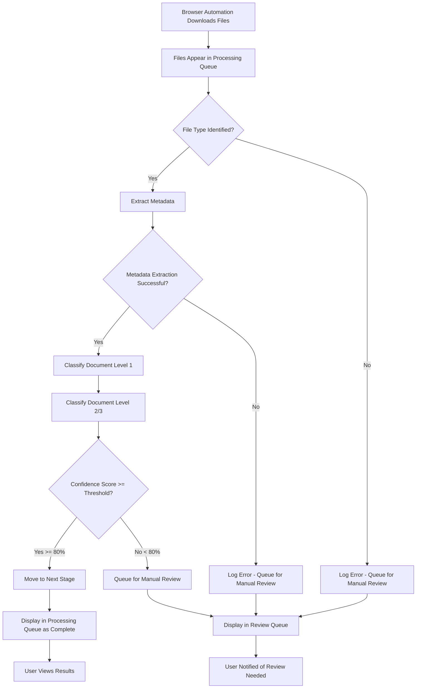
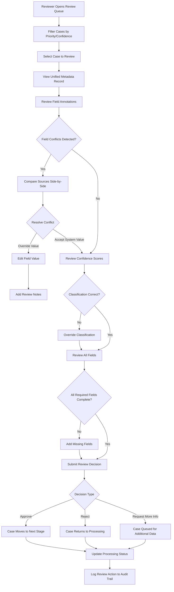
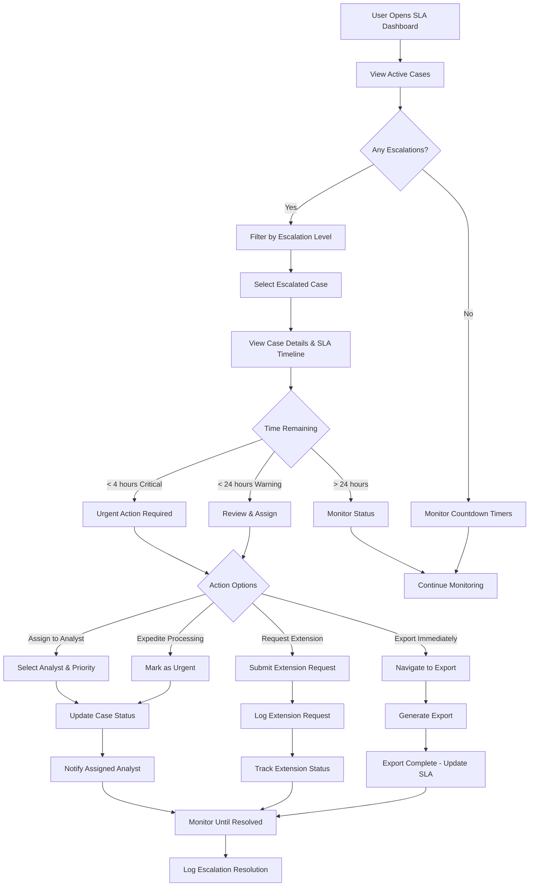
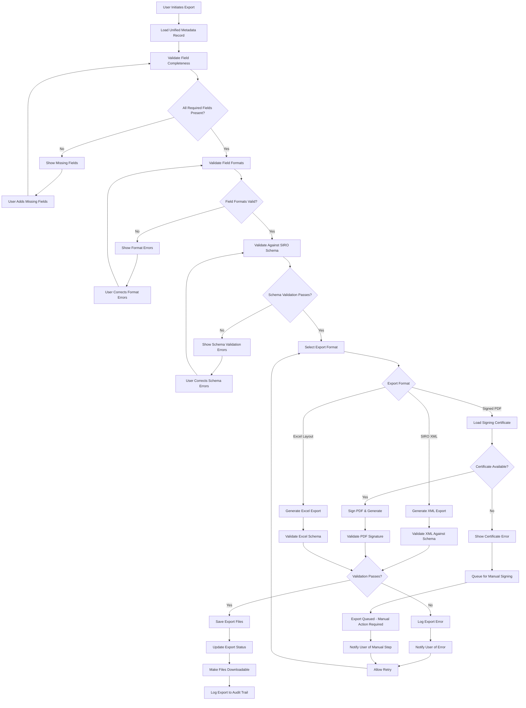
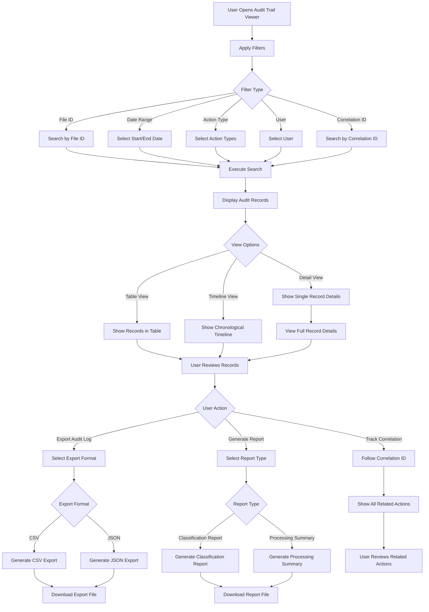

# ExxerCube.Prisma UI/UX Specification

**Version:** 1.0  
**Date:** 2025-01-12  
**Status:** Draft

---

## Introduction

This document defines the user experience goals, information architecture, user flows, and visual design specifications for ExxerCube.Prisma's user interface. It serves as the foundation for visual design and frontend development, ensuring a cohesive and user-centered experience.

The system is a **Regulatory Compliance Automation System** that transforms an existing OCR document processing pipeline into a comprehensive solution for automating end-to-end processing of regulatory directives (oficios) from Mexican financial regulatory bodies (UIF, CNBV). The UI must support complex workflows including document acquisition, metadata extraction, classification, identity resolution, SLA tracking, manual review, and compliance export generation.

---

## Overall UX Goals & Principles

### Target User Personas

**Compliance Officer**  
Primary user responsible for managing regulatory compliance workflows. Needs to:
- Monitor SLA deadlines and escalations
- Review and approve compliance actions
- Generate regulatory exports
- Track audit trails

**Compliance Analyst**  
Operational user who processes documents and performs manual reviews. Needs to:
- Review ambiguous classifications and low-confidence extractions
- Correct field values and classifications
- Navigate complex document metadata
- Complete tasks efficiently under time pressure

**System Administrator**  
Technical user who configures and maintains the system. Needs to:
- Configure processing pipelines
- Monitor system health and performance
- Manage browser automation settings
- Access audit logs and reports

### Usability Goals

- **Ease of learning:** New users can complete core tasks (review a case, approve classification) within 5 minutes of first use
- **Efficiency of use:** Power users can process 20+ documents per hour with minimal clicks
- **Error prevention:** Clear validation and confirmation for destructive actions (export, classification override)
- **Memorability:** Infrequent users can return to the system without relearning navigation patterns
- **Accessibility:** WCAG 2.1 AA compliance for keyboard navigation and screen reader support

### Design Principles

1. **Clarity over cleverness** - Prioritize clear communication over aesthetic innovation, especially for time-sensitive compliance tasks
2. **Progressive disclosure** - Show only what's needed when it's needed; hide advanced options until required
3. **Consistent patterns** - Use familiar UI patterns throughout (MudBlazor components) to reduce cognitive load
4. **Immediate feedback** - Every action should have clear, immediate response; especially critical for SLA tracking and escalations
5. **Accessible by default** - Design for all users from the start; financial regulatory systems require broad accessibility

### Change Log

| Date | Version | Description | Author |
|------|---------|-------------|--------|
| 2025-01-12 | 1.0 | Initial UI/UX specification draft | UX Expert |

---

## Information Architecture (IA)

### Site Map / Screen Inventory

```mermaid
graph TD
    A[Homepage/Dashboard] --> B[Document Processing]
    A --> C[Manual Review]
    A --> D[SLA Monitoring]
    A --> E[Compliance Validation]
    A --> F[Export Management]
    A --> G[Audit Trail]
    A --> H[Settings]
    
    B --> B1[Processing Queue]
    B --> B2[Processing Status]
    B --> B3[File Upload]
    B --> B4[Browser Automation Results]
    
    C --> C1[Review Queue]
    C --> C2[Case Details]
    C --> C3[Field Annotations]
    C --> C4[Review Decision]
    
    D --> D1[Active Cases]
    D --> D2[Escalations]
    D --> D3[Deadline Calendar]
    D --> D4[At-Risk Cases]
    
    E --> E1[Metadata Editor]
    E --> E2[Validation Results]
    E --> E3[Field Conflicts]
    E --> E4[Unified Record View]
    
    F --> F1[Export Queue]
    F --> F2[Export History]
    F --> F3[Download Files]
    F --> F4[SIRO XML Export]
    F --> F5[Signed PDF Export]
    F --> F6[Excel Layout Export]
    
    G --> G1[Audit Log Viewer]
    G --> G2[Filter & Search]
    G --> G3[Export Reports]
    G --> G4[Correlation ID Tracking]
    
    H --> H1[System Configuration]
    H --> H2[User Management]
    H --> H3[Processing Settings]
    H --> H4[Browser Automation Config]
    H --> H5[Matching Policies]
```

### Navigation Structure

**Primary Navigation:**  
Horizontal top navigation bar with main sections:
- **Dashboard** - Overview of active cases, SLA status, pending reviews, processing statistics
- **Documents** - Document processing queue, status tracking, browser automation results, manual file upload
- **Review** - Manual review queue and case details (high-frequency, critical workflow)
- **SLA** - SLA monitoring and escalation dashboard (time-sensitive, critical)
- **Export** - Export management and history (SIRO XML, signed PDF, Excel layouts)
- **Audit** - Audit trail viewer and reports (compliance and traceability)
- **Settings** - System configuration (admin only - browser automation, processing pipelines, matching policies)

**Secondary Navigation:**  
Contextual sidebar navigation within each main section:
- Shows sub-sections relevant to current area
- Quick filters and actions for current view (e.g., "Filter by confidence level" in Review)
- Status indicators (e.g., "12 cases pending review", "3 escalations")
- Breadcrumb trail showing current location

**Breadcrumb Strategy:**  
- Always visible at top of content area
- Format: `Home > Section > Subsection > Current Page`
- Clickable breadcrumbs for navigation
- Highlights current page location
- Example: `Dashboard > Review > Case Details > Case #12345`

### Key User Workflows & Scenarios

#### Workflow 1: Document Ingestion & Processing (Stage 1 → Stage 2)
**User:** Compliance Officer / System Administrator  
**Goal:** Monitor automated document downloads and processing status

**Steps:**
1. Navigate to **Documents > Processing Queue**
2. View list of downloaded files from browser automation
3. See processing status (Pending → Extracting → Classifying → Complete)
4. Review classification results and confidence scores
5. Identify files requiring manual review (low confidence indicators)

**UI Components Needed:**
- Processing queue table with status indicators
- Real-time status updates (SignalR)
- File metadata display (name, type, download timestamp, checksum)
- Classification results preview
- Confidence score indicators

#### Workflow 2: Manual Review (Stage 3)
**User:** Compliance Analyst  
**Goal:** Review and correct ambiguous classifications or low-confidence extractions

**Steps:**
1. Navigate to **Review > Review Queue**
2. Filter cases by confidence level, classification ambiguity, or error status
3. Select case to review
4. View unified metadata record with field-level annotations:
   - Source indicators (XML, DOCX, PDF, OCR)
   - Confidence scores per field
   - Field conflicts highlighted
   - Origin trace for each value
5. Override classifications or correct field values
6. Add review notes
7. Submit review decision
8. Case moves to next stage or back to processing

**UI Components Needed:**
- Review queue dashboard with filters
- Case detail view with side-by-side source comparison
- Field annotation display (color-coded confidence, source badges)
- Inline editing capabilities
- Review decision form
- Notes/comment system

#### Workflow 3: SLA Monitoring & Escalation (Stage 3)
**User:** Compliance Manager / Compliance Officer  
**Goal:** Monitor SLA deadlines and respond to escalations

**Steps:**
1. Navigate to **SLA > Active Cases**
2. View all active regulatory cases with deadline countdown
3. See risk indicators (color-coded: green/yellow/red)
4. Filter by escalation level (Warning, Critical, Breached)
5. Click on escalated case to view details
6. Take action (assign to analyst, expedite processing, etc.)
7. View escalation history

**UI Components Needed:**
- SLA dashboard with countdown timers
- Risk level indicators (visual: progress bars, color coding)
- Escalation alerts (toast notifications, badge counts)
- Case detail view with SLA timeline
- Action buttons (assign, expedite, acknowledge)

#### Workflow 4: Compliance Validation & Export (Stage 4)
**User:** Compliance Officer  
**Goal:** Validate metadata and generate regulatory exports

**Steps:**
1. Navigate to **Compliance Validation** (or from Review queue)
2. View unified metadata record
3. Review field completeness and consistency
4. Validate against SIRO schema requirements
5. Correct any validation errors
6. Navigate to **Export > Export Queue**
7. Select export format (SIRO XML, Signed PDF, Excel Layout)
8. Initiate export
9. Monitor export status
10. Download generated files

**UI Components Needed:**
- Validation form with field-level error indicators
- Schema validation results display
- Export initiation form
- Export status tracking
- File download interface

#### Workflow 5: Audit Trail Review
**User:** Compliance Manager / Auditor  
**Goal:** Track processing steps and generate compliance reports

**Steps:**
1. Navigate to **Audit > Audit Log Viewer**
2. Filter by file ID, date range, action type, user
3. View detailed audit records:
   - Processing steps (download, classification, extraction, review, export)
   - Timestamps and user identities
   - Classification decisions and scores
   - Correlation IDs for cross-stage tracking
4. Export audit logs for compliance reporting
5. Generate classification reports (CSV/JSON)

**UI Components Needed:**
- Audit log table with advanced filtering
- Correlation ID search
- Timeline view of processing steps
- Export functionality (CSV, JSON)
- Report generation interface

### Screen Inventory Details

**New Screens:**

1. **Dashboard (Homepage)**
   - Active cases summary
   - SLA alerts and escalations (critical items)
   - Pending review count
   - Processing statistics
   - Recent activity feed

2. **Document Processing Dashboard**
   - Enhanced to show classification results, field matching confidence scores
   - Processing stage status indicators
   - Browser automation download results
   - Manual file upload interface

3. **Manual Review Dashboard**
   - Lists cases requiring human review
   - Filters: confidence level, classification ambiguity, error status
   - Priority indicators (SLA-based)
   - Quick actions (bulk assign, filter by reviewer)

4. **Review Case Detail Screen**
   - Unified metadata record display
   - Field-level annotations (source, confidence, conflicts)
   - Side-by-side source comparison (XML vs DOCX vs PDF)
   - Inline editing capabilities
   - Review decision form
   - Related documents/files view

5. **SLA Monitoring Dashboard**
   - Active cases with deadline countdown
   - Escalation status and risk indicators
   - Deadline calendar view
   - At-risk cases list
   - Escalation history

6. **Compliance Validation Screen**
   - Unified metadata record editor
   - Field-level validation errors
   - Schema validation results
   - Field conflict resolution interface
   - Validation checklist

7. **Audit Trail Viewer**
   - Browseable audit log
   - Filtering: file ID, date range, action type, user
   - Correlation ID tracking
   - Timeline visualization
   - Export capabilities

8. **Export Management Screen**
   - Export queue
   - Export history
   - Download generated files (SIRO XML, signed PDF, Excel layouts)
   - Export status tracking
   - Re-export capabilities

**Modified Screens:**
- **File Upload/Management** - Extended to support browser automation download results and manual file uploads
- **Existing OCR Processing** - Enhanced to show classification results and confidence scores

### Navigation Patterns by User Role

**Compliance Analyst (Primary Daily User):**
- **Primary Path:** Dashboard → Review → Case Details → Submit Decision
- **Secondary Path:** Documents → Processing Queue → Review Status
- **Quick Access:** Review Queue (most frequent), SLA Alerts

**Compliance Officer (Manager/Oversight):**
- **Primary Path:** Dashboard → SLA Monitoring → Active Cases → Export Management
- **Secondary Path:** Audit Trail → Compliance Reports
- **Quick Access:** SLA Dashboard, Export Queue

**System Administrator (Configuration):**
- **Primary Path:** Settings → System Configuration → Processing Settings
- **Secondary Path:** Audit Trail → System Health Monitoring
- **Quick Access:** Settings, System Health

---

## User Flows

### Flow 1: Document Ingestion & Initial Processing

**User Goal:** Monitor automated document downloads and ensure successful processing through classification

**Entry Points:**
- Dashboard → Documents (automatic after browser automation)
- Manual file upload → Documents > File Upload
- Scheduled browser automation job completion notification

**Success Criteria:**
- All downloaded files are processed and classified
- Files requiring review are identified and queued
- Processing status is visible and accurate
- Classification confidence scores are displayed

**Flow Diagram:**

**Edge Cases & Error Handling:**
- **Browser automation failure:** Show error in processing queue, allow manual file upload as fallback
- **File corruption:** Detect during file type identification, queue for manual review with error message
- **OCR failure:** Log error, queue for manual review, show partial extraction results if available
- **Classification ambiguity:** When confidence < 80%, automatically queue for manual review
- **Duplicate file detection:** Show warning, allow user to skip or force process
- **Network timeout during download:** Retry with exponential backoff, show retry status

**Notes:**
- Processing status updates in real-time via SignalR
- Users can filter queue by status, file type, confidence level
- Bulk actions available for multiple files (e.g., "Queue all low-confidence for review")

---

### Flow 2: Manual Review Workflow

**User Goal:** Review ambiguous cases, correct field values, and approve classifications for processing continuation

**Entry Points:**
- Review Queue dashboard (primary entry)
- Processing Queue → "Requires Review" indicator
- SLA Dashboard → Cases with low confidence blocking export
- Direct case link from notification/alert

**Success Criteria:**
- Reviewer can see all field sources and confidence scores
- Reviewer can override classifications and correct field values
- Review decision is saved and case progresses to next stage
- All review actions are logged to audit trail

**Flow Diagram:**

**Edge Cases & Error Handling:**
- **Concurrent edits:** Detect when another user is editing same case, show conflict warning, allow merge or lock
- **Validation errors on submit:** Highlight invalid fields, prevent submission until resolved
- **Network failure during save:** Auto-save draft, retry on connection restore, show save status
- **Missing source documents:** Show available sources, indicate which sources are missing, allow review with partial data
- **Low confidence across all fields:** Highlight as high-risk case, require additional reviewer approval
- **SLA deadline approaching:** Show urgent indicator, prioritize in queue, allow expedited review path

**Notes:**
- Field annotations show: source (XML/DOCX/PDF/OCR), confidence (0-100%), agreement level, origin trace
- Side-by-side comparison view shows all sources for conflicted fields
- Review notes are required for overrides (explain why system value was changed)
- Bulk review actions available for similar cases (e.g., "Apply same classification to all similar cases")

---

### Flow 3: SLA Monitoring & Escalation Response

**User Goal:** Monitor SLA deadlines, respond to escalations, and prevent compliance breaches

**Entry Points:**
- SLA Dashboard (primary monitoring entry)
- Dashboard → SLA Alerts widget
- Email/SMS notification → Direct link to escalated case
- Real-time escalation alert (toast notification)

**Success Criteria:**
- All active cases visible with deadline countdown
- Escalations are clearly identified and actionable
- User can take action to prevent breach
- Escalation actions are logged and tracked

**Flow Diagram:**

**Edge Cases & Error Handling:**
- **SLA breach occurred:** Show breached status, require immediate action, log breach to audit trail
- **Multiple escalations:** Prioritize by time remaining, show escalation queue, allow bulk assignment
- **Analyst unavailable:** Show analyst status, suggest alternative analysts, allow reassignment
- **Export generation failure:** Show error, allow retry, escalate if blocking SLA
- **Extension request denied:** Notify user, show remaining time, suggest alternative actions
- **System calculation error:** Allow manual deadline override with justification, log to audit trail

**Notes:**
- Escalation levels: None (green), Warning (yellow, <24h), Critical (red, <4h), Breached (black, past deadline)
- Real-time countdown updates every minute
- Escalation notifications sent via multiple channels (dashboard, email, SMS if configured)
- SLA timeline shows: intake date, deadline, current time, remaining time, escalation history

---

### Flow 4: Compliance Validation & Export Generation

**User Goal:** Validate unified metadata records and generate SIRO-compliant exports for regulatory submission

**Entry Points:**
- Compliance Validation screen (from Review queue)
- Export Management → Initiate Export
- Review Case Detail → "Ready for Export" action
- Automated export trigger (after validation passes)

**Success Criteria:**
- All required fields validated against SIRO schema
- Export files generated in correct format (XML, PDF, Excel)
- Export status tracked and files downloadable
- Export operations logged to audit trail

**Flow Diagram:**

**Edge Cases & Error Handling:**
- **Missing required fields:** Show clear list of missing fields, link to field editor, prevent export until complete
- **Invalid field formats:** Highlight invalid fields with format requirements, provide format examples
- **Schema validation failure:** Show detailed schema errors with line numbers, allow partial export with warnings
- **Certificate unavailable:** Queue export for manual signing, notify user, allow retry when certificate available
- **Export generation timeout:** Show progress indicator, allow cancellation, queue for retry
- **File download failure:** Allow re-download, show download history, support multiple download attempts
- **Concurrent export requests:** Queue exports, show export queue status, prevent duplicate exports

**Notes:**
- Validation happens in stages: completeness → formats → schema → generation
- Users can save validation progress and return later
- Export formats: SIRO XML (primary), Signed PDF (PAdES), Excel Layout (for SIRO registration)
- Export history shows: timestamp, format, status, download link, file size
- Failed exports can be retried after corrections

---

### Flow 5: Audit Trail Review & Reporting

**User Goal:** Track all processing steps, generate compliance reports, and demonstrate regulatory compliance

**Entry Points:**
- Audit Trail Viewer (primary entry)
- Case Detail → View Audit History
- Dashboard → Recent Activity
- Compliance Report generation

**Success Criteria:**
- All processing steps visible and searchable
- Reports generated in required formats (CSV, JSON)
- Correlation IDs track actions across stages
- Export functionality works for compliance submissions

**Flow Diagram:**

**Edge Cases & Error Handling:**
- **Large result sets:** Implement pagination, show result count, allow export of filtered results
- **Date range too wide:** Warn user, suggest narrower range, allow export for large datasets
- **Correlation ID not found:** Show error message, suggest similar IDs, allow partial search
- **Export generation timeout:** Show progress, allow cancellation, queue for background generation
- **Missing audit records:** Log data integrity warning, show available records, flag gaps for investigation
- **Report generation failure:** Show error details, allow retry, support partial report generation

**Notes:**
- Audit records show: timestamp, user, action type, file ID, details (JSON), classification results, scores
- Correlation IDs enable tracking: File → Processing → Review → Export across all stages
- Reports available: Classification Report (by date range), Processing Summary (current state), Audit Log Export (filtered)
- Timeline view shows processing flow visually with stage transitions
- Export formats: CSV (for Excel analysis), JSON (for system integration)

---

## Wireframes

### Design Files

**Primary Design Files:**  
Detailed visual designs will be created in **Figma** (or your preferred design tool). The design files should be organized by screen/component and linked from this specification.

**Design File Structure:**
- `designs/dashboard/` - Dashboard and homepage designs
- `designs/documents/` - Document processing screens
- `designs/review/` - Manual review interface designs
- `designs/sla/` - SLA monitoring dashboard designs
- `designs/export/` - Export management screens
- `designs/audit/` - Audit trail viewer designs
- `designs/components/` - Reusable component library (MudBlazor-based)
- `designs/patterns/` - Design patterns and interaction guidelines

**Design Handoff Process:**
- Design files should include component specifications (spacing, colors, typography)
- Interactive prototypes for complex workflows (especially Manual Review)
- Annotations for developers explaining interactions and states
- Responsive breakpoints documented (mobile, tablet, desktop)

### Key Screen Layouts

#### Screen 1: Dashboard (Homepage)

**Purpose:** Provide overview of system status, critical alerts, and quick access to key workflows

**Key Elements:**
- **SLA Alerts Widget** - Top section showing critical escalations (<4h remaining) with countdown timers
- **Pending Review Count** - Large badge showing number of cases awaiting review, clickable to Review Queue
- **Active Cases Summary** - Cards showing: Total Active, At Risk, Breached, Completed Today
- **Processing Statistics** - Charts/graphs showing: Files processed today, Average processing time, Success rate
- **Recent Activity Feed** - Timeline of recent processing steps (downloads, classifications, exports)
- **Quick Actions** - Buttons for: Start Review, View SLA Dashboard, Initiate Export, Upload File

**Interaction Notes:**
- Real-time updates via SignalR (SLA alerts, review count, activity feed)
- Clicking any widget navigates to detailed view
- Color coding: Green (normal), Yellow (warning), Red (critical), Black (breached)
- Responsive: Stack widgets vertically on tablet, single column on mobile

**Design File Reference:** `designs/dashboard/homepage.fig`

---

#### Screen 2: Manual Review Dashboard

**Purpose:** List all cases requiring manual review with filtering and prioritization

**Key Elements:**
- **Filter Bar** - Filters for: Confidence level (<80%, 80-90%, >90%), Classification ambiguity, Error status, SLA priority, Assigned reviewer
- **Review Queue Table** - Columns: Case ID, File Name, Classification, Confidence Score, SLA Status, Priority, Assigned To, Actions
- **Priority Indicators** - Visual badges: Urgent (red, SLA <4h), High (yellow, SLA <24h), Normal (green)
- **Bulk Actions** - Select multiple cases: Assign to reviewer, Bulk approve, Export list
- **Quick Stats** - Summary: Total pending, By confidence level, By SLA status

**Interaction Notes:**
- Table supports sorting by any column
- Clicking a row opens Case Detail screen
- Filters persist across sessions
- Real-time updates when new cases are queued
- Export queue list to CSV for offline review

**Design File Reference:** `designs/review/review-dashboard.fig`

---

#### Screen 3: Review Case Detail Screen

**Purpose:** Detailed view for reviewing and correcting a single case

**Key Elements:**
- **Case Header** - Case ID, File Name, Classification (editable), Confidence Score, SLA Status, Related Files (XML, DOCX, PDF links)
- **Unified Metadata Record** - Form layout with fields grouped by category:
  - Expediente Information (Expediente Number, Oficio Number, Días Plazo, Subdivisión)
  - Person Information (RFC, Name, Address, etc.)
  - Classification (Level 1, Level 2/3 - editable dropdowns)
- **Field Annotations** - Each field shows:
  - Source badges (XML, DOCX, PDF, OCR) with color coding
  - Confidence score indicator (0-100% progress bar)
  - Agreement level (if multiple sources agree)
  - Origin trace (click to see where value came from)
- **Source Comparison Panel** - Collapsible side panel showing side-by-side comparison of XML, DOCX, PDF sources for conflicted fields
- **Review Decision Form** - Decision dropdown (Approve, Reject, Request More Info), Notes field (required for overrides), Submit button
- **Related Actions** - Links to: View Audit Trail, View SLA Timeline, View Related Cases

**Interaction Notes:**
- Fields with conflicts highlighted in yellow border
- Low confidence fields (<70%) highlighted in orange
- Inline editing: Click field to edit, shows validation errors immediately
- Auto-save draft every 30 seconds
- Side-by-side comparison opens in modal/panel for conflicted fields
- Review notes required when overriding system values
- Submit button disabled until all required fields complete

**Design File Reference:** `designs/review/case-detail.fig`

---

#### Screen 4: SLA Monitoring Dashboard

**Purpose:** Monitor all active cases with SLA deadlines and escalation management

**Key Elements:**
- **Escalation Summary Cards** - Top section: Critical (<4h), Warning (<24h), Breached, Total Active
- **Active Cases Table** - Columns: Case ID, File Name, Intake Date, Deadline, Time Remaining (countdown), Escalation Level, Status, Actions
- **Deadline Calendar View** - Optional calendar view showing cases by deadline date
- **At-Risk Cases List** - Filtered view of cases approaching deadline
- **Escalation Actions** - Quick actions: Assign to Analyst, Expedite, Request Extension, Export Immediately
- **SLA Timeline Visualization** - For selected case: Visual timeline showing intake → current time → deadline with escalation markers

**Interaction Notes:**
- Countdown timers update every minute (real-time)
- Color coding: Green (>24h), Yellow (<24h), Red (<4h), Black (breached)
- Clicking case opens Case Detail with SLA tab active
- Bulk actions: Select multiple cases to assign or expedite
- Export queue: Cases ready for export shown separately
- Filter by escalation level, time remaining, assigned analyst

**Design File Reference:** `designs/sla/sla-dashboard.fig`

---

#### Screen 5: Compliance Validation Screen

**Purpose:** Validate unified metadata records before export generation

**Key Elements:**
- **Validation Checklist** - Side panel showing validation status:
  - Field Completeness (X/Y required fields present)
  - Field Format Validation (X/Y fields valid format)
  - Schema Validation (SIRO schema compliance)
  - All checks must pass before export enabled
- **Metadata Editor** - Form layout similar to Review Case Detail but focused on validation:
  - Fields grouped by SIRO schema sections
  - Validation errors shown inline (red border, error message)
  - Format requirements shown as placeholder text
- **Validation Results Panel** - Shows detailed validation errors:
  - Missing required fields (with links to add)
  - Format errors (with examples)
  - Schema errors (with line numbers if applicable)
- **Export Actions** - Buttons: Validate Again, Export SIRO XML, Export Signed PDF, Export Excel Layout
- **Export Status** - Shows export queue status, download links for completed exports

**Interaction Notes:**
- Validation runs automatically on field change (debounced)
- Export buttons disabled until all validations pass
- Validation errors are actionable (click to fix)
- Export format selection opens modal with options
- Export progress shown in notification/toast
- Download links appear when export completes

**Design File Reference:** `designs/export/validation-screen.fig`

---

#### Screen 6: Export Management Screen

**Purpose:** Manage export queue, view export history, and download generated files

**Key Elements:**
- **Export Queue** - Table showing: Case ID, Export Format, Status (Pending, Processing, Complete, Failed), Initiated By, Initiated At, Actions
- **Export History** - Filterable table of completed exports: Case ID, Format, Status, File Size, Download Link, Exported At
- **Export Filters** - Filter by: Format (XML, PDF, Excel), Status, Date Range, Case ID
- **Bulk Actions** - Select multiple exports: Re-download, Delete, Re-export
- **Export Statistics** - Summary: Total Exports Today, By Format, Success Rate, Average File Size

**Interaction Notes:**
- Export queue shows real-time status updates
- Download links expire after configured time (e.g., 7 days)
- Failed exports show error details and allow retry
- Export history supports CSV export for reporting
- File preview available for XML/Excel (read-only)

**Design File Reference:** `designs/export/export-management.fig`

---

#### Screen 7: Audit Trail Viewer

**Purpose:** Browse and search audit logs for compliance and troubleshooting

**Key Elements:**
- **Advanced Filter Panel** - Filters for: File ID, Date Range (start/end), Action Type (multi-select), User, Correlation ID
- **Audit Records Table** - Columns: Timestamp, User, Action Type, File ID, Details (expandable), Correlation ID, View Details
- **Timeline View Toggle** - Switch between table view and chronological timeline visualization
- **Correlation ID Search** - Search box to find all actions for a specific correlation ID
- **Export Actions** - Buttons: Export Filtered Results (CSV/JSON), Generate Classification Report, Generate Processing Summary
- **Record Detail Modal** - Shows full audit record: All details (JSON), Classification results, Scores, Related actions

**Interaction Notes:**
- Filters support AND/OR logic for complex queries
- Table supports pagination (50 records per page)
- Timeline view shows processing flow visually
- Correlation ID search highlights related actions
- Export supports current filters
- Record detail modal shows full JSON for technical users

**Design File Reference:** `designs/audit/audit-viewer.fig`

---

#### Screen 8: Document Processing Dashboard

**Purpose:** Monitor document processing queue and browser automation results

**Key Elements:**
- **Processing Queue Table** - Columns: File Name, File Type, Status (Pending, Extracting, Classifying, Complete, Error), Classification, Confidence, Download Timestamp, Actions
- **Status Filters** - Filter by: Status, File Type, Confidence Level, Date Range
- **Browser Automation Results** - Section showing: Last automation run, Files downloaded, Duplicates skipped, Errors encountered
- **Manual File Upload** - Drag-and-drop area or file picker for manual uploads
- **Processing Statistics** - Summary: Files Processed Today, Average Processing Time, Success Rate, Files Queued for Review

**Interaction Notes:**
- Real-time status updates via SignalR
- Status indicators: Spinner (processing), Checkmark (complete), Warning (review needed), Error (failed)
- Clicking file opens processing detail view
- Bulk actions: Queue for review, Retry failed, Delete
- Browser automation section shows last run summary with link to full log

**Design File Reference:** `designs/documents/processing-dashboard.fig`

---

### Design System Integration

**MudBlazor Component Usage:**
- **Tables:** `MudTable` for all data tables (Processing Queue, Review Queue, SLA Dashboard, etc.)
- **Forms:** `MudForm`, `MudTextField`, `MudSelect` for metadata editing and validation
- **Navigation:** `MudNavMenu` for primary navigation, `MudBreadcrumbs` for breadcrumbs
- **Feedback:** `MudSnackbar` for notifications, `MudProgressLinear` for loading states
- **Dialogs:** `MudDialog` for confirmations, side-by-side comparisons, export format selection
- **Data Display:** `MudCard` for dashboard widgets, `MudChip` for badges and tags
- **Layout:** `MudContainer`, `MudGrid` for responsive layouts

**Design Consistency:**
- All screens follow MudBlazor spacing and typography scale
- Color scheme consistent with existing application (if any) or MudBlazor default theme
- Icons from Material Design Icons (MudBlazor compatible)
- Loading states use MudBlazor progress indicators
- Error states use MudBlazor alert components

---
