# ExxerCube Prisma - Complete System Flow

## Overview
This diagram shows the complete flow from Authority requirement creation through CNBV processing to the Bank's intelligent adaptive automation system.

## System Flow Diagram

```mermaid
flowchart TD
    %% ===== AUTHORITY & CNBV (External Systems) =====
    subgraph External["🏛️ External Systems"]
        Auth["👮 Authority<br/>(IMSS, SAT, UIF, FGR, etc.)"]
        CNBV["🏦 CNBV<br/>(National Banking Commission)"]
        Auth -->|"Creates Requirement<br/>(Requerimiento)"| CNBV
        CNBV -->|"Vets & Approves"| CNBV
    end

    %% ===== SIARA SYSTEM =====
    subgraph SIARA["📋 SIARA System<br/>(Sistema de Atención de Requerimientos)"]
        XMLGen["📄 XML Generator<br/>(Expediente Schema)"]
        PDFGen["📑 PDF Generator<br/>(Official Document)"]
        SiaraWeb["🌐 SIARA Web Portal<br/>(https://siara.cnbv.gob.mx)"]

        CNBV -->|"Generate Documents"| XMLGen
        CNBV -->|"Generate Documents"| PDFGen
        XMLGen --> SiaraWeb
        PDFGen --> SiaraWeb
    end

    %% ===== BANK'S INTELLIGENT AUTOMATION SYSTEM =====
    subgraph BankSystem["🏢 Bank's Intelligent Automation System<br/>(ExxerCube Prisma)"]

        %% Monitoring & Download
        subgraph Monitor["🔍 Monitoring & Download"]
            Watch["⏰ SIARA Page Watcher<br/>(Browser Automation)"]
            Download["⬇️ Document Downloader<br/>(Playwright + HttpClient)"]

            SiaraWeb -.->|"Monitors for<br/>New Cases"| Watch
            Watch -->|"Case Arrives"| Download
            Download -->|"Downloads XML + PDF<br/>(Facing Reality: Bad State)"| Intake
        end

        %% Document Intake
        subgraph Intake["📥 Document Intake<br/>(Dealing with Reality)"]
            PDFBad["📄 Bad PDF State<br/>• Low quality scans<br/>• Noise, blur, watermarks<br/>• Skewed, degraded"]
            XMLBad["📋 Bad XML State<br/>• Malformed structure<br/>• Missing fields<br/>• Inconsistent data"]
        end

        %% Intelligent Processing Pipeline
        subgraph Pipeline["🤖 Intelligent Processing Pipeline"]

            %% Image Quality Analysis
            QualityAnalysis["📊 Image Quality Analysis<br/>(EmguCV)<br/>• Blur detection<br/>• Noise level<br/>• Contrast<br/>• Sharpness"]

            %% Adaptive Filtering
            FilterSelect["🎯 Adaptive Filter Selection<br/>(ML-Driven)<br/>• Polynomial (18.4% avg)<br/>• Analytical NSGA-II (12.3% avg)<br/>• Quality-based clustering"]

            Enhancement["✨ Image Enhancement<br/>(Adaptive)<br/>• Polynomial regression (15 features)<br/>• Quality-aware parameters<br/>• Best-effort optimization"]

            %% OCR Processing
            OCR["👁️ OCR Processing<br/>(Tesseract)<br/>• Spanish + English<br/>• Confidence tracking<br/>• Best-effort extraction"]

            Sanitization["🧹 OCR Sanitization<br/>(Best-Effort)<br/>• Account number cleaning<br/>• SWIFT/BIC normalization<br/>• Warning flagging"]

            %% XML Processing
            XMLParse["📖 XML Parser<br/>(Tolerant)<br/>• Nullable parsing<br/>• Schema-flexible<br/>• Auto-detection"]

            PDFBad --> QualityAnalysis
            QualityAnalysis --> FilterSelect
            FilterSelect --> Enhancement
            Enhancement --> OCR
            OCR --> Sanitization

            XMLBad --> XMLParse
        end

        %% Reconciliation & Intelligence
        subgraph Reconcile["🔄 Reconciliation & Intelligence"]
            Compare["⚖️ Document Comparison<br/>(XML vs OCR)<br/>• Field-by-field matching<br/>• Levenshtein distance<br/>• Confidence scoring"]

            Conflict["🚨 Conflict Detection<br/>• Missing data flagging<br/>• Suspicious value detection<br/>• Quality thresholds"]

            Classify["🏷️ Requirement Classification<br/>• Area (Hacendario, Aseguramiento, etc.)<br/>• Type (Información, Bloqueo, etc.)<br/>• Priority"]

            Sanitization --> Compare
            XMLParse --> Compare
            Compare --> Conflict
            Conflict --> Classify
        end

        %% Final Processing
        subgraph FinalProcess["📦 Final Processing"]
            Generate["📋 Final Requirement Generation<br/>• Unified data model<br/>• All sources preserved<br/>• Traceability maintained"]

            Review["👤 Manual Review Queue<br/>(Only for flagged cases)<br/>• Missing data<br/>• Low confidence<br/>• Conflicts"]

            Template["🎨 Bank Template Adapter<br/>(Auto-Detecting)<br/>• Template schema detection<br/>• Dynamic mapping<br/>• No code changes needed"]

            Classify --> Generate
            Generate --> Conflict
            Conflict -->|"Flagged for Review"| Review
            Generate -->|"Auto-Processing"| Template
        end

        %% Storage & Observability
        subgraph Storage["💾 Storage & Intelligence"]
            DB["🗄️ Structured Storage<br/>• Expediente data<br/>• Processing metadata<br/>• Quality metrics"]

            Trace["🔍 Traceability<br/>• Full audit trail<br/>• Source preservation<br/>• Change history"]

            Log["📝 Logging & Observability<br/>(Serilog)<br/>• Performance metrics<br/>• Error tracking<br/>• Quality monitoring"]

            Learn["🧠 Adaptive Learning<br/>(Defensive Intelligence)<br/>• Quality patterns<br/>• Filter effectiveness<br/>• Schema evolution"]

            Template --> DB
            Template --> Trace
            DB --> Log
            Log --> Learn
            Learn -.->|"Feedback Loop"| FilterSelect
            Learn -.->|"Feedback Loop"| XMLParse
            Learn -.->|"Feedback Loop"| Template
        end
    end

    %% ===== BANK OUTPUT =====
    subgraph BankOutput["🏦 Bank's Efficient Processing"]
        BankSystems["🏢 Bank Internal Systems<br/>• Compliance department<br/>• Legal team<br/>• Operations<br/>• Optimized for bank's workflow"]

        DB --> BankSystems
    end

    %% ===== ADAPTIVE CAPABILITIES =====
    subgraph Adaptive["🔧 Adaptive Capabilities<br/>(No Code Changes Needed)"]
        AdaptSchema["📐 XML Schema Changes<br/>→ Auto-detection"]
        AdaptTemplate["📄 Bank Template Changes<br/>→ Auto-detection"]
        AdaptQuality["📊 PDF Quality Changes<br/>→ Filter adaptation"]
        AdaptFormat["📑 PDF Format Changes<br/>→ Robust parsing"]

        Learn -.->|"Monitors"| AdaptSchema
        Learn -.->|"Monitors"| AdaptTemplate
        Learn -.->|"Monitors"| AdaptQuality
        Learn -.->|"Monitors"| AdaptFormat
    end

    %% Styling
    classDef external fill:#e3f2fd,stroke:#1976d2,stroke-width:2px
    classDef siara fill:#fff3e0,stroke:#f57c00,stroke-width:2px
    classDef monitor fill:#f3e5f5,stroke:#7b1fa2,stroke-width:2px
    classDef process fill:#e8f5e9,stroke:#388e3c,stroke-width:2px
    classDef reconcile fill:#fff9c4,stroke:#f9a825,stroke-width:2px
    classDef storage fill:#fce4ec,stroke:#c2185b,stroke-width:2px
    classDef adaptive fill:#e0f2f1,stroke:#00897b,stroke-width:2px
    classDef bad fill:#ffebee,stroke:#d32f2f,stroke-width:2px

    class Auth,CNBV external
    class XMLGen,PDFGen,SiaraWeb siara
    class Watch,Download monitor
    class QualityAnalysis,FilterSelect,Enhancement,OCR,Sanitization,XMLParse process
    class Compare,Conflict,Classify reconcile
    class Generate,Review,Template,DB,Trace,Log,Learn storage
    class AdaptSchema,AdaptTemplate,AdaptQuality,AdaptFormat adaptive
    class PDFBad,XMLBad bad
```

## Key System Characteristics

### 🛡️ Defensive Intelligence (Not ML, but Intelligent)
- **Schema Evolution Detection**: Automatically detects XML schema changes
- **Template Adaptation**: Automatically adapts to bank template changes
- **Quality Adaptation**: Filter parameters adjust to PDF quality variations
- **Format Resilience**: Robust parsing handles format variations

### 🎯 Best-Effort Processing
- **Bad PDFs**: Quality analysis → Adaptive filtering → OCR optimization
- **Bad XMLs**: Tolerant parsing → Nullable fields → Auto-correction
- **Reconciliation**: XML vs OCR comparison → Conflict detection → Manual review only when needed

### 📊 Constant Learning (Without Traditional ML)
- **Filter Effectiveness**: Tracks which filters work best for which quality levels
- **Schema Patterns**: Learns common XML variations
- **Quality Patterns**: Identifies degradation trends
- **Template Evolution**: Monitors bank template changes

### ⚡ Efficiency Principles
- **Automatic Processing**: 80%+ cases processed without human intervention
- **Intelligent Flagging**: Only suspicious/missing data goes to review
- **Optimized Storage**: Structured for bank's workflow
- **Full Traceability**: Complete audit trail preserved

### 🔄 Adaptability Without Code Changes
- ✅ XML schema changes → Automatic detection & adaptation
- ✅ Bank template changes → Automatic detection & mapping
- ✅ PDF quality variations → Filter adaptation
- ✅ PDF format variations → Robust parsing
- ⚠️ Format change (PDF → EPUB) → Requires new parser (but algorithms remain)

## Technology Stack

### External Systems
- **SIARA**: CNBV's official requirement distribution system
- **Authorities**: IMSS, SAT, UIF, FGR, PJF, SHCP, CONDUSEF, etc.

### Bank's System (ExxerCube Prisma)
- **Browser Automation**: Playwright + HttpClient
- **Image Processing**: EmguCV (quality analysis)
- **Image Enhancement**: Polynomial regression (15 features, R² > 0.89)
- **OCR**: Tesseract (Spanish + English)
- **Parsing**: Custom nullable XML parser
- **Comparison**: Levenshtein distance algorithm
- **Storage**: SQL Server (structured storage)
- **Logging**: Serilog (observability)
- **UI**: Blazor Server + MudBlazor

## Service Wiring (Production DI)

This maps the flow stages to the concrete services and DbContexts currently wired in `Program.ConfigureServices` / `AddDatabaseServices`:

- **Identity & Auth**: `ApplicationDbContext` via `IDbContextFactory<ApplicationDbContext>`, Identity cookies, `IdentityUserAccessor`, `IdentityRedirectManager`, `AuthenticationStateProvider`.
- **Application Data**: `PrismaDbContext` + `IPrismaDbContext`, repositories (`IRepository<,>`), `DownloadTrackerService`, `FileMetadataLoggerService`, `IAuditLogger` (queued), `QueuedAuditProcessorService`, `SLAMetricsCollector`, `SLAEnforcerService` / `ISLAEnforcer`, `EventPublisher`.
- **Monitoring & Download**: `AddBrowserAutomationServices` (Playwright agent & job objects), `FileDownloadService`, `DocumentIngestionService`, `FileMetadataQueryService`.
- **OCR & Imaging**: `AddOcrProcessingServices` (Tesseract adapters), `AddPrismaPythonEnvironment`, `AddImagingInfrastructure` (quality analysis, filters).
- **Extraction & Classification**: `AddExtractionServices`, `AddClassificationServices`, `MetadataExtractionService`, `FieldMatchingService`, `IFieldMatcher<DocxSource>`, `IFieldMatcher<PdfSource>`.
- **Decision & SLA**: `DecisionLogicService`, `SLATrackingService`, health checks (`SLAEnforcerHealthCheck`, `SLABackgroundJobHealthCheck`).
- **Export & Delivery**: `AddExportServices`, `ExportService`, `AuditReportingService`.
- **Real-time UI**: `ProcessingHub` (SignalR), `AddMetricsServices`, Serilog logging/OTel exporters.

If additional flow capabilities are introduced, they should be represented here and wired through DI so the WebApplicationFactory DI tests can assert their presence.
